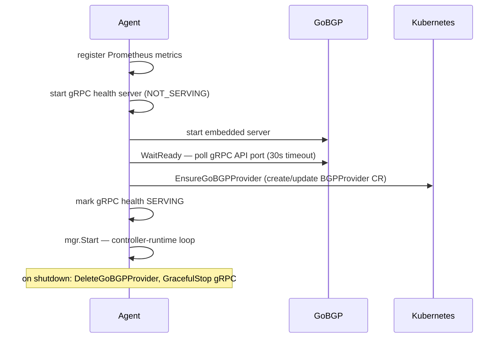

# Agent Startup Sequence

```mermaid
sequenceDiagram
    participant Agent
    participant GoBGP
    participant Kubernetes

    Agent->>Agent: register Prometheus metrics
    Agent->>Agent: start gRPC health server (NOT_SERVING)
    Agent->>GoBGP: start embedded server
    Agent->>GoBGP: WaitReady — poll gRPC API port (30s timeout)
    Agent->>Kubernetes: EnsureGoBGPProvider (create/update BGPProvider CR)
    Agent->>Agent: mark gRPC health SERVING
    Agent->>Agent: mgr.Start — controller-runtime loop
    Note over Agent: on shutdown: DeleteGoBGPProvider, GracefulStop gRPC
```
