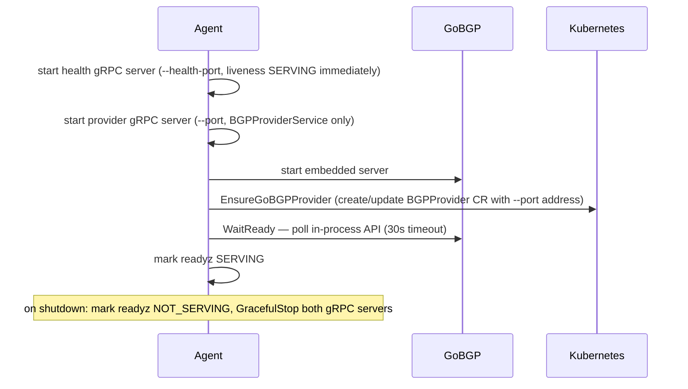

# Agent Startup Sequence

```mermaid
sequenceDiagram
    participant Agent
    participant GoBGP
    participant Kubernetes

    Agent->>Agent: start health gRPC server (--health-port, liveness SERVING immediately)
    Agent->>Agent: start provider gRPC server (--port, BGPProviderService only)
    Agent->>GoBGP: start embedded server
    Agent->>Kubernetes: EnsureGoBGPProvider (create/update BGPProvider CR with --port address)
    Agent->>GoBGP: WaitReady — poll in-process API (30s timeout)
    Agent->>Agent: mark readyz SERVING
    Note over Agent: on shutdown: mark readyz NOT_SERVING, GracefulStop both gRPC servers
```
