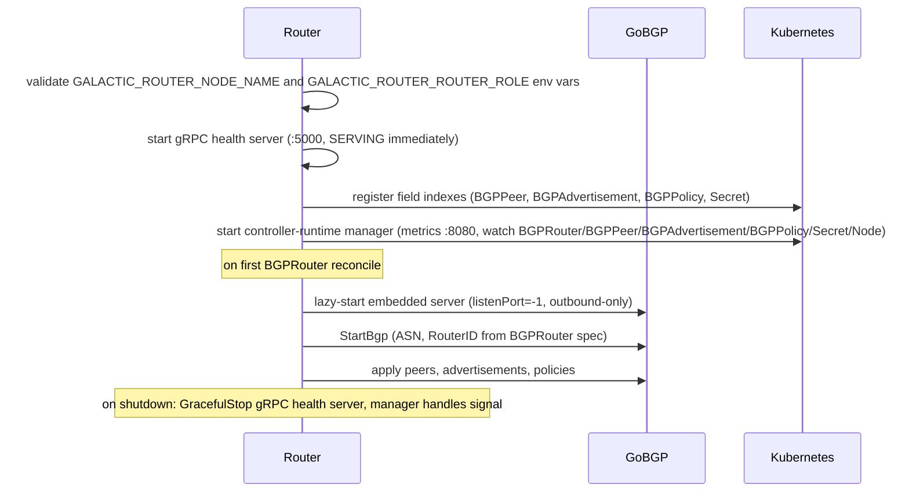

# Router Startup Sequence

```mermaid
sequenceDiagram
    participant Router
    participant GoBGP
    participant Kubernetes

    Router->>Router: validate GALACTIC_ROUTER_NODE_NAME and GALACTIC_ROUTER_ROUTER_ROLE env vars
    Router->>Router: start gRPC health server (:5000, SERVING immediately)
    Router->>Kubernetes: register field indexes (BGPPeer, BGPAdvertisement, BGPPolicy, Secret)
    Router->>Kubernetes: start controller-runtime manager (metrics :8080, watch BGPRouter/BGPPeer/BGPAdvertisement/BGPPolicy/Secret/Node)
    Note over Router: on first BGPRouter reconcile
    Router->>GoBGP: lazy-start embedded server (listenPort=-1, outbound-only)
    Router->>GoBGP: StartBgp (ASN, RouterID from BGPRouter spec)
    Router->>GoBGP: apply peers, advertisements, policies
    Note over Router: on shutdown: GracefulStop gRPC health server, manager handles signal
```
