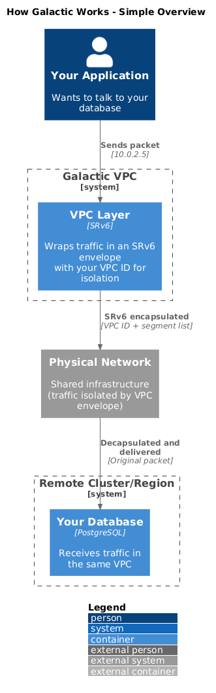
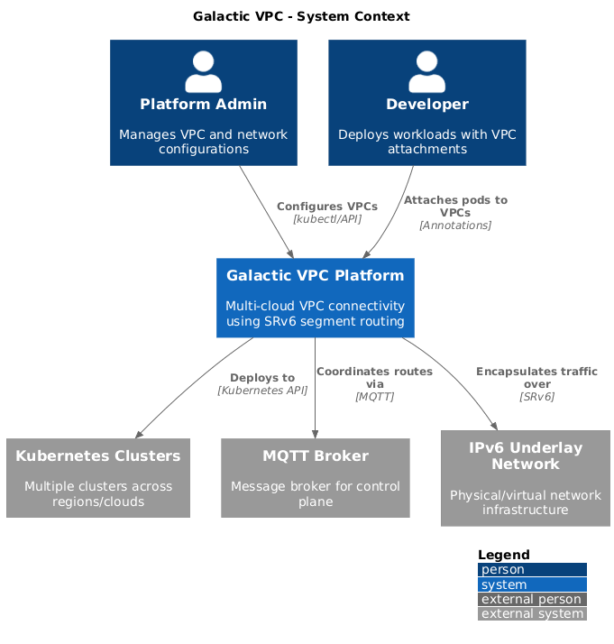
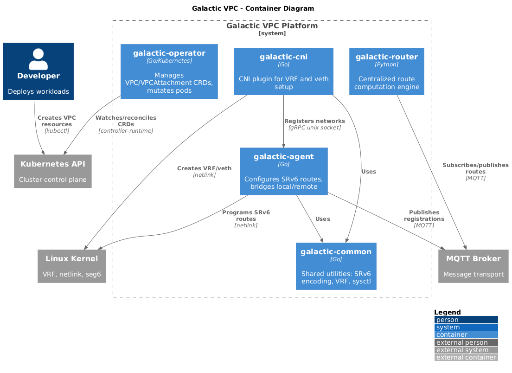
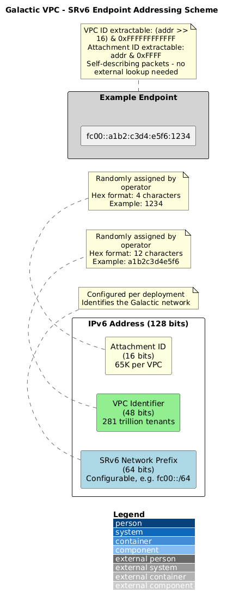
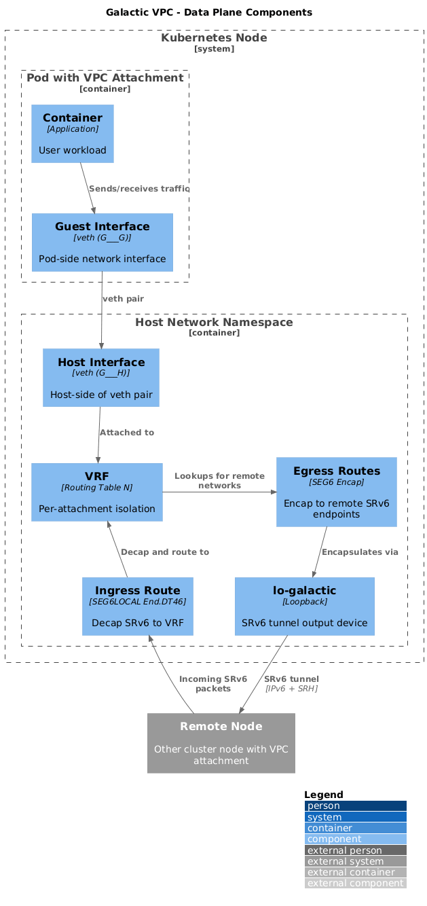
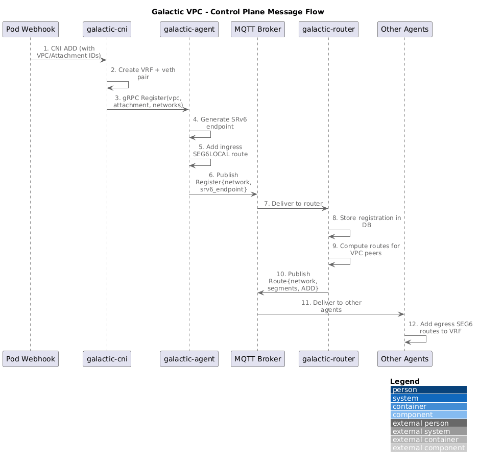
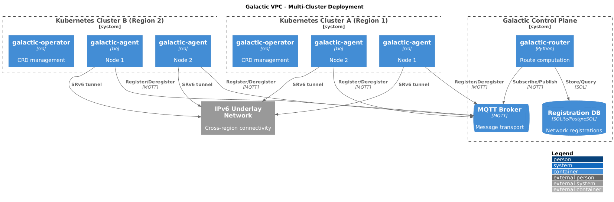

# Galactic VPC Architecture Overview

## What is Galactic?

Galactic solves a fundamental challenge in cloud computing: **how do you give each customer their own private, isolated network that works seamlessly across multiple data centers and cloud providers?**

Think of it like an apartment building. Each tenant has their own unit with their own locks, but they all share the same physical building and hallways. Galactic creates "virtual apartments" (VPCs) for network traffic, where each customer's data stays completely separate from everyone else's—even though it's all flowing through the same physical network infrastructure.

### The Problem

When you run applications in Kubernetes across multiple clusters (perhaps in different regions or clouds), you face several challenges:

1. **Isolation** - How do you ensure Customer A's traffic never mixes with Customer B's?
2. **Connectivity** - How do applications in one cluster talk to applications in another?
3. **Scalability** - How do you support thousands of customers without running out of network addresses?
4. **Simplicity** - How do you make this work without requiring a PhD in networking?

### The Solution

Galactic creates **Virtual Private Clouds (VPCs)**—isolated network environments where a customer's applications can communicate freely with each other, but are completely invisible to other customers. These VPCs work across clusters, regions, and even cloud providers.

Under the hood, Galactic uses a technology called **SRv6 (Segment Routing over IPv6)**, which embeds routing instructions directly into packet headers. This is like putting the delivery address AND the exact route to take right on the envelope, rather than relying on each post office to figure out the next step.

---

## How It Works (The Simple Version)



<details>
<summary>View PlantUML Source</summary>

See [architecture/simple-flow.puml](./architecture/simple-flow.puml)

</details>

**Key concepts:**

1. **VPC (Virtual Private Cloud)** - Your isolated network. Only your applications can see and talk to each other.

2. **VPCAttachment** - Connects a specific application (pod) to a VPC. Think of it as plugging your laptop into a specific network.

3. **SRv6 Envelope** - When traffic leaves your application, Galactic wraps it in a special IPv6 packet that includes your VPC ID. This ensures it stays isolated and reaches the right destination.

---

## System Overview

The following diagram shows Galactic's relationship with users and external systems.



<details>
<summary>View PlantUML Source</summary>

See [architecture/context.puml](./architecture/context.puml)

</details>

### Key Actors

| Actor | Role |
|-------|------|
| **Platform Admin** | Creates and manages VPCs for customers |
| **Developer** | Deploys applications and connects them to VPCs |
| **Kubernetes Clusters** | Where applications run (can span multiple regions/clouds) |
| **MQTT Broker** | Message bus that coordinates routing information |
| **IPv6 Network** | The underlying physical/virtual network infrastructure |

---

## Components

Galactic is made up of six components that work together. Think of them as specialized workers, each with a specific job.



<details>
<summary>View PlantUML Source</summary>

See [architecture/containers.puml](./architecture/containers.puml)

</details>

### Component Summary

| Component | What It Does | Analogy |
|-----------|--------------|---------|
| **galactic-operator** | Watches for VPC/VPCAttachment resources and configures the system | The building manager who assigns apartments |
| **galactic-agent** | Runs on each node, programs network routes | The local mail carrier who knows the routes |
| **galactic-cni** | Connects pods to their VPC when they start | The person who plugs in your network cable |
| **galactic-router** | Central brain that computes routes across all clusters | The postal service headquarters |
| **galactic-common** | Shared utilities used by other components | The toolbox everyone shares |
| **galactic-lab** | Test environment for development | The training facility |

### How They Work Together

1. **Admin creates a VPC** → `galactic-operator` assigns it a unique ID
2. **Developer deploys a pod with VPC annotation** → `galactic-operator` notices and prepares the pod
3. **Pod starts** → `galactic-cni` creates the network connection and tells `galactic-agent`
4. **Agent registers with router** → `galactic-agent` sends a message via MQTT to `galactic-router`
5. **Router advertises routes** → `galactic-router` tells all other agents "this network is now reachable here"
6. **Traffic flows** → Packets are wrapped in SRv6 and delivered across the network

---

## Defining Your Network (Kubernetes Resources)

Galactic extends Kubernetes with two custom resources. You define these in YAML, just like any other Kubernetes resource.

### VPC - Your Private Network

A VPC defines an isolated network with one or more IP address ranges.

```yaml
apiVersion: galactic.datumapis.com/v1alpha
kind: VPC
metadata:
  name: customer-acme        # Friendly name
spec:
  networks:
    - 10.0.0.0/16            # Private IPv4 range (65,536 addresses)
    - fd00:acme::/64         # Private IPv6 range
status:
  ready: true
  identifier: "a1b2c3d4e5f6" # System-assigned unique ID (used internally)
```

### VPCAttachment - Connecting a Pod

A VPCAttachment connects a specific application to a VPC and configures its network interface.

```yaml
apiVersion: galactic.datumapis.com/v1alpha
kind: VPCAttachment
metadata:
  name: acme-web-server
spec:
  vpc:
    name: customer-acme      # Which VPC to join
  interface:
    name: eth1               # Network interface name inside the pod
    addresses:
      - 10.0.1.10/24         # IP address for this pod
  routes:
    - destination: 10.0.2.0/24   # Route to database subnet
      gateway: 10.0.1.1          # Via this gateway
status:
  ready: true
  identifier: "1234"         # System-assigned attachment ID
```

### Connecting Your Pod

Add a simple annotation to your pod to connect it to a VPC:

```yaml
apiVersion: v1
kind: Pod
metadata:
  name: my-web-server
  annotations:
    k8s.v1alpha.galactic.datumapis.com/vpc-attachment: acme-web-server
spec:
  containers:
    - name: nginx
      image: nginx
```

That's it! When this pod starts, Galactic automatically connects it to the VPC.

---

## The Magic: How Traffic Stays Isolated

This section explains how Galactic keeps each customer's traffic separate, even on shared infrastructure.

### The Secret: Identity in the Address

Galactic's key innovation is embedding the VPC and attachment IDs directly into network addresses:



<details>
<summary>View PlantUML Source</summary>

See [architecture/srv6-addressing.puml](./architecture/srv6-addressing.puml)

</details>

**What this means:**
- Every packet carries its VPC identity in the destination address itself
- No external database lookup needed to know which VPC a packet belongs to
- Supports 281 trillion unique VPCs (2^48)
- Each VPC can have 65,000 attachments (2^16)

### Traffic Flow Example

Imagine Pod A (in Cluster 1) wants to talk to Pod B (in Cluster 2), both in the same VPC:



<details>
<summary>View PlantUML Source</summary>

See [architecture/data-plane.puml](./architecture/data-plane.puml)

</details>

**Step by step:**

1. **Pod A sends a packet** to Pod B's VPC address (10.0.2.5)
2. **Galactic wraps the packet** in an SRv6 envelope containing:
   - The destination's SRv6 address (includes VPC ID + attachment ID)
   - A list of network hops to take (the "segment list")
3. **The packet travels** across the physical network, following the segment list
4. **At the destination node**, Galactic unwraps the SRv6 envelope
5. **The original packet** is delivered to Pod B

The physical network never sees the original packet contents—only the SRv6 envelope. This provides isolation without requiring physical network separation.

---

## Route Distribution: How Everyone Learns the Map

When a new pod joins a VPC, how do all the other nodes learn how to reach it?



<details>
<summary>View PlantUML Source</summary>

See [architecture/control-plane.puml](./architecture/control-plane.puml)

</details>

**The flow:**

1. **Pod starts** → CNI plugin creates network setup and registers with local agent
2. **Agent generates SRv6 endpoint** → Creates unique address from VPC ID + attachment ID
3. **Agent publishes to MQTT** → "Hey, network 10.0.1.0/24 is now reachable at this SRv6 endpoint"
4. **Router receives message** → Stores in database, computes routes
5. **Router notifies other agents** → "To reach 10.0.1.0/24, send to this SRv6 endpoint"
6. **Other agents program routes** → Now traffic can flow

This happens automatically whenever pods are created or deleted.

---

## Multi-Cluster Deployment

Galactic is designed from the ground up for multi-cluster environments.



<details>
<summary>View PlantUML Source</summary>

See [architecture/multi-cluster.puml](./architecture/multi-cluster.puml)

</details>

**Key points:**

- **One router** coordinates all clusters (can be made highly available)
- **Agents in each cluster** register their local pods
- **MQTT broker** connects everything (can be clustered for reliability)
- **SRv6 tunnels** carry traffic between clusters over any IPv6 network
- **VPCs span clusters** - a single VPC can include pods in different regions/clouds

---

## Why SRv6? (Design Decision)

You might wonder: why SRv6 instead of other networking technologies?

| Technology | Overhead | Multi-tenant Support | Path Control | Cloud-Native |
|------------|----------|---------------------|--------------|--------------|
| **SRv6** | Low | Built into address | Full control | Yes |
| VXLAN | High (+50 bytes per packet) | 16 million IDs | Limited | Partially |
| GRE | Medium | Limited | None | No |
| IPsec | High | Limited | None | Partially |

**Why SRv6 wins for this use case:**

1. **Native IPv6** - No additional encapsulation overhead; works with modern cloud infrastructure
2. **Identity in address** - VPC isolation without external lookups
3. **Path control** - Can specify exact network path for traffic engineering
4. **Linux kernel support** - No special hardware required; runs on any Linux node
5. **Scalability** - 48-bit VPC IDs = virtually unlimited tenants

---

## Scalability and Limits

| Resource | Capacity | Notes |
|----------|----------|-------|
| VPCs | ~281 trillion | 48-bit identifier space |
| Attachments per VPC | ~65,000 | 16-bit identifier space |
| Nodes per cluster | Unlimited | Each node runs one agent |
| Clusters | Unlimited | All connect to shared router |

---

## Comparison with Alternatives

How does Galactic compare to other SRv6 networking projects?

| Feature | Galactic | Calico-VPP | Cilium | SONiC |
|---------|----------|------------|--------|-------|
| **Primary use case** | Multi-tenant VPC | High-performance CNI | Service mesh + steering | Switch fabric |
| **Multi-tenant by design** | Yes | No (policy-based) | No | No |
| **Cross-cluster native** | Yes (MQTT) | Separate product | Separate product | N/A |
| **Data plane** | Linux kernel | VPP (complex) | eBPF | Hardware ASIC |
| **Deployment complexity** | Low | High | Medium | Hardware-specific |

**When to use Galactic:**
- You need true multi-tenant network isolation
- You're running across multiple Kubernetes clusters
- You want simplicity (kernel-based, no special hardware)
- You need massive scale (trillions of potential VPCs)

---

## Glossary

| Term | Definition |
|------|------------|
| **VPC** | Virtual Private Cloud - An isolated network environment for a tenant |
| **VPCAttachment** | A connection between a pod and a VPC |
| **SRv6** | Segment Routing over IPv6 - A technology that encodes routing instructions in IPv6 headers |
| **Segment** | A waypoint in a network path, encoded as an IPv6 address |
| **VRF** | Virtual Routing and Forwarding - A Linux kernel feature that creates separate routing tables |
| **CNI** | Container Network Interface - The standard for Kubernetes networking plugins |
| **MQTT** | A lightweight messaging protocol used for control plane communication |
| **Encapsulation** | Wrapping a packet inside another packet (like putting a letter in an envelope) |
| **Decapsulation** | Unwrapping a packet to reveal the original contents |
| **Netlink** | Linux kernel interface for configuring network settings |
| **veth** | Virtual ethernet - A pair of connected network interfaces, like a virtual cable |

---

## Generating Diagrams

The architecture diagrams use PlantUML with the C4 model. To regenerate:

```bash
# Using Docker (no installation required)
docker run --rm -v "$(pwd)/docs/architecture:/data" plantuml/plantuml -tpng "/data/*.puml"
```

---

## Learn More

### External Resources

- [SRv6 Network Programming (RFC 8986)](https://datatracker.ietf.org/doc/html/rfc8986) - The official specification
- [ROSE Project](https://netgroup.github.io/rose/) - Research on Open SRv6 Ecosystem
- [Segment Routing](https://www.segment-routing.net/) - Community resources

### Internal Documentation

- [Datum Galactic VPC Documentation](http://datum.net/docs/galactic-vpc/)

---

## Technical Deep Dive

The sections below provide additional technical detail for those who want to understand the implementation.

<details>
<summary><strong>SRv6 Address Encoding</strong></summary>

The SRv6 endpoint address is constructed by combining three parts (see the [SRv6 Addressing Scheme diagram](#the-secret-identity-in-the-address) above).

Code from `galactic-common/util/util.go`:

```go
// Encoding
endpoint = prefix | (vpcID << 16) | attachmentID

// Decoding
vpcID = (endpoint >> 16) & 0xFFFFFFFFFFFF
attachmentID = endpoint & 0xFFFF
```

</details>

<details>
<summary><strong>Route Configuration Commands</strong></summary>

**Ingress route (decapsulation):**
```bash
ip -6 route add <srv6_endpoint>/128 \
  encap seg6local action End.DT46 vrftable <N> \
  dev eth0
```

**Egress route (encapsulation):**
```bash
ip -6 route add <remote_network> \
  encap seg6 mode encap segs <segment_list> \
  dev lo-galactic \
  table <N>
```

</details>

<details>
<summary><strong>Kernel Configuration (sysctls)</strong></summary>

For each VRF and host interface:

| Setting | Value | Purpose |
|---------|-------|---------|
| `net.ipv4.conf.{iface}.rp_filter` | 0 | Disable reverse path filtering |
| `net.ipv4.conf.{iface}.forwarding` | 1 | Enable IPv4 forwarding |
| `net.ipv6.conf.{iface}.forwarding` | 1 | Enable IPv6 forwarding |
| `net.ipv4.conf.{iface}.proxy_arp` | 1 | Enable ARP proxy |
| `net.ipv6.conf.{iface}.proxy_ndp` | 1 | Enable NDP proxy |

</details>

<details>
<summary><strong>Protocol Buffer Schemas</strong></summary>

**Local API** (`galactic-agent/api/local/local.proto`):
```protobuf
service Local {
  rpc Register(RegisterRequest) returns (RegisterReply);
  rpc Deregister(DeregisterRequest) returns (DeregisterReply);
}

message RegisterRequest {
  string vpc = 1;
  string vpcattachment = 2;
  repeated string networks = 3;
}
```

**Remote API** (`galactic-agent/api/remote/remote.proto`):
```protobuf
message Envelope {
  oneof kind {
    Register register = 1;
    Deregister deregister = 2;
    Route route = 3;
  }
}

message Route {
  string network = 1;
  string srv6_endpoint = 2;
  repeated string srv6_segments = 3;
  Status status = 4;  // ADD or DELETE
}
```

</details>

<details>
<summary><strong>MQTT Topic Structure</strong></summary>

| Direction | Topic Pattern | Purpose |
|-----------|---------------|---------|
| Agent → Router | `{base}/{worker_id}/send` | Registration/deregistration |
| Router → Agent | `{base}/{worker_id}/receive` | Route advertisements |

</details>
