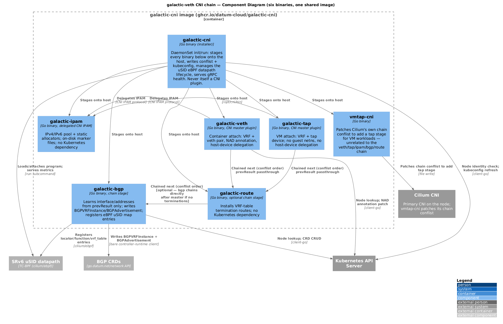
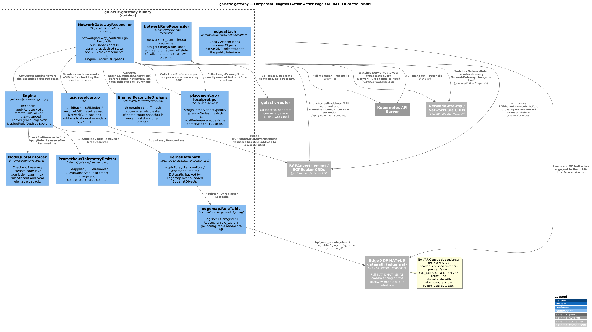

# Galactic — C4 Diagrams

C4-model diagrams (PlantUML, rendered from the `.puml` sources in this
directory) of Galactic's applications. See
[docs/agents/ARCHITECTURE-CNI.md](../agents/ARCHITECTURE-CNI.md),
[docs/agents/ARCHITECTURE-ROUTER.md](../agents/ARCHITECTURE-ROUTER.md), and
[docs/agents/ARCHITECTURE-GATEWAY.md](../agents/ARCHITECTURE-GATEWAY.md) for
the prose these diagrams summarize.

**Regenerating:** edit the `.puml` source, then re-render with Docker or
Podman:

```bash
podman run --rm -v "$(pwd)/docs/architecture:/data:Z" docker.io/plantuml/plantuml -tpng "/data/*.puml" "/data/**/*.puml"
```

Commit both the `.puml` source and the regenerated `.png` — GitHub does not
render PlantUML inline.

---

## Level 1 — System Context

Galactic as a whole in its environment: the people/systems that use it and
the external systems it depends on. The `Galactic` boundary is split into
two systems here — `Galactic core` (the CNI attach chain + BGP/EVPN control
plane, on every node) and `Galactic edge gateway` (`galactic-gateway`, on
dedicated gateway-role nodes only) — so the client-facing VIP path and the
Active-Active BGP routes it publishes are visible even at this zoom level,
rather than collapsing into one undifferentiated box.


## Level 2 — Container: the three deployable applications

The three separately-built, separately-deployed applications — the
`galactic-veth` CNI chain, `galactic-router`, and `galactic-gateway` — plus
the kernel eBPF datapaths each one drives and the CRDs that connect them.
`galactic-gateway` is deployed as a second container in the same
`hostNetwork` pod as `galactic-router` on gateway-role nodes only, which is
why the diagram shows them co-located but connected by no direct RPC — a
crash in one does not take down the other.


## Level 3 — Component: the CNI chain's six binaries

`galactic-veth` (the CNI-facing container-attach binary) is not a single
process — it's a **chain of six small Go binaries**, all shipped in one
`ghcr.io/datum-cloud/galactic-cni` image and staged onto each node by the
`galactic-cni` installer. This diagram is the one place all six binaries —
`galactic-cni`, `galactic-veth`, `galactic-tap`, `galactic-ipam`,
`galactic-bgp`, `galactic-route`, plus the unrelated `vmtap-cni` — appear
together, in the order the CNI runtime actually invokes them.



## Level 3 — Component: galactic-gateway internals

`galactic-gateway`'s own internals: the two reconcilers
(`NetworkGatewayReconciler`/`NetworkRuleReconciler`), the backend-uSID
resolver, `Engine`'s convergence loop and the `Datapath`/`QuotaEnforcer`/
`TelemetryEmitter` interfaces it drives, crash recovery, and the
`edgemap`/`edgeattach` packages that load and talk to the compiled
`edge_nat` XDP program. Mirrors the CNI chain diagram above one level
down, for the gateway side instead.



---

## Source files

| Diagram                | Source                                                        |
| ----------------------- | -------------------------------------------------------------- |
| System Context           | [`context.puml`](./context.puml)                               |
| Container                | [`containers.puml`](./containers.puml)                          |
| CNI chain components     | [`components/cni-chain.puml`](./components/cni-chain.puml)       |
| galactic-gateway components | [`components/gateway.puml`](./components/gateway.puml)      |
