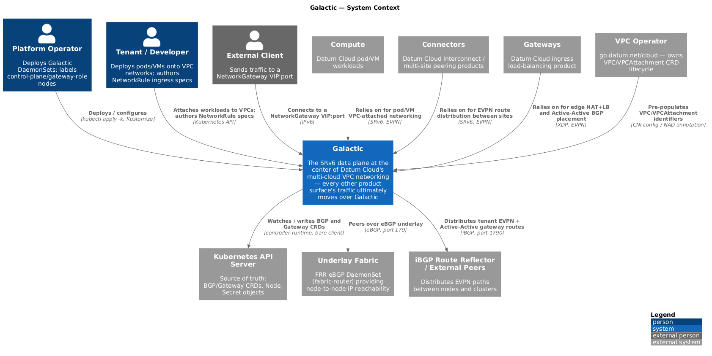
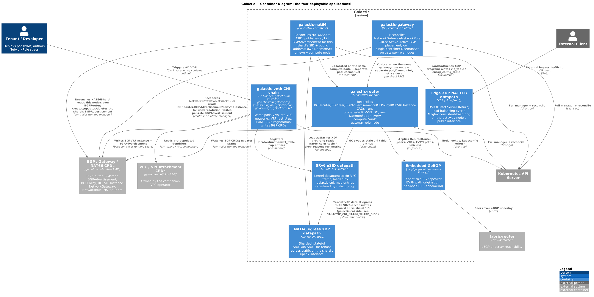

# Galactic — C4 Diagrams

C4-model diagrams (PlantUML, rendered from the `.puml` sources in this
directory) of Galactic's applications. See
[docs/agents/ARCHITECTURE-CNI.md](../agents/ARCHITECTURE-CNI.md),
[docs/agents/ARCHITECTURE-ROUTER.md](../agents/ARCHITECTURE-ROUTER.md), and
[docs/agents/ARCHITECTURE-GATEWAY.md](../agents/ARCHITECTURE-GATEWAY.md) for
the prose these diagrams summarize.

**Regenerating:** edit the `.puml` source, then re-render with Docker or
Podman:

```bash
podman run --rm -v "$(pwd)/docs/architecture:/data:Z" docker.io/plantuml/plantuml -tpng "/data/*.puml" "/data/**/*.puml"
```

Commit both the `.puml` source and the regenerated `.png` — GitHub does not
render PlantUML inline.

---

## Level 1 — System Context

Galactic as a single box in its environment: why it exists, not how it's
built internally. It's the shared networking substrate at the center of
Datum Cloud's multi-cloud VPC story — the `Compute` (pod/VM workloads),
`Connectors` (interconnect/multi-site peering), and `Gateways` (ingress
load-balancing) product surfaces all move their traffic over Galactic,
alongside the people/systems that deploy and configure it and the external
systems it depends on (Kubernetes API, the companion VPC operator, the
underlay fabric, iBGP peers).



## Level 2 — Container: the three deployable applications

The three separately-built, separately-deployed applications — the
`galactic-veth` CNI chain, `galactic-router`, and `galactic-gateway` — plus
the kernel eBPF datapaths each one drives and the CRDs that connect them.
`galactic-gateway` is deployed as a second container in the same
`hostNetwork` pod as `galactic-router` on gateway-role nodes only, which is
why the diagram shows them co-located but connected by no direct RPC — a
crash in one does not take down the other.



---

## Source files

| Diagram                | Source                                                        |
| ----------------------- | -------------------------------------------------------------- |
| System Context           | [`context.puml`](./context.puml)                               |
| Container                | [`containers.puml`](./containers.puml)                          |
