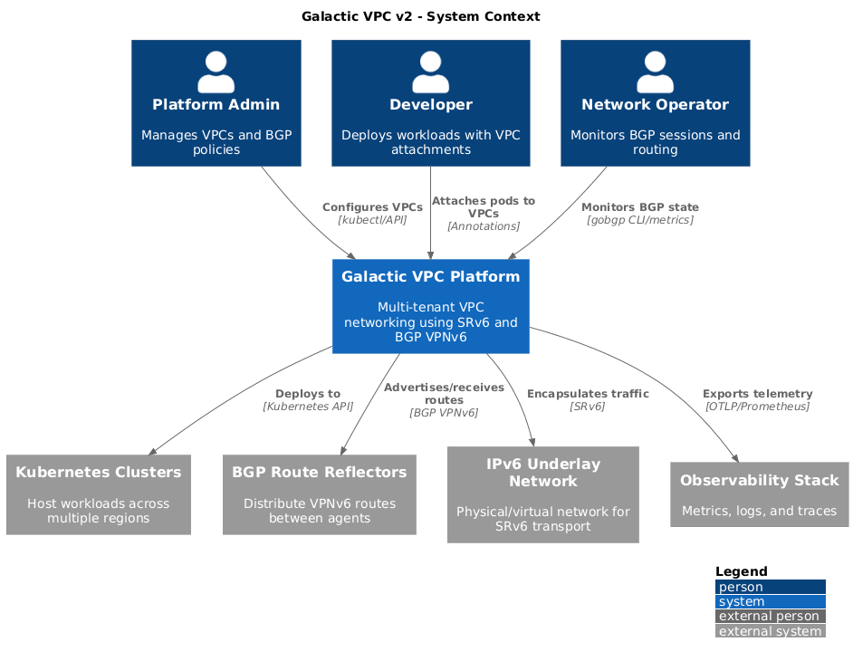
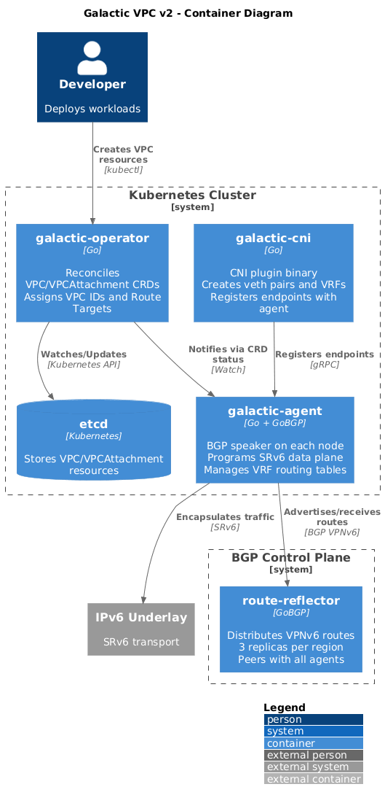
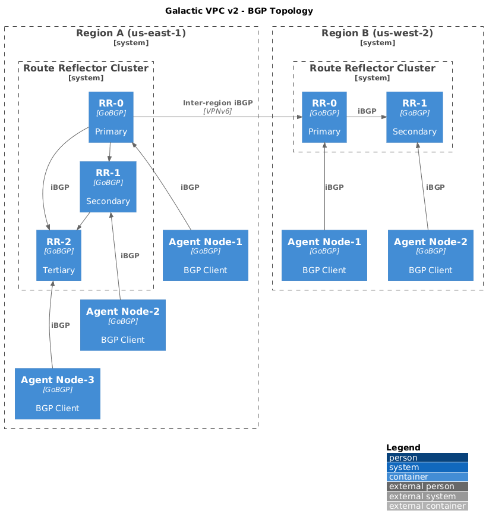
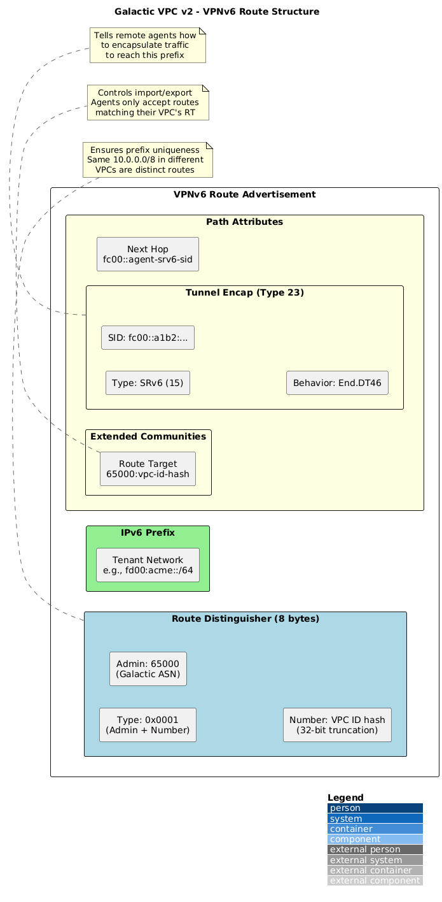
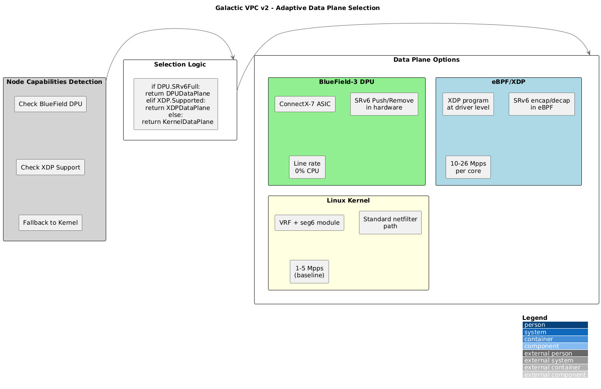
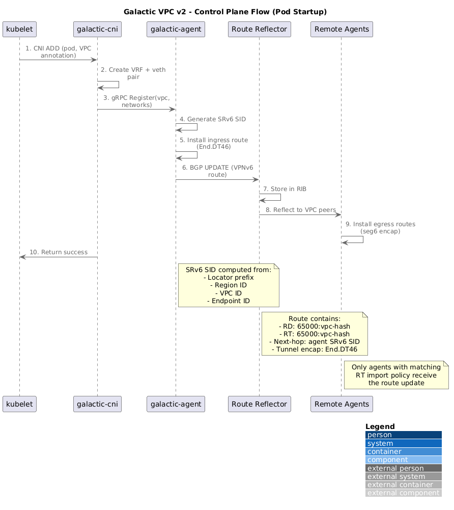
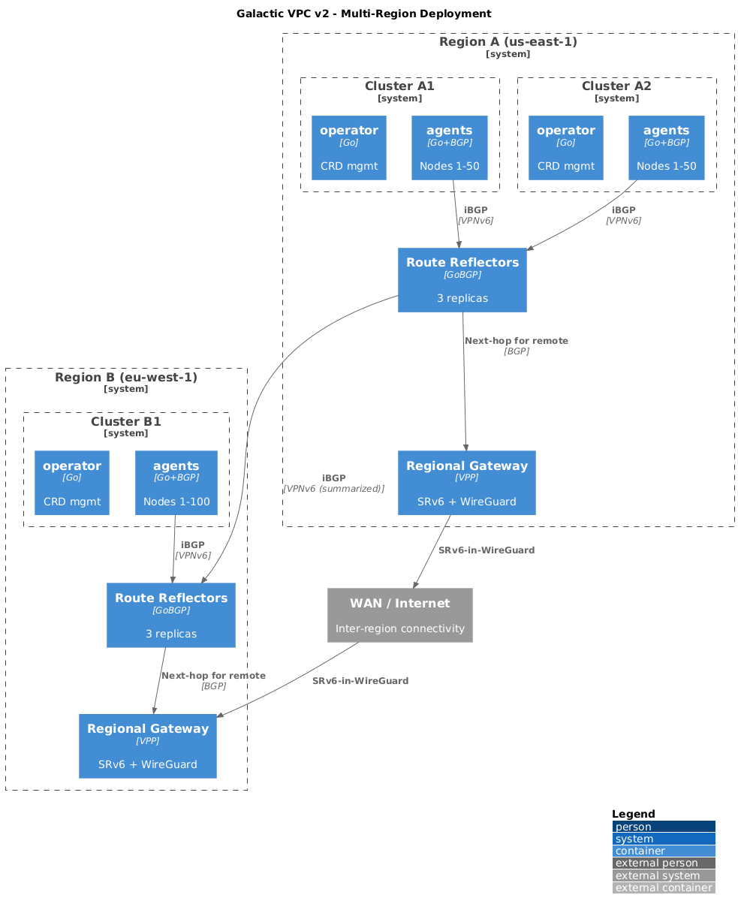

# Galactic VPC v2 Architecture

## Executive Summary

This document describes the next-generation architecture for Galactic VPC, a multi-tenant virtual private cloud platform built on SRv6 (Segment Routing over IPv6). The key architectural change is replacing the MQTT-based control plane with BGP VPNv6, leveraging industry-standard routing protocols for endpoint discovery and route distribution.

### Key Changes from v1

| Aspect | v1 (Current) | v2 (Proposed) |
|--------|--------------|---------------|
| Route distribution | MQTT + custom router | BGP VPNv6 |
| Control plane | Centralized Python router | Distributed route reflectors |
| Cross-region | Manual MQTT federation | Native iBGP mesh |
| Data plane | Kernel-only | Adaptive (kernel/eBPF/DPU) |
| Agent communication | MQTT pub/sub | BGP peering |

### Components Eliminated

- `galactic-router` (Python) → Replaced by standard BGP route reflectors
- MQTT Broker → Replaced by BGP peering
- Custom protobuf wire protocol → Replaced by BGP NLRI encoding

---

## Design Goals

| Goal | Target | Rationale |
|------|--------|-----------|
| **Scale** | 1M+ VPCs, 100M+ endpoints | Enterprise and hyperscaler deployments |
| **Convergence** | <1s intra-region, <5s inter-region | Fast failover for production workloads |
| **Availability** | No single point of failure | Regional independence during partitions |
| **Performance** | Line-rate forwarding | Hardware acceleration where available |
| **Operations** | Standard tooling | BGP debuggable with existing NOC tools |
| **Simplicity** | Fewer custom components | Leverage proven infrastructure |

---

## System Context

The following diagram shows Galactic's relationship with external systems and users.



<details>
<summary>View PlantUML Source</summary>

See [v2-context.puml](./v2-context.puml)

</details>

### Key Actors

| Actor | Role |
|-------|------|
| **Platform Admin** | Manages VPCs, configures BGP policies |
| **Developer** | Deploys workloads with VPC attachments |
| **Network Operator** | Monitors BGP sessions, troubleshoots routing |
| **Kubernetes Clusters** | Host workloads across regions |
| **Route Reflectors** | Distribute VPNv6 routes between agents |
| **IPv6 Underlay** | Physical/virtual network for SRv6 transport |

---

## Container Architecture

The system consists of four main components deployed across Kubernetes clusters.



<details>
<summary>View PlantUML Source</summary>

See [v2-containers.puml](./v2-containers.puml)

</details>

### Component Summary

| Component | Language | Deployment | Role |
|-----------|----------|------------|------|
| **galactic-operator** | Go | Deployment (1 per cluster) | CRD reconciliation, VPC/RT assignment |
| **galactic-agent** | Go + GoBGP | DaemonSet (every node) | BGP speaker, SRv6 data plane |
| **galactic-cni** | Go | Binary on node | Pod network attachment |
| **route-reflector** | GoBGP | StatefulSet (3 per region) | BGP route distribution |

---

## BGP Architecture

### Why BGP VPNv6?

BGP with the VPNv6 address family (AFI 2, SAFI 128) is the industry standard for multi-tenant route distribution:

- **Route Distinguisher (RD)**: Ensures prefix uniqueness across VPCs
- **Route Target (RT)**: Controls route import/export per VPC
- **SRv6 TLV**: Carries encapsulation information
- **Proven scale**: Powers MPLS/VPN networks globally

### BGP Topology



<details>
<summary>View PlantUML Source</summary>

See [v2-bgp-topology.puml](./v2-bgp-topology.puml)

</details>

### Route Reflector Design

Each region deploys a cluster of route reflectors for high availability:

```
Region Cluster:
├── route-reflector-0 (primary)
├── route-reflector-1 (secondary)
└── route-reflector-2 (tertiary)

All RRs peer with each other (full mesh within cluster)
All agents peer with all RRs (client sessions)
RR clusters peer across regions (inter-region iBGP)
```

**Configuration:**

| Parameter | Value | Rationale |
|-----------|-------|-----------|
| ASN | 65000 (single AS) | iBGP within organization |
| Cluster ID | Per-region unique | Loop prevention |
| Hold time | 9 seconds | Fast failure detection |
| Keepalive | 3 seconds | Standard 1/3 ratio |
| Address family | VPNv6 (ipv6-mpls-vpn) | Multi-tenant routes |

### Agent BGP Sessions

Each galactic-agent establishes BGP sessions with route reflectors:

```
Agent Configuration:
├── Peer with RR-0, RR-1, RR-2 (all local RRs)
├── Passive mode (don't listen on 179)
├── Graceful restart enabled
└── Add-path send/receive (multiple paths)
```

**Route policy per agent:**

| Direction | Policy |
|-----------|--------|
| Export | Advertise only locally-attached VPC networks |
| Import | Accept routes matching local VPC route targets |

---

## VPNv6 Route Encoding

### Route Structure

Each VPC endpoint is advertised as a VPNv6 route:



<details>
<summary>View PlantUML Source</summary>

See [v2-vpnv6-route.puml](./v2-vpnv6-route.puml)

</details>

### Route Distinguisher Format

```
Type 1 RD (Administrator + Assigned Number):
┌────────────────┬────────────────────────────┐
│  Type (2 bytes)│  Administrator (4 bytes)   │
│     0x0001     │  Galactic AS (65000)       │
├────────────────┴────────────────────────────┤
│  Assigned Number (4 bytes)                  │
│  VPC ID hash (32-bit truncation)            │
└─────────────────────────────────────────────┘

Example: 65000:0xA1B2C3D4
```

### Route Target Assignment

Each VPC receives import and export route targets:

```yaml
apiVersion: galactic.datumapis.com/v1alpha
kind: VPC
metadata:
  name: customer-acme
spec:
  networks:
    - 10.0.0.0/16
status:
  identifier: "a1b2c3d4e5f6"
  routeDistinguisher: "65000:2715090900"  # Hash of VPC ID
  routeTargets:
    import:
      - "65000:2715090900"    # Import own routes
    export:
      - "65000:2715090900"    # Export to own VPC
```

**Multi-VPC connectivity** (future): Add additional import RTs to allow controlled peering between VPCs.

### SRv6 Attributes

Routes carry SRv6 encapsulation information in BGP attributes:

```
BGP Tunnel Encapsulation Attribute (Type 23):
├── Tunnel Type: SRv6 (15)
└── Sub-TLVs:
    ├── SRv6 SID Information:
    │   └── SID: fc00::a1b2:c3d4:e5f6:1234
    └── SRv6 Endpoint Behavior:
        └── Behavior: End.DT46 (decap to VRF)
```

---

## SRv6 Addressing Scheme

### Address Structure

```
128-bit SRv6 SID:
┌────────────────┬──────────────┬──────────────┬──────────────┐
│  Locator Block │    Region    │    VPC ID    │   Endpoint   │
│    32 bits     │   16 bits    │   48 bits    │   32 bits    │
└────────────────┴──────────────┴──────────────┴──────────────┘

Example: fc00:0001:a1b2:c3d4:e5f6:0000:1234:0000
         ├──────┤├───┤├─────────────┤├─────────┤
         Locator Region    VPC ID      Endpoint
```

### Encoding Functions

```go
// Encode SRv6 SID from components
func EncodeSRv6SID(locator net.IP, region uint16, vpcID uint64, endpoint uint32) net.IP {
    sid := make(net.IP, 16)
    copy(sid[0:4], locator[0:4])           // 32-bit locator
    binary.BigEndian.PutUint16(sid[4:6], region)
    // VPC ID spans bytes 6-12 (48 bits)
    sid[6] = byte(vpcID >> 40)
    sid[7] = byte(vpcID >> 32)
    sid[8] = byte(vpcID >> 24)
    sid[9] = byte(vpcID >> 16)
    sid[10] = byte(vpcID >> 8)
    sid[11] = byte(vpcID)
    binary.BigEndian.PutUint32(sid[12:16], endpoint)
    return sid
}

// Decode VPC ID from SRv6 SID
func DecodeVPCID(sid net.IP) uint64 {
    return uint64(sid[6])<<40 | uint64(sid[7])<<32 |
           uint64(sid[8])<<24 | uint64(sid[9])<<16 |
           uint64(sid[10])<<8 | uint64(sid[11])
}
```

### Capacity

| Component | Bits | Capacity |
|-----------|------|----------|
| Region | 16 | 65,536 regions |
| VPC ID | 48 | 281 trillion VPCs |
| Endpoint | 32 | 4 billion per VPC |

---

## Data Plane Architecture

### Adaptive Data Plane Selection

The agent selects the optimal data plane based on node capabilities:



<details>
<summary>View PlantUML Source</summary>

See [v2-data-plane.puml](./v2-data-plane.puml)

</details>

### Data Plane Options

| Option | Performance | Requirements | Use Case |
|--------|-------------|--------------|----------|
| **Kernel** | 1-5 Mpps | Linux 4.14+ | Default fallback |
| **eBPF/XDP** | 10-26 Mpps | Linux 5.x, XDP-capable NIC | High-throughput nodes |
| **BlueField-3** | Line rate | ConnectX-7 DPU | Maximum performance |

### Kernel Data Plane (Default)

Uses Linux VRF and seg6 modules:

```bash
# Per-VPC VRF
ip link add vrf-${VPC_ID} type vrf table ${TABLE_ID}
ip link set vrf-${VPC_ID} up

# Ingress: Decapsulate SRv6 to VRF
ip -6 route add ${LOCAL_SID}/128 \
    encap seg6local action End.DT46 vrftable ${TABLE_ID} \
    dev eth0

# Egress: Encapsulate with SRv6
ip -6 route add ${REMOTE_NETWORK} \
    encap seg6 mode encap segs ${SEGMENT_LIST} \
    dev lo table ${TABLE_ID}
```

### eBPF/XDP Data Plane (High Performance)

```
┌─────────────┐     ┌─────────────┐     ┌─────────────┐
│   NIC RX    │────►│  XDP prog   │────►│   Kernel    │
│             │     │  (encap/    │     │   or pass   │
│             │     │   decap)    │     │             │
└─────────────┘     └─────────────┘     └─────────────┘
                           │
                    Fast path for
                    known SRv6 SIDs
```

### BlueField-3 Data Plane (Hardware Offload)

```
┌─────────────┐     ┌─────────────┐     ┌─────────────┐
│   Network   │────►│  BlueField  │────►│  Host CPU   │
│             │     │  ConnectX-7 │     │  (control   │
│             │     │  SRv6 ASIC  │     │   only)     │
└─────────────┘     └─────────────┘     └─────────────┘
                           │
                    Full SRv6 encap/decap
                    in hardware
```

---

## Control Plane Flow

### Pod Startup Sequence



<details>
<summary>View PlantUML Source</summary>

See [v2-control-flow.puml](./v2-control-flow.puml)

</details>

### Sequence Description

1. **Pod Created**: Kubernetes schedules pod with VPC annotation
2. **CNI Invoked**: kubelet calls galactic-cni with pod network config
3. **VRF Setup**: CNI creates VRF and veth pair for pod
4. **Agent Registration**: CNI calls agent via gRPC to register endpoint
5. **SRv6 SID Generated**: Agent computes SRv6 SID from VPC ID + endpoint ID
6. **Local Route Installed**: Agent programs ingress decap route
7. **BGP Advertisement**: Agent advertises VPNv6 route to route reflectors
8. **Route Reflection**: RRs distribute route to other agents in VPC
9. **Remote Routes Installed**: Other agents program egress encap routes
10. **Traffic Flows**: Pods can communicate via SRv6

### Convergence Time Budget

| Phase | Target | Mechanism |
|-------|--------|-----------|
| CNI + Agent registration | <100ms | Local gRPC |
| BGP advertisement to RR | <100ms | TCP, pre-established session |
| RR reflection to peers | <100ms | BGP update batching |
| Remote agent route install | <100ms | Netlink |
| **Total (same region)** | **<500ms** | |
| Cross-region propagation | <3s | Inter-region BGP |

---

## Multi-Region Deployment

### Regional Architecture



<details>
<summary>View PlantUML Source</summary>

See [v2-multi-region.puml](./v2-multi-region.puml)

</details>

### Cross-Region BGP

Route reflectors in different regions peer via iBGP:

```
Region A RRs ◄────── iBGP ──────► Region B RRs
     │                                  │
     │  VPNv6 routes with              │
     │  SRv6 next-hop pointing         │
     │  to regional gateway            │
     │                                  │
     ▼                                  ▼
Regional Gateway              Regional Gateway
(SRv6 inter-region tunnel)
```

### Route Summarization

At region boundaries, routes are summarized to reduce state:

```
Within Region A:
  - 10.0.1.0/24 via fc00:1::agent1
  - 10.0.2.0/24 via fc00:1::agent2
  - 10.0.3.0/24 via fc00:1::agent3

Advertised to Region B:
  - 10.0.0.0/16 via fc00:1::gateway  (summarized)
```

---

## Security Model

### Threat Model

| Threat | Mitigation |
|--------|------------|
| VPC spoofing | Route targets enforce VPC isolation |
| Route injection | BGP MD5 authentication + RPKI (optional) |
| Data interception (inter-region) | WireGuard tunnels between gateways |
| Endpoint impersonation | Agent validates pod identity via kubelet |
| Control plane tampering | mTLS between agents and RRs |

### BGP Security

```yaml
# Route reflector peer configuration
neighbors:
  - neighbor-address: "agent-1"
    peer-asn: 65000
    auth-password: "${BGP_MD5_PASSWORD}"  # MD5 authentication
    ttl-security:
      min-ttl: 254  # Require direct connection
```

### Data Plane Security

```
Intra-region:  SRv6 plaintext (trusted fabric)
Inter-region:  SRv6-in-WireGuard

┌─────────────────────────────────────────┐
│ WireGuard Header (encrypted)            │
│ ┌─────────────────────────────────────┐ │
│ │ SRv6 Header                         │ │
│ │ ┌─────────────────────────────────┐ │ │
│ │ │ Original Tenant Packet          │ │ │
│ │ └─────────────────────────────────┘ │ │
│ └─────────────────────────────────────┘ │
└─────────────────────────────────────────┘
```

---

## Kubernetes Resources

### VPC (unchanged API, new status fields)

```yaml
apiVersion: galactic.datumapis.com/v1alpha
kind: VPC
metadata:
  name: customer-acme
spec:
  networks:
    - 10.0.0.0/16
    - fd00:acme::/64
status:
  ready: true
  identifier: "a1b2c3d4e5f6"
  # New in v2:
  routeDistinguisher: "65000:2715090900"
  routeTargets:
    import: ["65000:2715090900"]
    export: ["65000:2715090900"]
  region: "us-east-1"
```

### VPCAttachment (unchanged)

```yaml
apiVersion: galactic.datumapis.com/v1alpha
kind: VPCAttachment
metadata:
  name: acme-web-server
spec:
  vpc:
    name: customer-acme
  interface:
    name: eth1
    addresses:
      - 10.0.1.10/24
  routes:
    - destination: 10.0.2.0/24
      gateway: 10.0.1.1
status:
  ready: true
  identifier: "1234"
  srv6Endpoint: "fc00:0001:a1b2:c3d4:e5f6:0000:1234:0000"
```

### RouteReflector (new resource)

```yaml
apiVersion: galactic.datumapis.com/v1alpha
kind: RouteReflector
metadata:
  name: rr-us-east-1
spec:
  region: us-east-1
  replicas: 3
  asn: 65000
  clusterId: "10.0.0.1"
  peerRegions:
    - name: us-west-2
      addresses:
        - rr-us-west-2-0.galactic.svc
        - rr-us-west-2-1.galactic.svc
status:
  ready: true
  peers:
    - address: "10.1.0.5"
      state: "established"
      prefixesReceived: 15420
```

---

## Operational Considerations

### Monitoring

| Metric | Source | Alert Threshold |
|--------|--------|-----------------|
| BGP session state | Agent + RR | Any session down |
| Prefixes received | Agent | Sudden drop >10% |
| Route convergence time | Agent | >1s intra-region |
| SRv6 encap errors | Data plane | Any errors |
| VRF route count | Kernel | >100K per VRF |

### Debugging

```bash
# Check agent BGP state
kubectl exec -it galactic-agent-xxx -- gobgp neighbor

# View received routes for a VPC
kubectl exec -it galactic-agent-xxx -- gobgp global rib -a vpnv6 \
    | grep "RD:65000:2715090900"

# Check route reflector state
kubectl exec -it route-reflector-0 -- gobgp neighbor
kubectl exec -it route-reflector-0 -- gobgp global rib -a vpnv6 --json | jq

# Verify SRv6 routes in kernel
ip -6 route show table all | grep seg6
```

### Graceful Maintenance

```bash
# Drain agent before node maintenance
kubectl drain node-1 --ignore-daemonsets

# Agent graceful shutdown:
# 1. Send BGP notification (cease)
# 2. Wait for routes to withdraw (hold time)
# 3. Stop processing new registrations
# 4. Exit
```

---

## Migration Path

### Phase 1: Parallel Deployment

```
┌─────────────────────────────────────────────┐
│              Existing Cluster               │
│                                             │
│  galactic-agent ──► MQTT ──► galactic-router│
│        │                                    │
│        └──────────► BGP ──► route-reflector │
│                     (new)        (new)      │
│                                             │
│  Dual-write: agent advertises to both       │
└─────────────────────────────────────────────┘
```

### Phase 2: Validation

- Compare routes from MQTT vs BGP
- Verify convergence times
- Load test with production traffic patterns

### Phase 3: Cutover

1. Stop MQTT writes (agent BGP-only)
2. Verify all routes present in BGP
3. Decommission galactic-router
4. Decommission MQTT broker

### Phase 4: Cleanup

- Remove MQTT code from agent
- Remove galactic-router repository
- Update documentation

---

## Appendix: GoBGP Configuration

### Route Reflector

```toml
[global.config]
  as = 65000
  router-id = "10.0.0.1"

[global.apply-policy.config]
  default-import-policy = "accept-route"
  default-export-policy = "accept-route"

[[neighbors]]
  [neighbors.config]
    neighbor-address = "0.0.0.0"
    peer-as = 65000
  [neighbors.transport.config]
    passive-mode = true
  [neighbors.route-reflector.config]
    route-reflector-client = true
    route-reflector-cluster-id = "10.0.0.1"
  [[neighbors.afi-safis]]
    [neighbors.afi-safis.config]
      afi-safi-name = "l3vpn-ipv6-unicast"
    [neighbors.afi-safis.mp-graceful-restart.config]
      enabled = true
```

### Agent

```toml
[global.config]
  as = 65000
  router-id = "${NODE_IP}"
  port = -1  # Don't listen

[[neighbors]]
  [neighbors.config]
    neighbor-address = "${RR_0_IP}"
    peer-as = 65000
  [[neighbors.afi-safis]]
    [neighbors.afi-safis.config]
      afi-safi-name = "l3vpn-ipv6-unicast"

[[neighbors]]
  [neighbors.config]
    neighbor-address = "${RR_1_IP}"
    peer-as = 65000
  [[neighbors.afi-safis]]
    [neighbors.afi-safis.config]
      afi-safi-name = "l3vpn-ipv6-unicast"

[[neighbors]]
  [neighbors.config]
    neighbor-address = "${RR_2_IP}"
    peer-as = 65000
  [[neighbors.afi-safis]]
    [neighbors.afi-safis.config]
      afi-safi-name = "l3vpn-ipv6-unicast"
```

---

## References

- [RFC 4364: BGP/MPLS IP Virtual Private Networks](https://datatracker.ietf.org/doc/html/rfc4364)
- [RFC 8986: SRv6 Network Programming](https://datatracker.ietf.org/doc/html/rfc8986)
- [RFC 9252: BGP Overlay Services Based on SRv6](https://datatracker.ietf.org/doc/html/rfc9252)
- [GoBGP Documentation](https://github.com/osrg/gobgp)
- [Linux SRv6 Implementation](https://segment-routing.org/index.php/Implementation/Linux)
