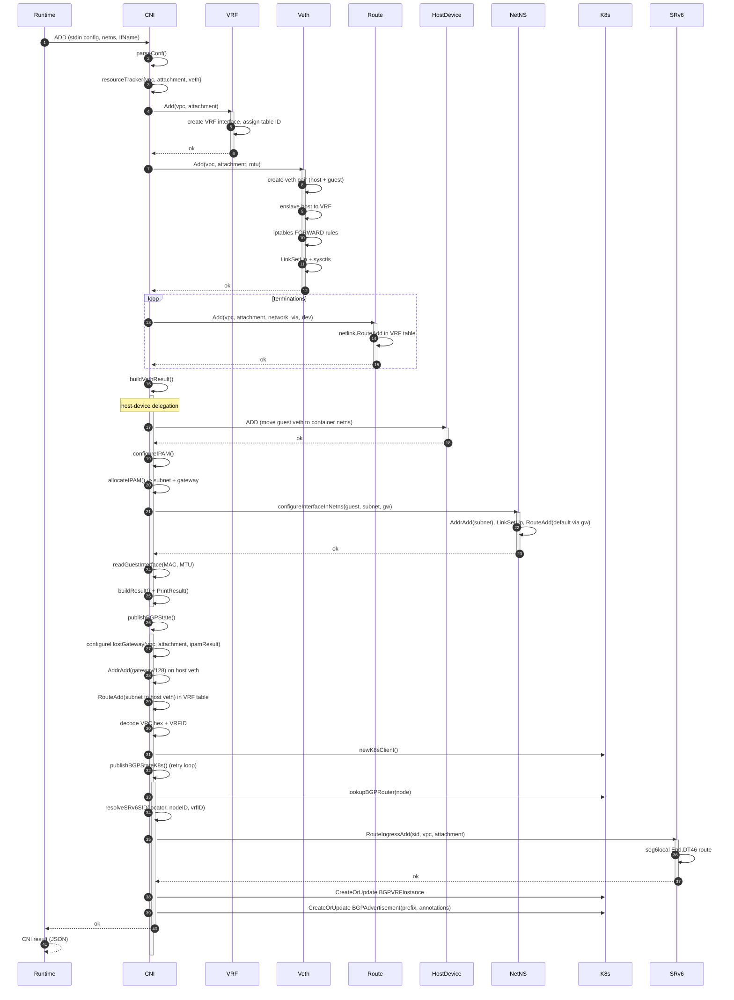
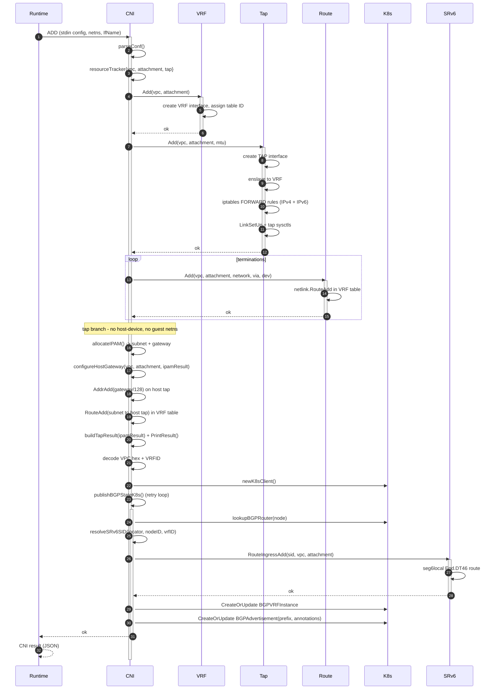

# CNI cmdAdd / cmdDel Sequence Diagrams

Per-interface-type sequence diagrams for the galactic-cni ADD and DEL paths.

## cmdAdd — veth



## cmdAdd — tap



## cmdDel — veth / tap (shared)

Both interface types share the same DEL path. Per the CNI spec, DEL is
idempotent — missing resources are never errors.

```mermaid
sequenceDiagram
    autonumber
    Runtime->>CNI: DEL (stdin config, containerID)
    activate CNI

    CNI->>CNI: parseConf()
    alt parse fails
        CNI->>CNI: slog.Error, print empty result
        CNI-->>Runtime: nil
        deactivate CNI
    else parse succeeds
        alt hasIPAM
            CNI->>K8s: newK8sClient()
            alt k8s client OK
                CNI->>CNI: deallocateIPAM()
                CNI->>K8s: Get BGPAdvertisement -> read subnet annotation
                CNI->>IPAM: PoolAllocator.Deallocate(subnet)
            end
        end

        Note over CNI: Shared resources (VRF, interface, routes, SRv6,<br/>BGPAdvertisement, BGPVRFInstance) are NOT deleted here.<br/>They may be in use by another pod on the same (vpc, attachment).<br/>The GC controller collects orphans periodically.

        CNI->>CNI: slog.Info("DEL: skipping shared resource cleanup (handled by GC)")
        CNI->>CNI: print empty result

        CNI-->>Runtime: nil
        deactivate CNI
    end
```
