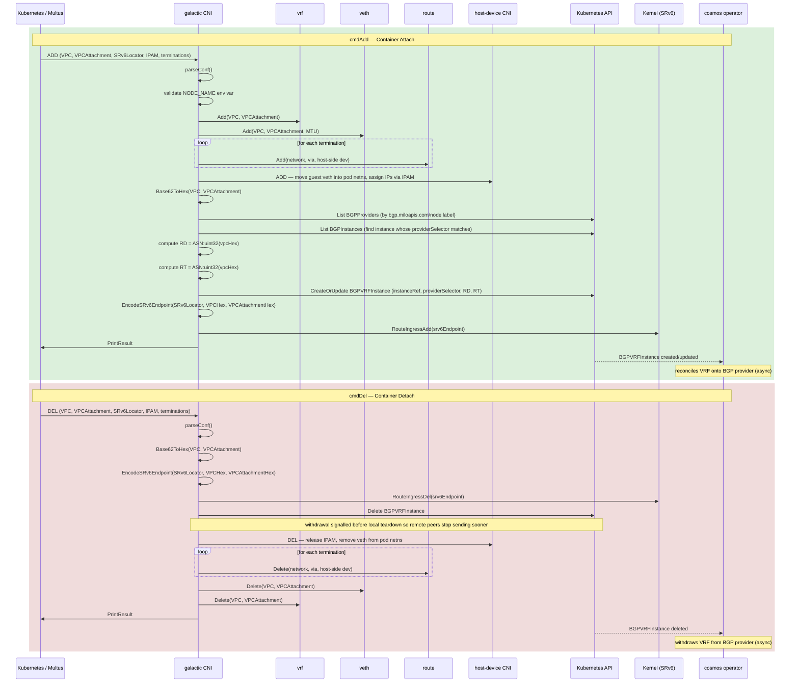

# CNI Plugin Sequence

```mermaid
sequenceDiagram
    participant Multus as Kubernetes / Multus
    participant CNI as galactic CNI
    participant VRF as vrf
    participant Veth as veth
    participant Route as route
    participant HD as host-device CNI
    participant K8s as Kubernetes API
    participant Kernel as Kernel (SRv6)
    participant Cosmos as cosmos operator

    rect rgb(220, 240, 220)
        note over Multus,Cosmos: cmdAdd — Container Attach
        Multus->>CNI: ADD (VPC, VPCAttachment, SRv6Locator, IPAM, terminations)
        CNI->>CNI: parseConf()
        CNI->>CNI: validate NODE_NAME env var
        CNI->>VRF: Add(VPC, VPCAttachment)
        CNI->>Veth: Add(VPC, VPCAttachment, MTU)
        loop for each termination
            CNI->>Route: Add(network, via, host-side dev)
        end
        CNI->>HD: ADD — move guest veth into pod netns, assign IPs via IPAM
        CNI->>CNI: Base62ToHex(VPC, VPCAttachment)
        CNI->>K8s: List BGPProviders (by bgp.miloapis.com/node label)
        CNI->>K8s: List BGPInstances (find instance whose providerSelector matches)
        CNI->>CNI: compute RD = ASN:uint32(vpcHex)
        CNI->>CNI: compute RT = ASN:uint32(vpcHex)
        CNI->>K8s: CreateOrUpdate BGPVRFInstance (instanceRef, providerSelector, RD, RT)
        CNI->>CNI: EncodeSRv6Endpoint(SRv6Locator, VPCHex, VPCAttachmentHex)
        CNI->>Kernel: RouteIngressAdd(srv6Endpoint)
        CNI->>Multus: PrintResult
        K8s-->>Cosmos: BGPVRFInstance created/updated
        note over Cosmos: reconciles VRF onto BGP provider (async)
    end

    rect rgb(240, 220, 220)
        note over Multus,Cosmos: cmdDel — Container Detach
        Multus->>CNI: DEL (VPC, VPCAttachment, SRv6Locator, IPAM, terminations)
        CNI->>CNI: parseConf()
        CNI->>CNI: Base62ToHex(VPC, VPCAttachment)
        CNI->>CNI: EncodeSRv6Endpoint(SRv6Locator, VPCHex, VPCAttachmentHex)
        CNI->>Kernel: RouteIngressDel(srv6Endpoint)
        CNI->>K8s: Delete BGPVRFInstance
        note over CNI,K8s: withdrawal signalled before local teardown so remote peers stop sending sooner
        CNI->>HD: DEL — release IPAM, remove veth from pod netns
        loop for each termination
            CNI->>Route: Delete(network, via, host-side dev)
        end
        CNI->>Veth: Delete(VPC, VPCAttachment)
        CNI->>VRF: Delete(VPC, VPCAttachment)
        CNI->>Multus: PrintResult
        K8s-->>Cosmos: BGPVRFInstance deleted
        note over Cosmos: withdraws VRF from BGP provider (async)
    end
```
