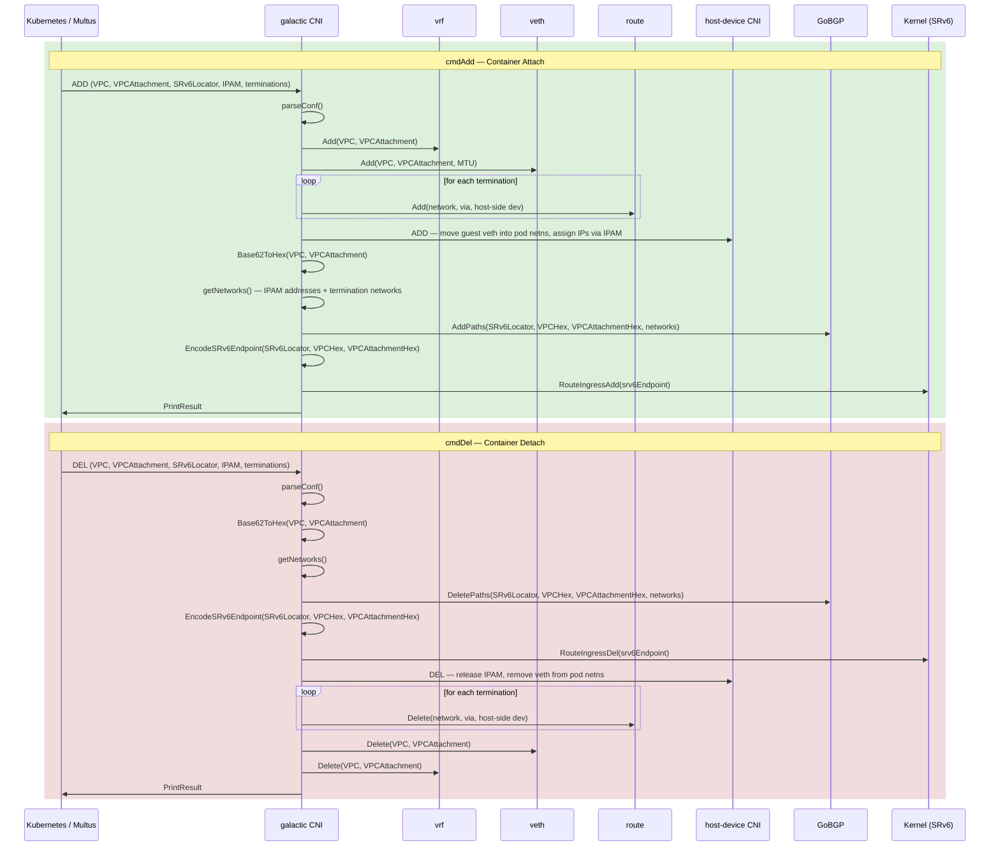

# CNI Plugin Sequence

```mermaid
sequenceDiagram
    participant Multus as Kubernetes / Multus
    participant CNI as galactic CNI
    participant VRF as vrf
    participant Veth as veth
    participant Route as route
    participant HD as host-device CNI
    participant GoBGP as GoBGP
    participant Kernel as Kernel (SRv6)

    rect rgb(220, 240, 220)
        note over Multus,Kernel: cmdAdd — Container Attach
        Multus->>CNI: ADD (VPC, VPCAttachment, SRv6Locator, IPAM, terminations)
        CNI->>CNI: parseConf()
        CNI->>VRF: Add(VPC, VPCAttachment)
        CNI->>Veth: Add(VPC, VPCAttachment, MTU)
        loop for each termination
            CNI->>Route: Add(network, via, host-side dev)
        end
        CNI->>HD: ADD — move guest veth into pod netns, assign IPs via IPAM
        CNI->>CNI: Base62ToHex(VPC, VPCAttachment)
        CNI->>CNI: getNetworks() — IPAM addresses + termination networks
        CNI->>GoBGP: AddPaths(SRv6Locator, VPCHex, VPCAttachmentHex, networks)
        CNI->>CNI: EncodeSRv6Endpoint(SRv6Locator, VPCHex, VPCAttachmentHex)
        CNI->>Kernel: RouteIngressAdd(srv6Endpoint)
        CNI->>Multus: PrintResult
    end

    rect rgb(240, 220, 220)
        note over Multus,Kernel: cmdDel — Container Detach
        Multus->>CNI: DEL (VPC, VPCAttachment, SRv6Locator, IPAM, terminations)
        CNI->>CNI: parseConf()
        CNI->>CNI: Base62ToHex(VPC, VPCAttachment)
        CNI->>CNI: getNetworks()
        CNI->>GoBGP: DeletePaths(SRv6Locator, VPCHex, VPCAttachmentHex, networks)
        CNI->>CNI: EncodeSRv6Endpoint(SRv6Locator, VPCHex, VPCAttachmentHex)
        CNI->>Kernel: RouteIngressDel(srv6Endpoint)
        CNI->>HD: DEL — release IPAM, remove veth from pod netns
        loop for each termination
            CNI->>Route: Delete(network, via, host-side dev)
        end
        CNI->>Veth: Delete(VPC, VPCAttachment)
        CNI->>VRF: Delete(VPC, VPCAttachment)
        CNI->>Multus: PrintResult
    end
```
