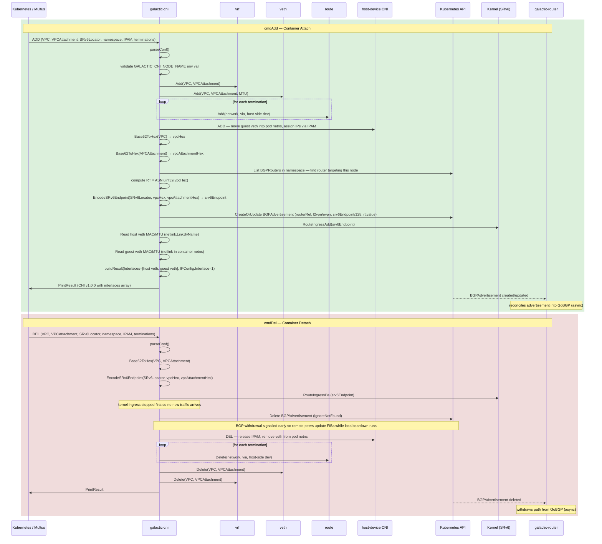

# CNI Plugin Sequence

```mermaid
sequenceDiagram
    participant Multus as Kubernetes / Multus
    participant CNI as galactic-cni
    participant VRF as vrf
    participant Veth as veth
    participant Route as route
    participant HD as host-device CNI
    participant K8s as Kubernetes API
    participant Kernel as Kernel (SRv6)
    participant Router as galactic-router

    rect rgb(220, 240, 220)
        note over Multus,Router: cmdAdd — Container Attach
        Multus->>CNI: ADD (VPC, VPCAttachment, SRv6Locator, namespace, IPAM, terminations)
        CNI->>CNI: parseConf()
        CNI->>CNI: validate GALACTIC_CNI_NODE_NAME env var
        CNI->>VRF: Add(VPC, VPCAttachment)
        CNI->>Veth: Add(VPC, VPCAttachment, MTU)
        loop for each termination
            CNI->>Route: Add(network, via, host-side dev)
        end
        CNI->>HD: ADD — move guest veth into pod netns, assign IPs via IPAM
        CNI->>CNI: Base62ToHex(VPC) → vpcHex
        CNI->>CNI: Base62ToHex(VPCAttachment) → vpcAttachmentHex
        CNI->>K8s: List BGPRouters in namespace — find router targeting this node
        CNI->>CNI: compute RT = ASN:uint32(vpcHex)
        CNI->>CNI: EncodeSRv6Endpoint(SRv6Locator, vpcHex, vpcAttachmentHex) → srv6Endpoint
        CNI->>K8s: CreateOrUpdate BGPAdvertisement (routerRef, l2vpn/evpn, srv6Endpoint/128, rt:value)
        CNI->>Kernel: RouteIngressAdd(srv6Endpoint)
        CNI->>CNI: Read host veth MAC/MTU (netlink.LinkByName)
        CNI->>CNI: Read guest veth MAC/MTU (netlink in container netns)
        CNI->>CNI: buildResult(Interfaces=[host veth, guest veth], IPConfig.Interface=1)
        CNI->>Multus: PrintResult (CNI v1.0.0 with interfaces array)
        K8s-->>Router: BGPAdvertisement created/updated
        note over Router: reconciles advertisement into GoBGP (async)
    end

    rect rgb(240, 220, 220)
        note over Multus,Router: cmdDel — Container Detach
        Multus->>CNI: DEL (VPC, VPCAttachment, SRv6Locator, namespace, IPAM, terminations)
        CNI->>CNI: parseConf()
        CNI->>CNI: Base62ToHex(VPC, VPCAttachment)
        CNI->>CNI: EncodeSRv6Endpoint(SRv6Locator, vpcHex, vpcAttachmentHex)
        CNI->>Kernel: RouteIngressDel(srv6Endpoint)
        note over CNI: kernel ingress stopped first so no new traffic arrives
        CNI->>K8s: Delete BGPAdvertisement (IgnoreNotFound)
        note over CNI,K8s: BGP withdrawal signalled early so remote peers update FIBs while local teardown runs
        CNI->>HD: DEL — release IPAM, remove veth from pod netns
        loop for each termination
            CNI->>Route: Delete(network, via, host-side dev)
        end
        CNI->>Veth: Delete(VPC, VPCAttachment)
        CNI->>VRF: Delete(VPC, VPCAttachment)
        CNI->>Multus: PrintResult
        K8s-->>Router: BGPAdvertisement deleted
        note over Router: withdraws path from GoBGP (async)
    end
```
