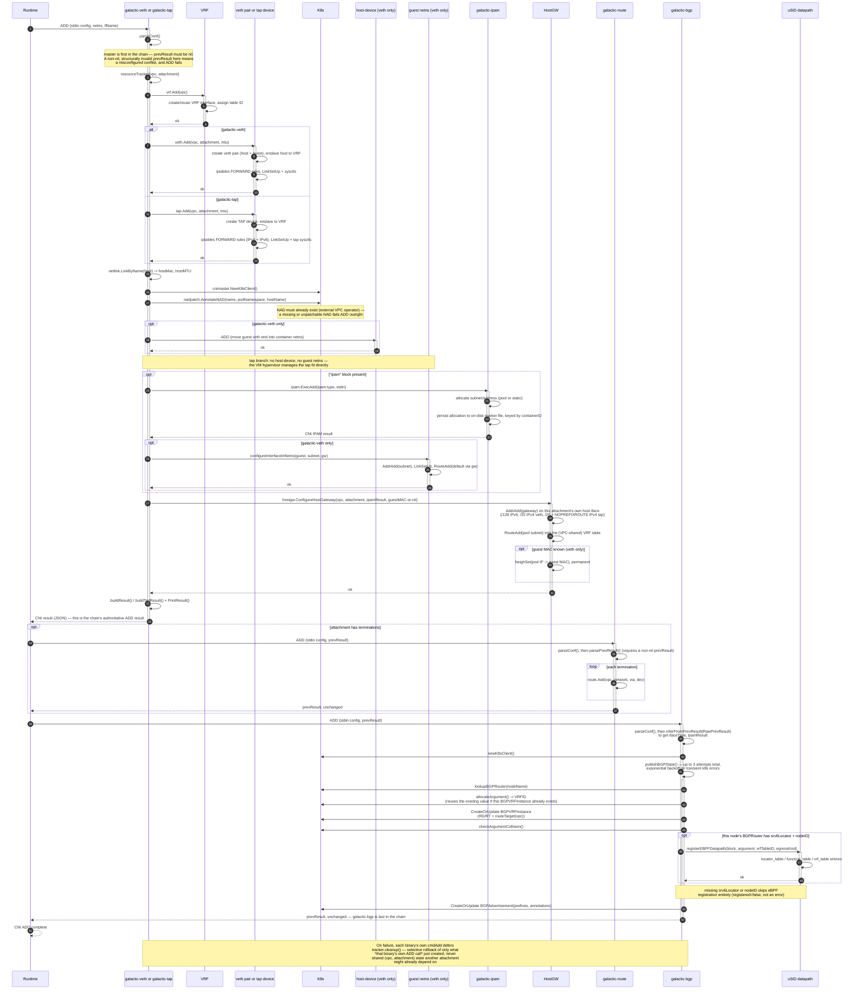
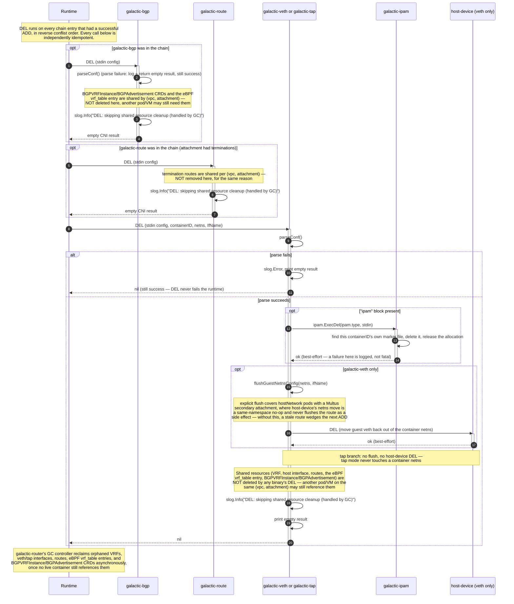

# CNI ADD / DEL Sequence Diagrams

Two sequence diagrams for the galactic CNI plugin chain: one for `ADD`
(container/VM attach), one for `DEL` (detach). Both diagrams cover every
binary in the chain — `galactic-veth` **or** `galactic-tap` as the master
plugin, plus the optional `galactic-route` stage and `galactic-bgp` — using
`alt`/`opt` blocks to call out where the veth and tap paths diverge, rather
than duplicating near-identical diagrams per interface kind. Both diagrams
use plain Mermaid `sequenceDiagram` syntax, which GitHub and Obsidian both
render natively from a ```` ```mermaid ```` fence — no plugin or preprocessing
required in either viewer.

## Chain overview

The chain is one master plugin, plus up to two optional plugins invoked
after it in conflist order:

1. **Master** — `galactic-veth` (veth, for containers) or `galactic-tap`
   (tap, for VM workloads: Kata, Firecracker, kraftlet/Unikraft). Creates
   the VRF and host-side interface, annotates the NAD, delegates IPAM (if
   an `"ipam"` block is present) and — for `galactic-veth` only —
   host-device (to move the guest veth into the container netns), then
   configures the host gateway address/route and prints the CNI result.
2. **`galactic-route`** (optional — present only when the attachment has
   `terminations`) — installs each termination as a route into the VRF
   table, then passes `prevResult` through unchanged.
3. **`galactic-bgp`** — publishes BGP/SRv6/eBPF state: `BGPVRFInstance`,
   `BGPAdvertisement`, and (when this node's `BGPRouter` has SRv6
   configured) the eBPF uSID datapath's `vrf_table` registration. Learns
   everything it needs (interface kind, allocated addresses) from
   `prevResult` alone — it never touches a kernel interface. Passes
   `prevResult` through unchanged as the final CNI result.

Every binary's own `cmdDel` is a no-op beyond binary-local, per-container
cleanup (IPAM deallocation, guest netns flush, host-device DEL — all
`galactic-veth`/`galactic-tap` only). Shared node-level state (VRF,
host interface, routes, SRv6/eBPF registration, `BGPVRFInstance`,
`BGPAdvertisement`) is kept because it may still be in use by another
pod/VM on the same `(vpc, vpcAttachment)`; `galactic-router`'s GC
controller reclaims it once nothing references it anymore.

---

## CNI ADD



### Notes on ADD

- **One chain, two interface kinds.** `galactic-veth` and `galactic-tap`
  share almost the entire ADD shape — VRF, interface create, NAD
  annotation, optional IPAM, host gateway, print result — which is why this
  is one diagram with `alt` blocks rather than two near-duplicate ones. The
  only real divergence is container-specific plumbing: `galactic-veth`
  additionally delegates to `host-device` to move the new veth end into the
  container's netns and configures an address/default route inside that
  netns; `galactic-tap` does neither; the VM hypervisor owns the tap fd
  directly and configures the guest side itself.
- **`galactic-veth`/`galactic-tap`'s own result is the chain's real ADD
  result.** `galactic-route` and `galactic-bgp`, when present, both pass
  `prevResult` straight through unchanged — neither adds an interface or IP
  of its own. A successful CNI ADD response therefore only guarantees the
  master plugin succeeded; it does **not** guarantee `galactic-bgp` has run
  yet, let alone that the `BGPAdvertisement`/`BGPVRFInstance` CRDs exist.
  `RawPrevResult` (not the always-empty typed `PrevResult` field — a
  `containernetworking/cni` quirk, not specific to this codebase) is what
  every downstream stage actually reads.
- **IPAM is opt-in per attachment, not per binary.** Whether IPAM runs at
  all is driven entirely by the presence of an `"ipam"` block in that
  attachment's own conflist stanza — `galactic-ipam` never re-decides this
  for itself, it simply allocates when invoked. Allocation state is
  persisted to an on-disk, flock-guarded marker file keyed by `containerID`
  under this node's own filesystem, not to a CRD — so `galactic-ipam`'s own
  DEL never needs a Kubernetes round-trip to find what to release.
- **Host gateway configuration is why `galactic-bgp` never touches the
  kernel.** `internal/hostgw.ConfigureHostGateway` — called directly by
  both master plugins, before they print their own result — assigns the
  gateway address on *this attachment's own* host interface (never the
  shared VRF device: IPv6 NDP only resolves on the link an address is
  actually configured on) and installs an explicit pod-subnet route into
  the VRF table. For veth, it also primes a permanent ARP/NDP neighbor
  entry for the pod's address, because the eBPF uSID datapath's
  `bpf_fib_lookup()` never triggers dynamic neighbor resolution itself —
  without a pre-existing entry the datapath drops with
  `BPF_FIB_LKUP_RET_NO_NEIGH`. Tap has no separate guest-side link in this
  netns to resolve a MAC from, so no neighbor entry is installed there.
  Once this step returns, `galactic-bgp` has zero kernel-interface
  dependency of its own — everything it advertises comes from `prevResult`.
- **BGP/SRv6/eBPF publish is retried, not best-effort.** `publishBGPState`
  wraps its Kubernetes operations in `retryK8sOps`, which retries up to two
  additional times (three attempts total) with exponential backoff, but
  only for errors classified as transient (API server unavailability,
  timeouts, `Temporary()` network errors) — validation and not-found
  failures fail immediately without retry.
- **VRFID (the eBPF `Argument`) allocation is idempotency-aware.**
  `allocateArgument` first checks whether a `BGPVRFInstance` already exists
  for this exact attachment name — an idempotent CNI ADD retry, or a repeat
  ADD on an attachment that's already live — and reuses its VRFID rather
  than allocating a new one; only a genuinely new attachment gets the
  lowest unused value. `checkArgumentCollision` then re-lists to catch a
  concurrent allocation race.
- **Failure rolls back only what that call created.** Every binary's own
  `cmdAdd` tracks what it created this invocation and calls
  `tracker.cleanup()` from a deferred function keyed on a non-nil named
  return `err`. This is strictly binary-local and per-call: it never
  deletes state another attachment might be depending on (e.g. a shared
  `BGPVRFInstance` another pod on the same VPC already created) — the same
  "don't race a concurrent user of shared state" principle DEL follows,
  covered next.

---

## CNI DEL

Per the CNI spec, DEL is idempotent — missing resources are never errors,
and every binary always returns success to the runtime. The runtime invokes
DEL on every chain entry that had a successful ADD, in the **reverse** of
conflist order (`galactic-bgp` → `galactic-route` → the master plugin); each
call is independently idempotent, so this ordering matters for symmetry
with ADD, not for correctness.



### Notes on DEL

- **Nothing shared is ever deleted synchronously.** Every binary's own
  `cmdDel` cleans up only what is unambiguously safe to release
  immediately for *this specific container*: `galactic-ipam`'s own on-disk
  marker file, and — `galactic-veth` only — the guest netns' address/route
  and the host-device move-back. The VRF, host veth/tap interface, VRF-table
  routes, the eBPF `vrf_table` entry, and the `BGPVRFInstance`/
  `BGPAdvertisement` CRDs are all keyed by `(vpc, vpcAttachment)`, not by
  `containerID` — they may legitimately be shared with another pod/VM on
  the same attachment, so deleting them here would race a concurrent ADD
  during a pod restart (the old pod's DEL destroying state the new pod's
  ADD just created). `galactic-router`'s GC controller reclaims this state
  asynchronously and safely, by checking whether any live container still
  references it before removing anything.
- **`galactic-bgp` and `galactic-route` are pure no-ops on DEL.** Neither
  holds any per-container state to release — their entire DEL body is a log
  line plus an empty CNI result. `galactic-route`'s DEL doesn't even parse
  `vpc`/`vpcAttachment` for logging, unlike the other four binaries.
- **A config parse failure never fails DEL.** If `parseConf` can't parse
  `stdin`, every binary logs the error and still prints an empty, successful
  CNI result — per the CNI spec, DEL must never propagate an error the
  runtime would treat as a failed teardown, even when there's nothing left
  to clean up because the config itself couldn't be read.
- **The explicit guest-netns flush is a targeted fix, not defensive
  boilerplate.** For an ordinary pod, moving the guest veth end back out of
  the container netns during `host-device` DEL crosses a namespace
  boundary, which flushes its address/route as a kernel side effect. That
  side effect never fires for a hostNetwork pod with a Multus secondary
  attachment, because the "move" is then a no-op (the link never left the
  host namespace to begin with) — without `flushGuestNetnsConfig` running
  first, the stale route would survive indefinitely and wedge the next ADD
  on that same interface with `file exists`.
- **IPAM deallocation needs no Kubernetes round-trip.** Because
  `galactic-ipam`'s allocation state lives in an on-disk marker file keyed
  by `containerID` (see the ADD notes above), its own DEL looks the
  allocation up locally — there's no CRD read involved, and no dependency
  on the API server being reachable at teardown time.
