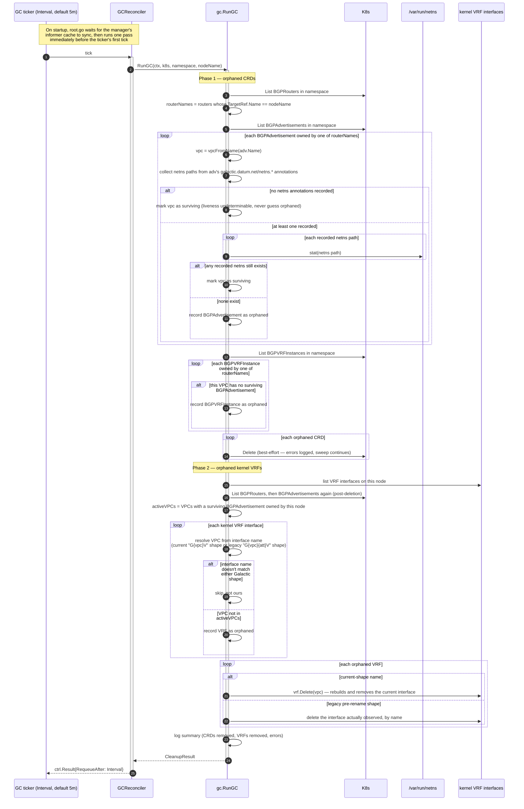
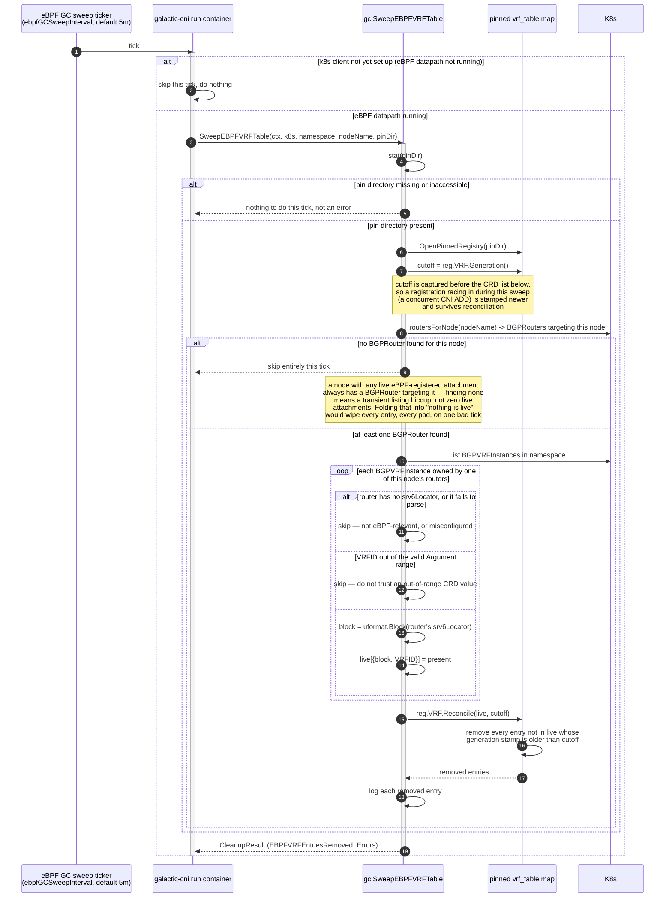

# GC Sequence Diagrams

Two sequence diagrams for Galactic's garbage collection: the orphaned
`BGPAdvertisement`/`BGPVRFInstance` CRD and kernel-VRF sweep that
`galactic-router`'s `GCReconciler` runs on a ticker, and the eBPF `vrf_table`
sweep that `galactic-cni`'s `run` container runs on its own, independent
ticker. Both diagrams use plain Mermaid `sequenceDiagram` syntax, which
GitHub and Obsidian both render natively from a ```` ```mermaid ```` fence —
no plugin or preprocessing required in either viewer.

## Why GC exists

Every CNI-chain binary's own `cmdDel` is intentionally minimal — see
[docs/cni/cni-cmd-sequence.md](cni-cmd-sequence.md#notes-on-del). The VRF,
VRF-table routes, the eBPF `vrf_table` entry, and the `BGPVRFInstance`/
`BGPAdvertisement` CRDs are all keyed by `(vpc, vpcAttachment)` or
`(vpc, node)`, not by `containerID`, so no per-container DEL call is ever
allowed to delete them outright: another pod/VM on the same attachment might
still depend on them, and deleting them synchronously would race a
concurrent ADD during a pod restart. That leaves a gap — a force-terminated
container (kubelet SIGKILL, node crash, netns torn down without CNI DEL ever
running) leaves this shared state behind with nothing left alive to
eventually clean it up on DEL. GC exists to close that gap asynchronously,
on a periodic sweep, by checking actual liveness on the node rather than
trusting that DEL always fires.

The per-attachment host veth/tap interface itself is **not** part of that
list. It is private to one attachment, so `cmdDel` deletes it directly and
immediately (`veth.Delete`/`tap.Delete`) rather than deferring it here — see
[docs/cni/cni-cmd-sequence.md](cni-cmd-sequence.md#notes-on-del) for why that
is safe. It used to be deferred the same way as the VRF, which was a real
leak: GC's own kernel sweep below only ever recognizes VRF-shaped interface
names, so a host interface deferred to GC was never actually reclaimed by
anything, and was left behind enslaved to a VRF that no longer existed once
GC collected it. Nothing in this document's diagrams covers the host
veth/tap interface for that reason — it has no GC path at all, by design.

Both sweeps below are conceptually "GC" and live in the same `internal/gc`
package, but run as two unrelated ticker loops in two different processes,
each reading only the liveness signal it can see for itself:

| Sweep                                  | Process                          | Reads                                                                | Removes                                                                              |
| --------------------------------------- | --------------------------------- | --------------------------------------------------------------------- | --------------------------------------------------------------------------------------- |
| Orphaned CRD + kernel VRF sweep         | `galactic-router` (`GCReconciler`) | `/var/run/netns` on this node, `BGPRouter`/`BGPAdvertisement`/`BGPVRFInstance` CRDs | `BGPAdvertisement`, `BGPVRFInstance` CRDs; kernel VRF interfaces                        |
| eBPF `vrf_table` sweep                  | `galactic-cni`'s `run` container    | the pinned eBPF `vrf_table` map, `BGPRouter`/`BGPVRFInstance` CRDs     | stale `vrf_table` map entries (`Block`, `Argument` keys)                                |

They stay split rather than merging into one loop because the pinned
`vrf_table` map only exists inside `galactic-cni`'s `run` container, which is
the process holding the `/sys/fs/bpf` hostPath mount and `CAP_BPF` — RBAC and
capabilities `galactic-router`'s own DaemonSet neither has nor, for this
alone, should need.

---

## GC — orphaned CRD and kernel VRF sweep (galactic-router)



### Notes

- **Liveness is read from the node, not inferred from CRD age.** GC never
  times a CRD out — it checks whether the exact `netns` path recorded on a
  `BGPAdvertisement` at CNI ADD time (`galactic.datum.net/netns.<containerID>`
  annotation) still exists under `/var/run/netns` on this node right now.
  That path can't be reconstructed from a container ID alone (the container
  runtime's own bind-mount naming convention has no relationship to it), so
  the exact value recorded at ADD time is what gets checked.
- **A `BGPAdvertisement` can carry several netns annotations at once.** Pod
  churn on the same `(vpc, vpcAttachment)` adds a new annotation entry
  without removing old ones — `cmdDel` never touches this shared CRD. The
  object is only orphaned once **every** container that ever referenced it is
  confirmed gone, not just the most recent one.
- **A dead sibling's annotations don't have to wait for this sweep.** This
  whole-object collection only fires once every container that ever
  referenced the `BGPAdvertisement` is dead, which is never true while the
  attachment still has any live pod — the ordinary case for a
  Deployment-style replacement. `galactic-bgp`'s own ADD path now prunes a
  dead sibling's netns and subnet annotations directly
  (`pruneDeadContainerAnnotations`, using the same `NetNSExists` liveness
  check this sweep uses) the moment a new container attaches, so that class
  of staleness self-heals on the very next ADD and never depends on this
  ticker at all. See
  [docs/cni/cni-cmd-sequence.md](cni-cmd-sequence.md#notes-on-add). This
  sweep still owns the case pruning cannot reach: reclaiming the entire CRD
  once no container ever attaches again.
- **No netns annotations at all means "assume alive," never "assume
  orphaned."** A `BGPAdvertisement` GC can't judge — no annotations recorded,
  possibly a legacy or manually-created object — counts as surviving. GC's
  guiding rule throughout is to never guess a shared resource is safe to
  reclaim.
- **`BGPVRFInstance` is judged at VPC granularity, `BGPAdvertisement` at
  vpc+attachment granularity.** The VRF (and its `BGPVRFInstance` CRD) is
  shared by every attachment on a VPC on this node, so it's orphaned only
  once every `BGPAdvertisement` whose name starts with that VPC segment is
  either orphaned or entirely absent — not by aliasing off one specific
  `BGPAdvertisement`'s name.
- **Phase 2 re-lists `BGPAdvertisement`s after Phase 1's deletions.** This
  means a CRD deleted moments earlier in the same pass can already be
  reflected in Phase 2's `activeVPCs` set (subject to the informer cache
  catching up), letting a VPC's kernel VRF be reclaimed in the very same GC
  pass its last CRD was. If the cache hasn't caught up yet, nothing is lost —
  the next tick simply repeats the whole pass, and GC's outputs are
  idempotent either way.
- **The kernel-VRF sweep understands two interface-name shapes.** The
  current template (`G{9-char-vpc}V`) is per-VPC; a legacy pre-rename
  template (`G{9-char-vpc}{3-char-att}V`) carried a VPCAttachment segment
  the same way host/guest veth names still do. A node upgraded in place can
  still be running interfaces named the old way, and both resolve to the
  same VPC for liveness purposes — but only the current-shape name is
  reconstructible well enough to delete via `vrf.Delete(vpc)`; a legacy name
  is deleted by the exact interface observed instead, since rebuilding the
  *current* name from its VPC and deleting that would silently no-op against
  the legacy interface.
- **This sweep never matches a per-attachment host veth/tap interface, by
  design.** Both the current and legacy name shapes above end in the VRF
  suffix (`V`); the host interface's own suffix (`H`) never matches either
  regex. That interface isn't orphaned state for this sweep to find at all —
  `cmdDel` deletes it directly and immediately, see
  [docs/cni/cni-cmd-sequence.md](cni-cmd-sequence.md#notes-on-del).
- **Node scoping matters because CRDs are namespace-, not node-, scoped.**
  `BGPAdvertisement`/`BGPVRFInstance` objects in a namespace can belong to
  routers on other nodes (e.g. the default and rr roles watching
  the same namespace). Every collection pass first filters to only the
  `BGPRouter`s whose `TargetRef.Name` matches this node, and this node's own
  kernel/filesystem state can only ever confirm or deny liveness for
  containers that actually ran here — so a CRD belonging to another node's
  router is never touched, regardless of what this node's kernel looks like.
- **Deletion is best-effort throughout.** A failed `Delete` call (CRD or
  kernel interface) is logged and counted in `CleanupResult.Errors`, but
  never aborts the rest of the sweep — one stuck resource doesn't block
  reclaiming everything else found orphaned in the same pass. The next tick
  tries the failed one again.
- **The very first pass waits for the cache to sync.** `root.go` calls
  `mgr.GetCache().WaitForCacheSync(ctx)` before the initial `RunGC` — an
  empty, not-yet-populated `BGPAdvertisement`/`BGPRouter` list would
  otherwise look identical to "everything is orphaned" and delete every live
  VRF on the node on startup.

---

## GC — eBPF `vrf_table` sweep (galactic-cni)



### Notes

- **This is a reconcile against a generation cutoff, not a two-list diff.**
  `Generation()` is captured *before* `BGPVRFInstance`s are listed. A CNI ADD
  that registers a brand-new entry (`registerEBPFDatapath`, see
  [docs/cni-cmd-sequence.md](cni-cmd-sequence.md#notes-on-add)) between that
  capture and the CRD list below stamps its entry with a generation newer
  than `cutoff`, so `Reconcile` never removes it even though it won't appear
  in the `BGPVRFInstance` list this sweep happened to see. Without that
  ordering, a CNI ADD racing a GC sweep could have its brand-new eBPF
  registration deleted moments after being created.
- **Finding zero `BGPRouter`s is treated as "can't tell," not "genuinely
  empty."** `registerEBPFDatapath` requires a `BGPRouter` targeting the node
  to run at all, so any node with a live eBPF-registered attachment
  necessarily has one. An empty result here is far more likely a transient
  cache/listing hiccup (or the router object mid-rename) than truly zero
  attachments — and treating it as the latter would wipe the *entire*
  `vrf_table`, every pod on the node, on one bad tick. The sweep skips
  entirely and lets the next tick retry once listing is reliable again.
- **Missing/inaccessible pin directory is normal, not an error.** The eBPF
  datapath's "run" container may not have finished loading and pinning the
  map yet, or `/sys/fs/bpf` may be in a restrictive mode this process can't
  stat. Either way, `SweepEBPFVRFTable` returns cleanly with nothing done —
  it isn't this function's job to diagnose why the pin isn't there yet.
- **CRD field validation happens inline, per instance.** A `BGPVRFInstance`
  whose router has no `srv6Locator` (not eBPF-relevant at all), an
  unparseable locator, or a `VRFID` outside the valid Argument range is
  skipped individually with a warning — one malformed CRD doesn't abort the
  sweep for every other live entry.
- **Independent ticker, independent process, same default interval by
  design.** `ebpfGCSweepInterval` defaults to 5 minutes specifically to match
  `galactic-router`'s own `GCReconciler` interval — a deliberate parity
  choice, not a shared clock; the two loops never coordinate and can drift
  out of phase with each other freely.
- **This sweep never touches `BGPAdvertisement`/`BGPVRFInstance` CRDs or
  kernel VRF interfaces.** It reconciles exactly one thing: pinned eBPF
  `vrf_table` map entries. Reclaiming the CRDs and kernel VRFs those entries
  ultimately derive from is entirely the other diagram's job, running in a
  different process on its own schedule.
