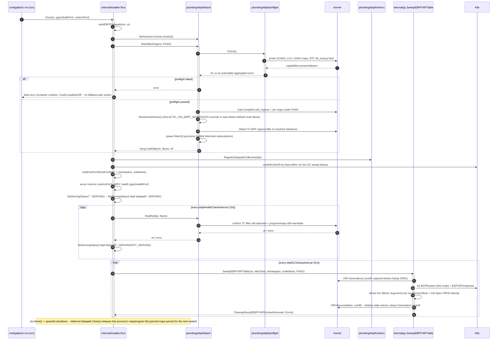
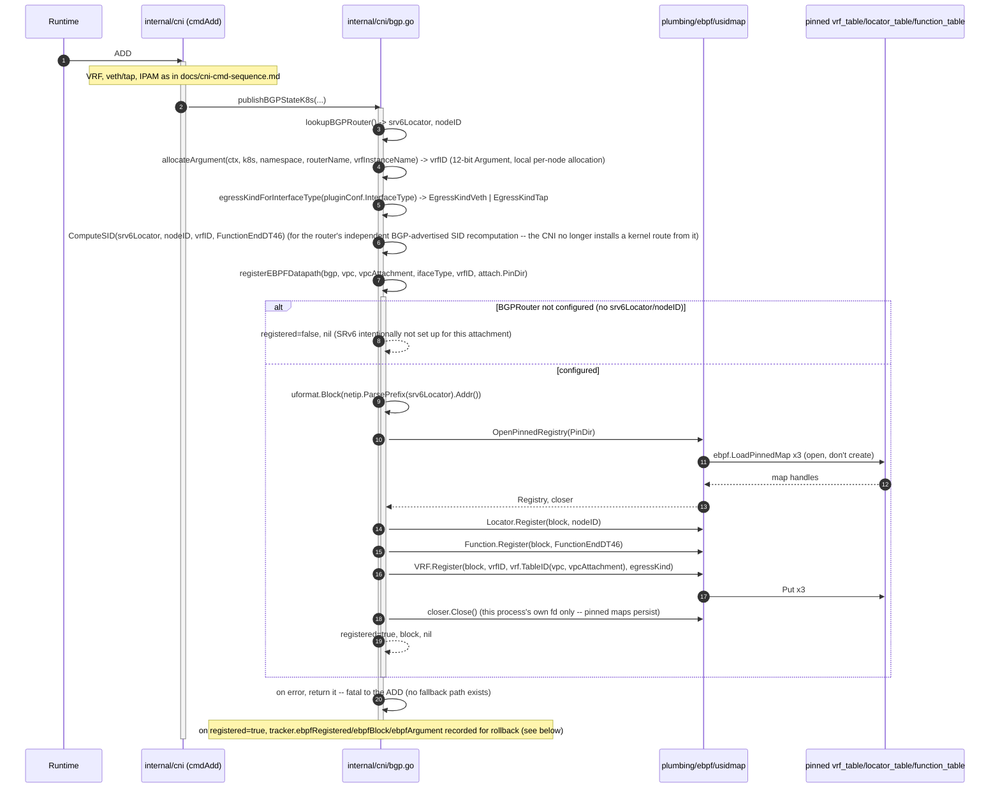
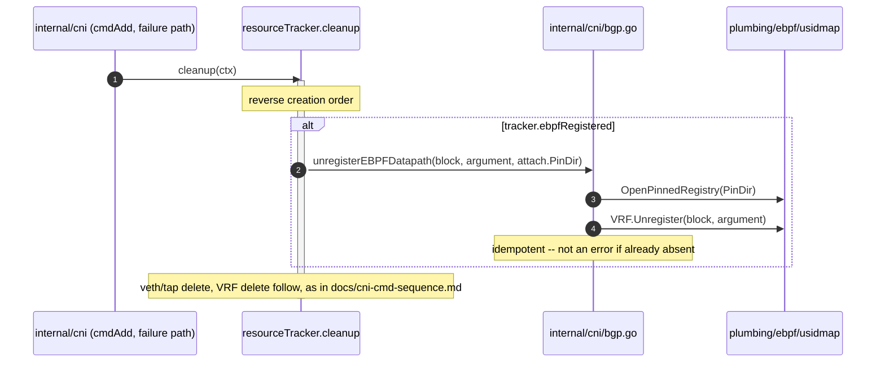

# eBPF uSID Datapath Sequence Diagrams

Sequence diagrams for the eBPF/TC-BPF `uFMT 48+16` uSID datapath, covering the
`run` container's startup/load/attach path and the CNI ADD path's map
registration. This is the only forwarding path — there is no legacy
static-route fallback and no feature flag to disable it (removed in the
2026-08-02 direct cutover; see
[docs/cni/configuration.md](cni/configuration.md#ebpf-usid-datapath)).

See [docs/cni-cmd-sequence.md](cni-cmd-sequence.md) for the pre-existing
`cmdAdd`/`cmdDel` diagrams this one supplements, not replaces.

## `run` container startup — datapath load, attach, health, GC sweep

## CNI ADD — eBPF `vrf_table` registration

## Failed-ADD rollback — unregistering the eBPF entry

Steady-state (non-failed-ADD) teardown of the `vrf_table` entry is
deliberately **not** part of `cmdDel` — matching this repo's existing
"DEL is intentionally minimal" design (`docs/agents/ARCHITECTURE.md`'s
Known Constraints) — it is instead the `run` container's periodic
`gc.SweepEBPFVRFTable` shown in the first diagram above.
