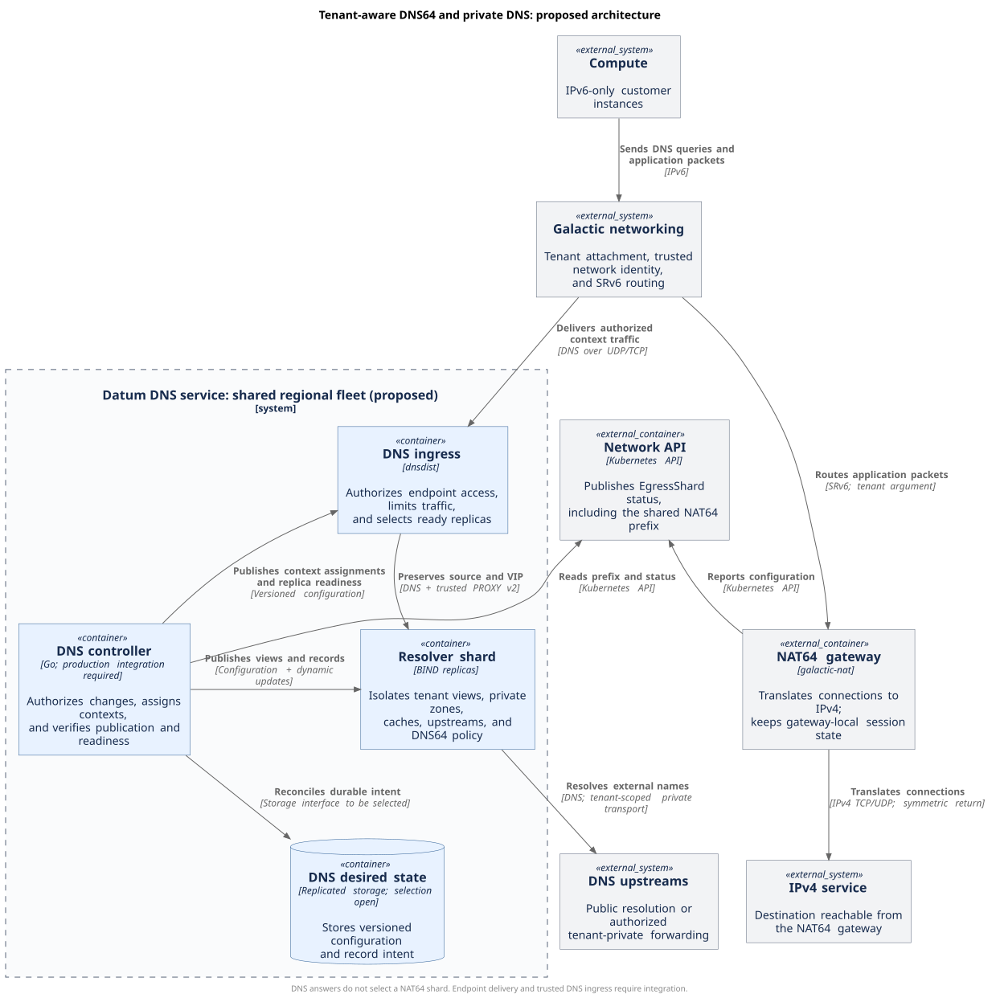
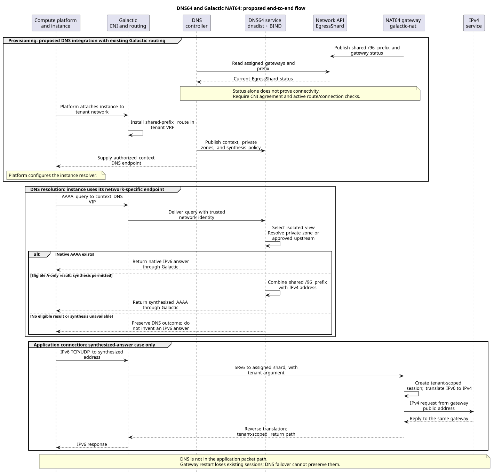

# Tenant-aware DNS64 and private DNS

Status: Proposed. This design has not passed end-to-end Galactic validation.

## Summary

Provide a managed DNS service for IPv6-only Compute instances. Customers can
resolve private names within their networks and connect to IPv4-only services
by name. DNS64 synthesizes AAAA (IPv6) records from A (IPv4) records. Galactic's
NAT64 gateway translates the resulting connection to IPv4.

Shared regional resolver fleets serve isolated tenant configurations. The
planning range is 10,000–100,000 tenants, not a verified capacity limit. The
service adds shared capacity instead of deploying a resolver for every tenant.

## Motivation

Customers need private names for applications and access to IPv4-only
dependencies without configuring their own DNS servers. Two customers must be
able to use the same private name without sharing answers or exposing their
network configuration. A shared service reduces the infrastructure and
maintenance required for each customer.

## Goals

- Resolve public names and network-scoped private names through one endpoint.
- Connect IPv6-only instances to eligible IPv4 destinations through Galactic.
- Isolate tenant records, caches, upstream selection, policies, and telemetry.
- Scale by measured traffic and configuration size, with bounded resolver shards.
- Report record publication status, query failures, and tenant usage.

## Non-goals

- Build a DNS protocol engine or replace the public authoritative DNS product.
- Operate an open recursive resolver or add public encrypted DNS endpoints.
- Assign a NAT64 prefix to each tenant or change Galactic's translation engine.
- Make IPv4 literals work or create connectivity to unreachable private networks.
- Preserve established connections when a NAT64 gateway loses session state.

## High-level architectural proposal

Use dnsdist for DNS ingress and BIND for private DNS, recursive resolution,
and DNS64. A new DNS controller manages configuration and record publication.
Galactic supplies network isolation and NAT64 routing. BIND is the reference
engine; capacity and reliability tests gate its production selection.

A *context* identifies one tenant and one network. Each context receives an
IPv6 virtual IP address (VIP) and a BIND view. A view contains private zones,
upstream configuration, synthesis policy, and an independent cache. A *shard*
is a bounded group of contexts served by shared resolver replicas.

DNS traffic and application traffic follow separate paths. In the C4 container
diagram, boxes represent services, not one deployment per tenant.



[Container diagram source](containers.puml).

| Component                 | Purpose                                                                                         |
| ------------------------- | ----------------------------------------------------------------------------------------------- |
| Compute                   | Runs customer applications and configures their network-specific DNS endpoint.                  |
| Galactic networking       | Attaches instances to tenant networks and routes DNS and application packets.                   |
| DNS ingress: dnsdist      | Checks endpoint access, limits query traffic, and selects a healthy resolver replica.           |
| Resolver shard: BIND      | Serves private zones, resolves external names, and synthesizes eligible AAAA answers.           |
| DNS controller            | Authorizes changes, assigns contexts to shards, and publishes configuration and record updates. |
| Durable DNS desired state | Stores versioned tenant intent for reconciliation and recovery; storage selection remains open. |
| Network API               | Exposes the NAT64 prefix and gateway configuration through `EgressShard` status.                |
| NAT64: `galactic-nat`     | Translates IPv6 connections to IPv4 and maintains gateway-local connection state.               |

### Tenant isolation

Authorize the tenant-network attachment before accepting queries for its VIP.
A destination VIP selects configuration; knowledge of the VIP does not grant
access. Source addresses alone cannot identify networks with overlapping
address space. The Galactic-to-DNS ingress contract must preserve trusted
network identity and reject spoofed sources.

Keep dnsdist packet caching disabled. Use separate BIND caches and private
zones for each context. Only trusted ingress processes can supply PROXY
protocol metadata to BIND. Tenants cannot access resolver administration or
select a view through EDNS Client Subnet. EDNS Client Subnet shares client
network information in DNS requests; reject it at ingress and do not send it
upstream.

Views provide logical isolation, not separate processes. A resolver crash or
resource-exhaustion attack can affect other contexts on the shard. Bound shard
memory, connections, outstanding queries, and update queues. Enforce tenant
query budgets across ingress replicas, not independently on each replica.

### Private DNS

Private zones take precedence over public resolution. Two contexts can resolve
`database.internal.example` to different addresses. Negative private answers
must not fall back to public DNS. An upstream failure must not expose private
queries to a public resolver.

Conditional forwarding sends selected zones to a customer resolver. Forwarders
with overlapping private addresses require transport through the correct tenant
network. The shared NAT64 prefix cannot select that network. Private DNS works
without DNS64; an IPv4 private answer becomes usable by an IPv6-only instance
only if a tenant-scoped translation and return path also exists.

## Design details

### Resolution and connection flow

The sequence separates provisioning, DNS resolution, and the application
connection. The Compute platform configures the instance; the instance then
uses ordinary DNS and TCP or UDP. The DNS controller is not on the query path.



[Sequence diagram source](resolution-sequence.puml).

1. The Compute platform attaches the instance to its tenant network. Galactic's
   Container Network Interface (CNI) chain installs the NAT64 prefix route in
   the network's virtual routing and forwarding (VRF) table. The DNS integration
   supplies the instance's context-specific resolver address.
2. The instance queries that address. Trusted ingress selects the context, and
   BIND resolves the name from a private zone or an approved upstream.
3. If a native AAAA record exists, BIND returns it without synthesis. Otherwise,
   eligible A records produce AAAA records containing the shared NAT64 prefix.
4. For a synthesized answer, the instance connects to the returned IPv6 address.
   Galactic encapsulates the packet using Segment Routing over IPv6 (SRv6) and
   sends it to the assigned NAT64 shard. DNS does not choose the gateway.
5. `galactic-nat` translates the packet and sends it to the IPv4 destination.
   IPv4 routing returns the reply to the same gateway, which translates and
   returns it to the instance.

The [CNI route implementation][cni-routes] and [NAT64 gateway design][nat64-design]
define the existing networking side of this flow. Endpoint delivery and trusted
DNS ingress remain proposed integrations.

### Shared prefix and routing contract

Use one Datum-managed `/96` network-specific prefix, shared across the fabric.
Read the prefix from [`EgressShard.status.nat64Prefix`][egress-status]; do not
allocate prefixes in the DNS service. Require agreement between all assigned
NAT64 shards and the CNI configuration before enabling synthesis.

Galactic includes the worker address and a node-local tenant argument in its
[NAT session key][session-key]. The [CNI sets that argument][cni-routes] in the
gateway's segment identifier (SID). Neither the shared prefix nor the argument
alone identifies a tenant across the fabric.

Require current gateway status, route convergence, and active IPv4 connection
checks. The current [`Ready` condition][shard-readiness] reports an attached
translation program, not working IPv4 connectivity. Operators must provide
[IPv4 return routing][return-routing].

If the prefix is missing or inconsistent, disable synthesis for affected
contexts and report the reason. Continue native IPv6 and private DNS resolution.
Withdraw cached synthesized answers from the service when policy changes;
clients can retain earlier answers until their time to live (TTL) expires.
Coordinate prefix changes with route retention for those cached answers.

### Synthesis and DNS security

Follow [RFC 6147][dns64-rfc]. Synthesize only when a name has eligible A records
but no native AAAA record. Preserve name-not-found responses and upstream errors.
Do not synthesize prohibited destinations. Private IPv4 destinations require an
authorized tenant-network translation path. DNS policy does not replace
packet-level egress enforcement.

Enable DNS Security Extensions (DNSSEC) validation and retain BIND's
[`break-dnssec no` behavior][bind-dnssec]. Never bypass validation failures to
produce a synthesized answer. Clients that request DNSSEC data might receive
no synthesized AAAA for signed IPv4-only names. Synthesized records have no
signature from the original zone. Identify synthesis in diagnostics; do not
claim that the original zone signed the answer.

Require per-zone opt-out before offering zone-level DNS64 controls. The
prototype's view-level switch does not implement that contract; the policy
mechanism still needs qualification. Use public-root trust anchors and query
name minimization for public resolution. Keep private trust anchors and
forwarding policy scoped to the context.

### Configuration and record updates

The controller authorizes each change against the tenant and network, records
versioned intent durably, and reconciles it to the assigned shard. Use BIND's
native dynamic updates and primary-secondary replication for record changes.
Keep tenant clients away from resolver control and update credentials.

Expose three publication states:

- **Accepted:** Durable storage contains the requested change and idempotency key.
- **Applied:** The primary resolver contains the requested record version.
- **Published:** Every replica eligible to serve that context has the version.

Require the configured minimum replica count before reporting publication.
Client caches still obey TTLs after publication. Admit a returning replica only
after version and tenant-answer checks pass. During primary failure, bound the
update queue and report delayed publication. Primary promotion still needs
qualification.

For configuration changes, validate a revision before activation and retain the
previous revision for rollback. A rollback must preserve newer accepted record
changes. Suspension revokes DNS access; network policy must separately revoke
cached destinations and existing connections. Deletion removes zones, caches,
endpoint bindings, and credentials before endpoint reuse.

### Availability, capacity, and operations

Place ingress and resolver replicas on separate hosts across failure domains
within each serving region. Keep enough spare capacity to lose a replica.
Drain and upgrade one replica at a time, then verify its tenant configuration
before returning it to service. Restore desired state and zones from backups;
rebuild caches instead of treating them as durable data.

Assign contexts by zone count, record count, cache use, query rate, and update
rate. Move contexts through versioned shard assignments and preserve their DNS
endpoints. Configuration and memory still grow with tenant count. Shared
processes eliminate a fixed deployment per tenant, not the cost of tenant data.

Measure query latency, errors, synthesis, publication delay, resource use, and
NAT64 connection success. Scope usage and optional query logs to the tenant and
network. Audit configuration changes. Set retention and access controls before
collecting query names, and bound metric cardinality. Availability targets,
tenant quotas, and shard limits require pilot measurements.

## Implementation boundary

The separate prototype exercised dnsdist, isolated BIND views, private updates,
and Jool translation in a controlled lab. Jool is a test fixture, not the
proposed production gateway. The Galactic compatibility profile validates
saved configuration offline; it does not prove the Galactic packet path.
Controlled upstreams and same-host replicas do not establish internet
resolution performance or failure-domain availability.

Galactic source reviewed on September 16, 2026, supports TCP and UDP. It lacks
Internet Control Message Protocol (ICMP) translation, fragmentation handling,
and path maximum transmission unit (MTU) discovery. It does not provide full
[RFC 6146][nat64-rfc] behavior. Gateway restart loses session state.
See the [datapath limits][nat-limits] and [gateway design constraints][nat-constraints].

Before a tenant pilot, complete these checks:

1. Verify trusted ingress, endpoint delivery, and overlapping-address isolation
   through Galactic, including identical flows from different tenants.
2. Test synthesis, native IPv6, DNSSEC failures, private-zone precedence,
   per-zone opt-out, and tenant-specific forwarding.
3. Verify the intended NAT64 route and IPv4 return path with TCP and UDP;
   measure gateway restart, stale status, and large-packet behavior.
4. Repeat mixed public/private query and update tests across hosts. Qualify
   BIND's [experimental PROXY access controls][bind-proxy], shard limits,
   primary recovery, abuse controls, and rollback.

Production requires agreed service objectives, a durable control-plane design,
and a documented resolution or accepted product restriction for NAT64 protocol
limits. The [DNS64 enhancement][dns64-enhancement] tracks the capability; this
proposal does not close its implementation work.

## Diagram maintenance

Edit the PlantUML sources, then regenerate both SVG files from the repository
root. PlantUML 1.2026.5 and its bundled C4 library produced these diagrams.

```sh
plantuml -tsvg docs/enhancements/dns64/containers.puml docs/enhancements/dns64/resolution-sequence.puml
```

[nat64-design]: https://github.com/datum-cloud/enhancements/blob/a778a6c3104b60b0e7634af4f3e5d2e3ae303549/enhancements/networking/nat64-gateway-for-vpc-networks.md#L184-L198
[egress-status]: https://github.com/datum-cloud/network/blob/ec15d7bda7eb47960a5e2b38daa4d30d42b12748/api/v1alpha1/egressshard_types.go#L90-L114
[cni-routes]: https://github.com/datum-cloud/galactic/blob/846f5d2a189f2849e044de3b383b5ca7be759777/internal/cnibgp/bgp.go#L759-L834
[session-key]: https://github.com/datum-cloud/galactic/blob/846f5d2a189f2849e044de3b383b5ca7be759777/internal/plumbing/ebpf/natmap/conntable.go#L27-L55
[shard-readiness]: https://github.com/datum-cloud/galactic/blob/846f5d2a189f2849e044de3b383b5ca7be759777/internal/controller/egressshard_controller.go#L286-L303
[return-routing]: https://github.com/datum-cloud/galactic/blob/846f5d2a189f2849e044de3b383b5ca7be759777/internal/controller/egressshard_controller.go#L180-L184
[nat-limits]: https://github.com/datum-cloud/galactic/blob/846f5d2a189f2849e044de3b383b5ca7be759777/internal/plumbing/ebpf/natprog/nat.c#L74-L92
[nat-constraints]: https://github.com/datum-cloud/enhancements/blob/a778a6c3104b60b0e7634af4f3e5d2e3ae303549/enhancements/networking/nat64-gateway-for-vpc-networks.md#L184-L198
[dns64-enhancement]: https://github.com/datum-cloud/enhancements/issues/888
[dns64-rfc]: https://www.rfc-editor.org/rfc/rfc6147.html
[nat64-rfc]: https://www.rfc-editor.org/rfc/rfc6146.html
[bind-dnssec]: https://bind9.readthedocs.io/en/v9.20.26/reference.html#namedconf-statement-break-dnssec
[bind-proxy]: https://bind9.readthedocs.io/en/v9.20.26/reference.html#namedconf-statement-allow-proxy
