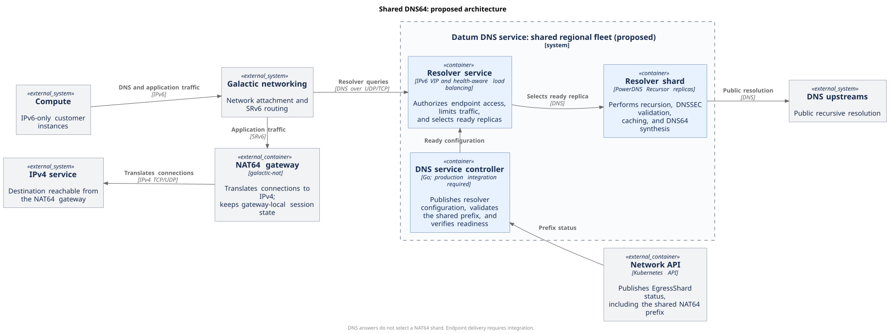
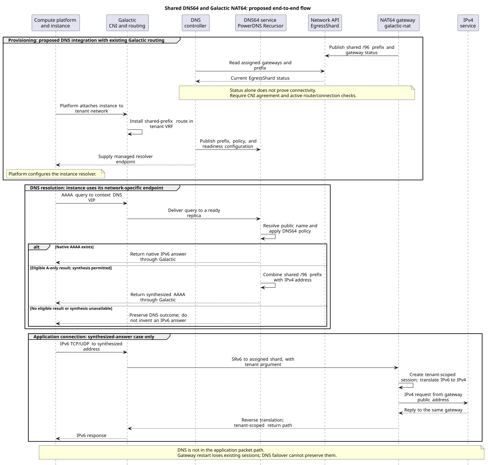

# Shared DNS64 service

Status: Prototype. Galactic implements same-node service routing. Production
DNS64/NAT64 packet-path validation is not complete. The prototype is not
production-ready.

## Summary

This design proposes a managed DNS64 service for IPv6-only Compute instances.
PowerDNS Recursor resolves public names and synthesizes AAAA records from
A records when a name has no usable native AAAA record. Galactic's NAT64
gateway translates connections to IPv4.

The initial service uses one shared `/96` NAT64 prefix per serving fabric and a
shared regional resolver fleet. The planning range is 10,000–100,000 tenants;
it is not a verified capacity limit. The service scales resolver capacity by
traffic and configuration size instead of deploying a resolver for every
tenant.

Private DNS, tenant-specific views, private zones, conditional forwarding,
and tenant-specific NAT64 prefixes are outside this proposal.

## Motivation

IPv6-only instances need to reach IPv4-only public services without requiring
each customer to operate a DNS64 resolver or NAT64 gateway. A managed service
provides a consistent resolver address and connects DNS synthesis to the
Galactic routing and NAT64 path.

## Goals

- Resolve public names for IPv6-only instances.
- Synthesize eligible AAAA records using the shared NAT64 prefix.
- Deliver a stable IPv6 resolver endpoint through the Compute network path.
- Scale through shared resolver replicas and bounded capacity shards.
- Validate DNSSEC behavior, synthesis exclusions, abuse controls, failover, and
  end-to-end NAT64 connectivity.
- Report resolver health, query failures, synthesis, and NAT64 reachability.

## Non-goals

- Provide private zones, split-horizon DNS, or customer DNS forwarding.
- Provide tenant-specific resolver views, caches, upstreams, or NAT64 prefixes.
- Build a DNS protocol engine or replace public authoritative DNS.
- Operate an open recursive resolver or expose public encrypted DNS endpoints.
- Make IPv4 literals work or create connectivity to unreachable destinations.
- Preserve established connections when a NAT64 gateway loses session state.

## Proposed architecture

Use PowerDNS Recursor as the short-term recursive DNS64 engine. Its native
`recursor.dns64_prefix` setting supplies the shared `/96` prefix and performs
RFC 6147 synthesis. A DNS service controller publishes resolver configuration
and readiness. Galactic supplies network isolation, resolver endpoint routing,
and NAT64 forwarding. dnsdist and authoritative DNS components are deferred
until a later capability requires them.

A resolver shard is a bounded group of PowerDNS Recursor replicas. Shards are
selected by aggregate query rate, cache size, and operational limits rather
than by one-process-per-tenant allocation. The initial endpoint is shared by
the serving region; workload attachment and routing determine which network
may reach it.



[Container diagram source](containers.puml).

The diagrams describe the proposed product architecture.

### Endpoint access and resource controls

The proposed resolver VIP is a managed network service. Galactic selects
eligible workload attachments for routing. The attachment and resolver service
must reject spoofed sources and unauthorized queries. The current route
programmer does not enforce the policy's protocol and port restrictions.

The first milestone does not require a resolver process or cache per tenant.
Bound shard memory, connections, outstanding queries, and query rates. Apply
ACLs and rate limits at the resolver service and enforce limits consistently
across replicas. Reject EDNS Client Subnet from clients and do not send it to
public upstreams unless a later privacy review approves an exception.

## Design details

### Resolution and connection flow

The Compute platform configures the instance. The instance then uses ordinary
DNS and TCP or UDP; the DNS service controller is not on the query path.



[Sequence diagram source](resolution-sequence.puml).

The sequence diagram is the flow reference. The important invariants are that
DNS does not select a NAT64 gateway, the synthesized address uses the shared
prefix, and application traffic returns through the same translation path.

The [CNI route implementation][cni-routes] and [NAT64 gateway design][nat64-design]
define the egress side of this flow. The service-route prototype supplies the
local resolver route; end-to-end DNS64 integration remains planned.

### Current service-route prototype

The [Network API][service-route-api] defines two internal resources:

- `ServiceEndpoint` publishes a stable service address, protocol, and port.
  Its `attachmentRef` identifies the Cloud API `VPCAttachment` that hosts the
  service. The current Galactic implementation requires this reference.
- `ServiceRoutePolicy` references an endpoint in the same namespace and selects
  consumer attachments by label. The network control plane must assign labels
  that grant service access.

These resources support shared services without a customer-facing DNS64 API
or a Kubernetes route resource for every attachment or node. Policy status
holds durable conditions, not attachment counts. The current reconciler does
not publish those conditions.

[Galactic's service-route controller][service-route-programming] runs inside
`galactic-router`. It watches both resources and Cloud `VPCAttachment` changes,
including `VPCAttachment.status.node`, the authoritative placement field.
Router RBAC grants read and watch access to these APIs. Each router reconciles
only attachments assigned to its node. The service attachment must also be on
that node.

For each selected consumer, Galactic uses attachment status to resolve the
consumer subnet, both VPCs, and their host interfaces. On Linux, it programs
bidirectional routes in the VPC virtual routing and forwarding (VRF) tables:

- The consumer VPC table routes the endpoint address to the service interface.
- The service VPC table routes the consumer subnet to the consumer interface.

Galactic also programs matching eBPF pass-through route-map entries in both
VRFs. These entries keep service traffic on the local Linux routing path
instead of sending it through an egress gateway. NAT64 translation, NAT64
routes, and default-route programming remain outside this controller.

### Route cleanup and rollback

After it successfully computes the desired routes, the controller removes the
policy's previously tracked routes and pass-through entries before applying
the replacement. This removes stale routes when selection or attachment
placement changes. Policy deletion also triggers cleanup of tracked routes.

Updates are not atomic. If the return route fails to install, the programmer
attempts to remove the forward route. If the service-side pass-through entry
fails, it attempts to remove the consumer-side entry, but leaves the Linux
routes installed. Rollback does not restore the previous policy state.

Cleanup relies on in-memory tracking. Restarting the controller loses that
tracking, and failed updates can leave partial state. Endpoint lookup or route
planning errors leave existing routes in place; deleting an endpoint alone
does not withdraw them. Recovery from these cases remains a prototype limit.

### Current routing observability

[Service-route metrics][service-route-observability] use the existing
`galactic-router` Prometheus endpoint. They report reconciliation outcomes and
duration, route apply and remove outcomes, and the number of locally tracked
route intents. Labels use only bounded result and operation values. Resource
identities stay out of metric labels to keep cardinality bounded.

Structured logs include policy and node context, endpoint context where
available, compiled intent counts, and errors from lookup, planning,
programming, or cleanup. The route count reflects controller tracking; it does
not prove resolver health or packet delivery.

### Planned DNS64 readiness and prefix contract

DNS64 readiness requires agreement between the resolver VIP, the Galactic
route to that VIP, and the shared NAT64 prefix. The VIP supplied to the instance
must match the routed endpoint. The resolver's synthesis prefix must match
the prefix routed to the assigned NAT64 gateway. A reachable resolver alone
does not establish DNS64 readiness. The service-route controller does not
implement this readiness check.

Use one Datum-managed `/96` prefix shared across the fabric. Read it from
[`EgressShard.status.nat64Prefix`][egress-status]; do not allocate prefixes in
the DNS service. Require agreement between assigned NAT64 shards and the CNI
configuration before enabling synthesis.

Require current gateway status, route convergence, and active IPv4 connection
checks. The current [`Ready` condition][shard-readiness] reports an attached
translation program, not working IPv4 connectivity. Operators must provide
[IPv4 return routing][return-routing].

If the prefix is missing or inconsistent, disable synthesis and report the
reason. Native IPv6 resolution can continue. Coordinate prefix changes with
route retention for cached synthesized answers; clients can retain earlier
answers until their TTL expires.

### Planned synthesis and DNS security

Follow [RFC 6147][dns64-rfc]. Synthesize only for an AAAA query when eligible
A records exist and no usable native AAAA record exists. Preserve NXDOMAIN,
negative answers, and upstream errors. Exclude IPv4 literals, special-use
names, destinations covered by local policy, and any destination that must
remain unreachable.

Enable PowerDNS Recursor DNSSEC validation. Do not synthesize when validation
returns `Bogus`. Synthesized records are generated by the resolver and do not
carry a signature from the original zone. Validate behavior for signed
IPv4-only names, unsigned names, SERVFAIL, and negative answers.

Use public-root trust anchors and query-name minimization for public
resolution. Apply ACLs, response-rate limiting, maximum response sizes, and
resource limits to reduce cache-poisoning, amplification, and denial-of-
service risk.

### Planned configuration and rollout

The proposed DNS service controller distributes versioned fleet configuration
to the assigned resolver shards. The initial configuration contains the shared
prefix, public upstream policy, ACLs, synthesis exclusions, resource limits,
and observability settings. It does not manage tenant zones or tenant DNS
records.

Validate each revision before activation and retain the previous revision for
rollback. Drain a replica before upgrade, verify health and synthesis, then
return it to service. Admit a shard only after its configuration and resolver
health pass the DNS64 readiness checks.

### Planned availability and capacity

Place resolver replicas across failure domains within each region. Keep enough
spare capacity to lose a replica. Use a stable IPv6 VIP with health-aware
backend selection. Rebuild caches after failure; do not treat them as durable
state.

Assign shards by query rate, cache size, response size, and connection limits.
Configuration and memory still grow with aggregate traffic, but shared replicas
avoid a fixed deployment per tenant. Measure query latency, error rate,
synthesis rate, cache hit rate, resolver resource use, and NAT64 connection
success. Bound metric cardinality and query-log retention. Add tenant-level
accounting only when quotas or billing require it.

## Limitations and validation

The current implementation supports same-node consumer and service attachments
only. Cross-node service routing is future work. Health-based endpoint
withdrawal is not implemented. Route programming requires Linux.

The existing prototype exercised dnsdist, BIND, and Jool in a controlled lab.
That implementation is not the proposed production design. The DNS64 prototype
must exercise PowerDNS Recursor with the shared prefix and the intended
Galactic/NAT64 path. Jool remains a test fixture only.

Production DNS64/NAT64 packet-path validation is not complete. The Galactic
compatibility profile validates saved configuration offline; it does not prove
the Galactic packet path. Controlled upstreams and same-host replicas do not
establish internet-resolution performance or failure-domain
availability.

Galactic source reviewed on September 16, 2026, supports TCP and UDP. It lacks
ICMP translation, fragmentation handling, and path MTU discovery, and it does
not provide full [RFC 6146][nat64-rfc] behavior. Gateway restart loses session
state. See the [datapath limits][nat-limits] and [gateway design constraints][nat64-constraints].

Before a production pilot, complete these checks:

1. Verify resolver endpoint delivery and unauthorized-source rejection through
   Galactic.
2. Test native AAAA, synthesized AAAA, DNSSEC failures, exclusions, negative
   answers, and upstream failures.
3. Verify the intended NAT64 route and IPv4 return path with TCP and UDP;
   measure gateway restart, stale status, and large-packet behavior.
4. Qualify PowerDNS Recursor shard limits, cache behavior, rate limiting,
   rolling upgrades, configuration rollback, and resolver failover.
5. Run load and abuse tests at the planned 1,000, 5,000, and 10,000 aggregate
   QPS shard profiles.

Production requires agreed service objectives, a durable control-plane design,
and a documented resolution or accepted product restriction for NAT64 protocol
limits.

## Diagram maintenance

Edit the PlantUML sources, then regenerate both SVG files from the repository
root. PlantUML 1.2026.5 and its bundled C4 library produced these diagrams.

```sh
plantuml -tsvg docs/enhancements/dns64/containers.puml docs/enhancements/dns64/resolution-sequence.puml
```

[nat64-design]: https://github.com/datum-cloud/enhancements/blob/a778a6c3104b60b0e7634af4f3e5d2e3ae303549/enhancements/networking/nat64-gateway-for-vpc-networks.md#L184-L198
[egress-status]: https://github.com/datum-cloud/network/blob/ec15d7bda7eb47960a5e2b38daa4d30d42b12748/api/v1alpha1/egressshard_types.go#L90-L114
[cni-routes]: https://github.com/datum-cloud/galactic/blob/846f5d2a189f2849e044de3b383b5ca7be759777/internal/cnibgp/bgp.go#L759-L834
[shard-readiness]: https://github.com/datum-cloud/galactic/blob/846f5d2a189f2849e044de3b383b5ca7be759777/internal/controller/egressshard_controller.go#L286-L303
[return-routing]: https://github.com/datum-cloud/galactic/blob/846f5d2a189f2849e044de3b383b5ca7be759777/internal/controller/egressshard_controller.go#L180-L184
[nat-limits]: https://github.com/datum-cloud/galactic/blob/846f5d2a189f2849e044de3b383b5ca7be759777/internal/plumbing/ebpf/natprog/nat.c#L74-L92
[nat64-constraints]: https://github.com/datum-cloud/enhancements/blob/a778a6c3104b60b0e7634af4f3e5d2e3ae303549/enhancements/networking/nat64-gateway-for-vpc-networks.md#L184-L198
[dns64-rfc]: https://www.rfc-editor.org/rfc/rfc6147.html
[nat64-rfc]: https://www.rfc-editor.org/rfc/rfc6146.html
[service-route-api]: https://github.com/datum-cloud/network/pull/27
[service-route-programming]: https://github.com/datum-cloud/galactic/pull/634
[service-route-observability]: https://github.com/datum-cloud/galactic/pull/635
