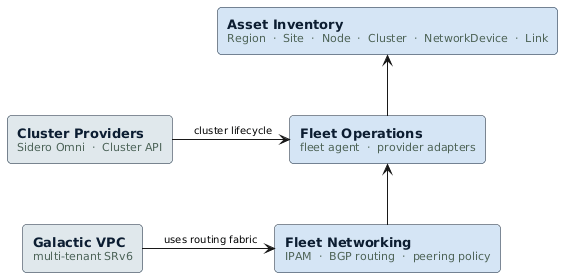

<!-- omit from toc -->
# Infrastructure Platform

- [Overview](#overview)
- [Enhancements](#enhancements)
- [Layered Architecture](#layered-architecture)

## Overview

The Infrastructure Platform provides the foundational services that Datum Cloud
uses to manage its fleet of clusters and network devices across multiple
geographic regions. It is the layer between the physical infrastructure
(provisioned by providers like [Sidero Omni][sidero-omni] or
[Cluster API][cluster-api]) and the platform services that run on it (VPC
networking, compute, storage).

All infrastructure platform services are built on Kubernetes as a **control
plane framework** — using its API machinery, resource model, watch semantics,
and RBAC as the foundation for custom resources and controllers. This is the
same approach used by projects like [kcp][kcp-style], and is distinct from
using Kubernetes as a container runtime platform.

The infrastructure platform answers three questions:

1. **What do we have and where is it?** — A structured inventory of all
   infrastructure assets, their geographic placement, and connectivity
   relationships.

2. **How do we manage it?** — Automated registration of assets from
   providers, and pull-based configuration delivery to clusters via a
   lightweight fleet agent.

3. **How do we network it?** — Automated allocation of network identities
   ([AS numbers][asn-overview], IPv6 prefixes) and [BGP][bgp-overview] routing
   configuration so clusters can exchange traffic.

## Enhancements

| Enhancement | Purpose | API Group |
|------------|---------|-----------|
| [Asset Inventory — infrastructure registry and topology model](./asset-inventory/) | Structured registry of nodes, clusters, network devices, and their geographic placement | `infra.datumapis.com` |
| [Fleet Operations — declarative deployments and configuration delivery](./fleet-operations/) | `ClusterDeployment` lifecycle, provider adapters, pull-based fleet agent | `fleet.datumapis.com` |
| [Fleet Networking — network resource allocation and routing automation](./fleet-networking/) | IPAM pools and claims, [BGP control plane][datum-bgp], topology policy | `ipam.datumapis.com`, `bgp.miloapis.com` |

## Layered Architecture

The three enhancements form a layered architecture where each layer builds on
the one below. Each layer can be used independently — the Asset Inventory is
useful without Fleet Operations, and Fleet Operations is useful without Fleet
Networking.

  

**Consumers beyond this stack:**

- **[Galactic VPC](../networking/vpc/)** uses the routing fabric provided by
  Fleet Networking for cross-cluster [SRv6][srv6] traffic.
- **Compliance and audit tools** can read the Asset Inventory directly for
  infrastructure audits.
- **Capacity planning** can query asset counts and connectivity by region.
- **Future fleet services** (policy, observability, certificates) will consume
  Fleet Operations for configuration delivery and Asset Inventory for topology
  awareness.

<!-- References -->
[sidero-omni]: https://www.siderolabs.com/platform/saas-for-kubernetes/
[cluster-api]: https://cluster-api.sigs.k8s.io/
[kcp-style]: https://www.kcp.io/
[bgp-overview]: https://datatracker.ietf.org/doc/html/rfc4271
[asn-overview]: https://www.iana.org/assignments/as-numbers/as-numbers.xhtml
[srv6]: https://datatracker.ietf.org/doc/html/rfc8986
[datum-bgp]: https://github.com/datum-cloud/bgp
