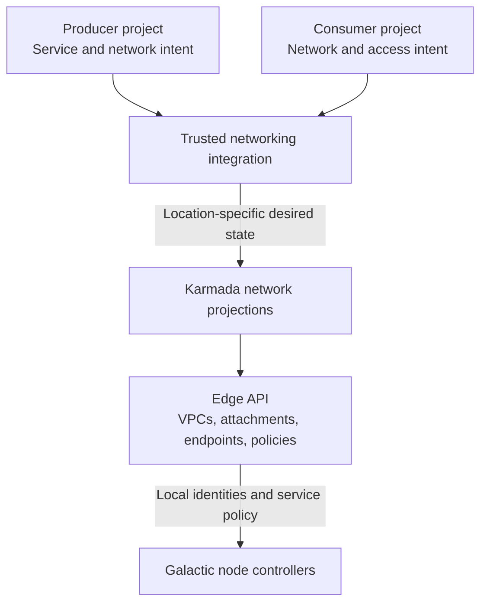
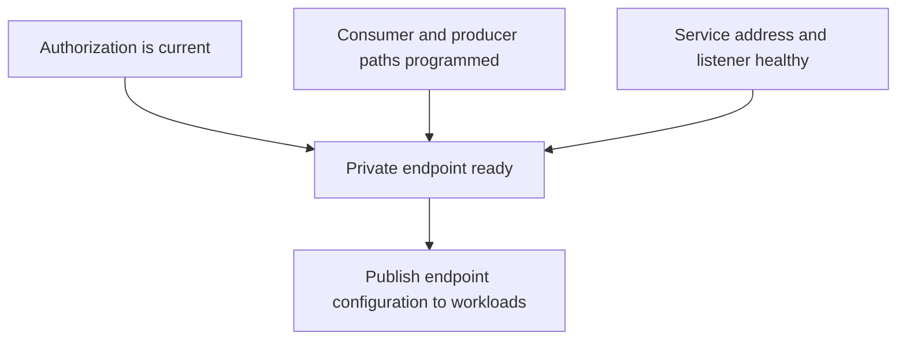
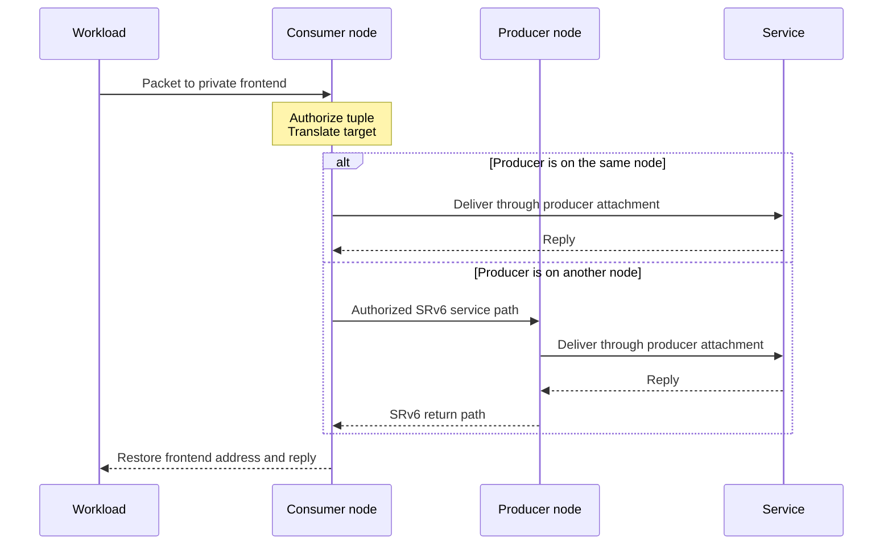

# Private Service Connect

Status: Proposed. Galactic has private-service routing primitives; frontend
translation and integration extensions have local validation. Production
readiness remains work in progress.

The [Internal DNS overview](https://github.com/datum-cloud/enhancements/blob/docs/internal-dns-product-proposal/architecture/deliver/dns/internal-dns/README.md) describes the first consumer of
this capability.

## Product overview

Private Service Connect gives a consumer VPC private access to a published
service in a producer VPC. The producer owns the service and its availability.
The platform authorizes access to specific addresses, protocols, and ports.
Publishing an endpoint does not connect the entire producer network.

A shared service can serve many consumer VPCs. Consumers receive a stable private
endpoint while the platform selects an eligible producer. Internal DNS is the
first integration in this proposal; arbitrary customer-published services and
their management experience need separate release scope.

## System architecture

Networking integration translates project intent into location-specific network
state. Galactic programs each node from its edge API. Traffic uses the applied
data plane without querying project APIs or Karmada per packet.

Project APIs own intent. Karmada owns placement and projected desired state.
The edge owns local VPC and attachment identities. Networking controllers return
selected edge observations through federation and project consumer status.
The integration resolves live edge identities when creating service policies;
project and propagated object UIDs are separate lifetimes.

The networking APIs live in the
[network repository](https://github.com/datum-cloud/network/blob/main/api/v1alpha1/serviceroute_types.go).
Galactic owns route compilation and packet handling. The
[private-service routing reference](../../../router/private-service-routes.md)
describes the existing direct-endpoint contract. API schemas, map layouts, and
deployment configuration remain in those component repositories.

## Control-plane design

### Endpoints and authorization

`ServiceEndpoint` declares the exact destination address, transport, and port
that its producer attachments accept. The service owner configures the listener,
address reachability, and health. Galactic does not discover a hidden backend
behind that address.

`ServiceRoutePolicy` selects authorized consumer attachments and references an
endpoint in the same namespace. The proposed consumer VPC lifetime reference
limits access to the live VPC. The proposed frontend address maps a
consumer-facing endpoint to the producer's declared destination.

Consumer policies and endpoint descriptors live in the consumer VPC's edge
namespace. A descriptor can select producer attachments in the service's edge
namespace. Only trusted platform controllers can write authorization or labels
that select producers and consumers.

The integration derives serving placement from trusted network location state.
Independent locations have separate programming and readiness. Cross-region
fallback requires an explicit policy.

### Readiness and lifecycle

Policy acceptance confirms valid configuration. Advertising a usable endpoint
also requires consumer and producer paths to be programmed and the service
listener to be healthy.

The service owner withdraws unhealthy producers. Networking integration removes
access when the consumer or service is deleted. Recreated resources receive new
identities; stale work must not restore previous access. The released design
needs a node-level programming acknowledgment and a bounded revocation policy.
The current route policy does not provide an authorization lease.

## Data-plane design

Galactic classifies traffic by the trusted consumer attachment and endpoint
tuple. The proposed frontend translation changes the destination to the
authorized service address and restores the frontend on replies. Consumers use
their ordinary gateway; Galactic does not install a service-specific guest route.

`NodeLocal` requires a producer on the consumer's node. `PreferNodeLocal` uses
a local producer when available and otherwise selects a ready remote producer.
Selection is deterministic. The current direct-endpoint path rejects multiple
ready producers in the same node and VPC because it cannot distinguish them.

Overlapping consumer addresses remain scoped to their attachments. Remote
delivery requires matching platform-programmed service grants. Tenant-supplied
addresses or packet metadata cannot grant access. The design relies on trusted
attachment state and protected fabric delivery.

The current return path rejects concurrent flows from different consumers that
produce the same reply tuple on one producer attachment. Internal DNS separates
service-side destinations by context. General shared endpoints need equivalent
disambiguation for overlapping consumers that use identical tuples.

This path is separate from Galactic's gateway `ServiceVIPBinding` mechanism.
Publishing a private endpoint does not create gateway load-balancer state.

## Internal DNS integration

Internal DNS uses a well-known frontend address in each consumer VPC. Its
networking integration maps that frontend to an authorized service-side
destination for the network's DNS context. Galactic enforces the private path;
DNS interprets the destination and isolates zones and answers.

DNS contexts, record publication, health-aware discovery, and resolver leases
belong to the [DNS component design](https://github.com/datum-cloud/dns-operator/blob/docs/internal-dns-architecture/docs/architecture/internal-dns/README.md).
The generic private-service path does not interpret DNS resources.

## Operations and remaining work

An API outage can delay updates and revocation while nodes retain applied state.
Define retention and revocation budgets before rollout. Restart and replay must
reconcile current intent and remove obsolete programming. Producer reselection
does not promise continuity for established connections.

Observe policy acceptance, path programming, producer health, selection failures,
and revocation lag separately. The frontend extension defaults to disabled in
the local prototype.

Local kernel tests cover local and remote service translation and authorization.
The internal DNS suite validates live queries over the local path. Normal
router/CNI lifecycle, independent edge APIs, remote live DNS traffic, rollout,
capacity, and regional failures remain unqualified. Producer address ownership,
readiness, and safe address reclamation need production lifecycle handling.
