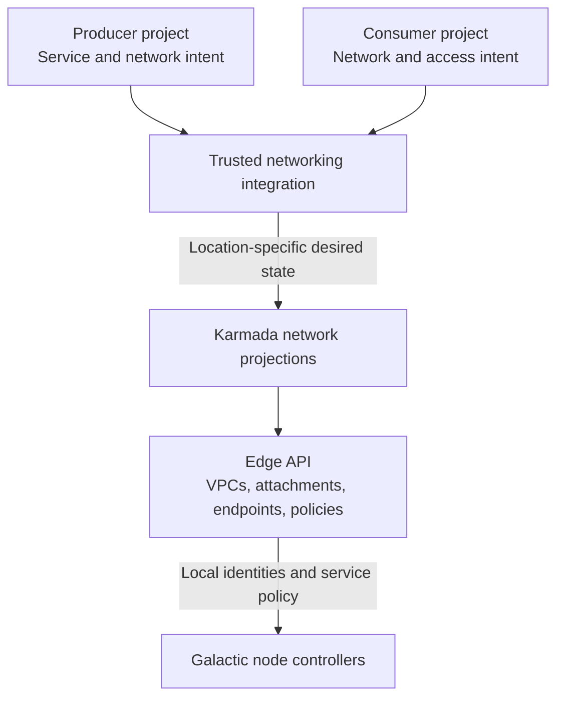
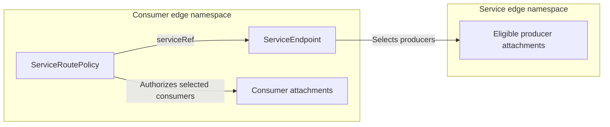
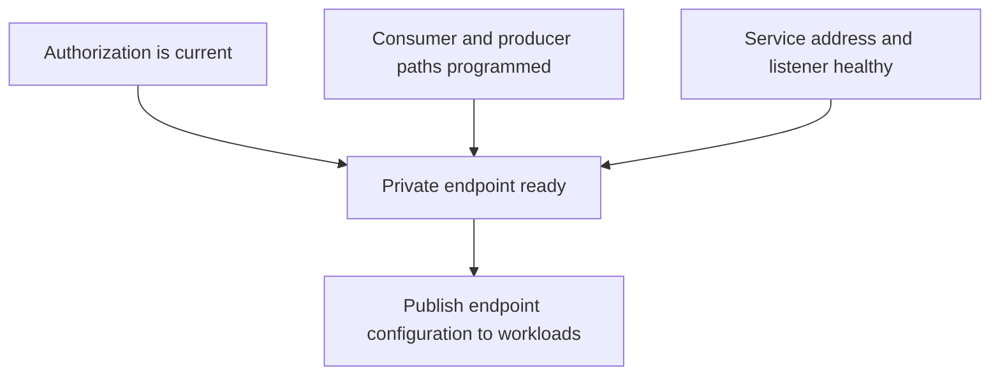
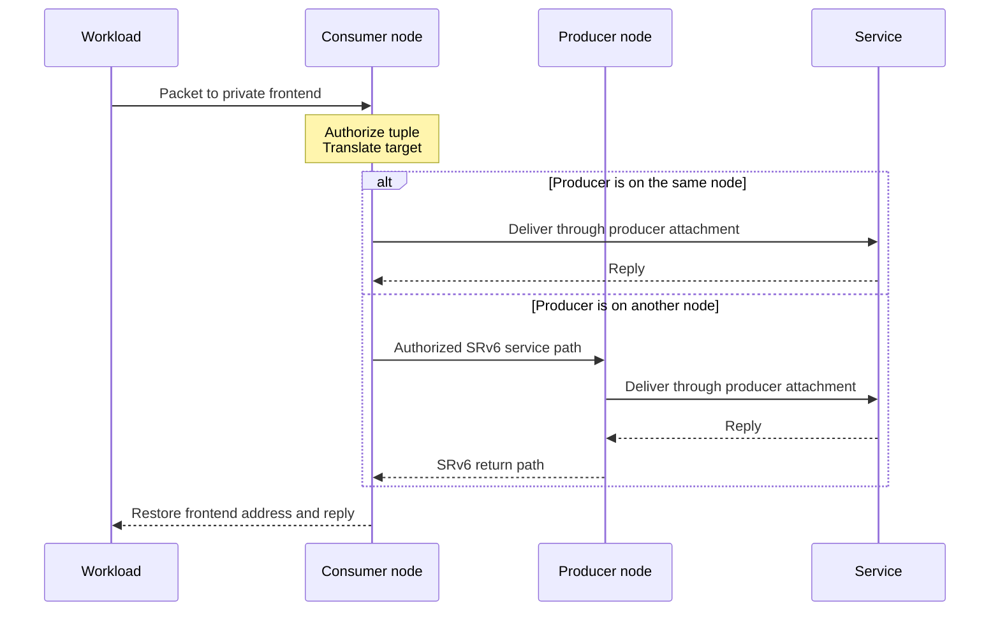

# Private Service Connect

- [Summary](#summary)
- [Motivation](#motivation)
  - [Goals](#goals)
  - [Non-goals](#non-goals)
- [Proposal](#proposal)
  - [User stories](#user-stories)
  - [Notes, constraints, and caveats](#notes-constraints-and-caveats)
  - [Risks and mitigations](#risks-and-mitigations)
- [Design Details](#design-details)
  - [System architecture](#system-architecture)
  - [Resource model and ownership](#resource-model-and-ownership)
  - [Endpoint declaration](#endpoint-declaration)
  - [Consumer access and frontend translation](#consumer-access-and-frontend-translation)
  - [Validation and compatibility](#validation-and-compatibility)
  - [Reconciliation and selection](#reconciliation-and-selection)
  - [Status and lifecycle](#status-and-lifecycle)
  - [Data plane](#data-plane)
  - [Internal DNS integration](#internal-dns-integration)
- [Production readiness review questionnaire](#production-readiness-review-questionnaire)
- [Implementation history](#implementation-history)
- [Drawbacks](#drawbacks)
- [Alternatives](#alternatives)
- [Infrastructure needed](#infrastructure-needed)

## Summary

Private Service Connect gives a consumer VPC private access to a published
service in a producer VPC. Consumers use a stable private endpoint while the
platform selects an authorized, eligible producer. A shared service can serve
many VPCs without a separate deployment for each consumer.

## Motivation

Platform services need private connectivity from isolated consumer networks.
Connecting entire VPCs exposes more of the producer network than a service
requires. Private Service Connect grants access to a specific service tuple and
keeps network identity trustworthy when consumers use overlapping addresses.

The [Internal DNS overview](https://github.com/datum-cloud/enhancements/blob/docs/internal-dns-product-proposal/architecture/deliver/dns/internal-dns/README.md)
describes the first integration: the same resolver address in each VPC reaches
that network's isolated DNS context through a shared DNS fleet.

### Goals

- Give workloads private access to authorized services through their existing
  network configuration.
- Share producer capacity across consumer VPCs with overlapping addresses.
- Preserve consumer identity through local delivery, remote delivery, and replies.
- Withdraw access on resource deletion and stop selecting unhealthy producers.

### Non-goals

- Connecting entire producer and consumer networks.
- Discovering service backends or performing application health checks in Galactic.
- Defining customer-published services or their management experience.
- Defining DNS contexts, record publication, or resolver cache isolation.

## Proposal

A service owner publishes an endpoint and maintains its availability. Trusted
networking integration authorizes consumer attachments and assigns a private
frontend. Galactic delivers only the permitted address, protocol, and port to an
eligible producer. Service health and network programming are separate readiness
requirements.

### User stories

- A workload uses the network's inherited DNS resolver without selecting a
  resolver deployment or configuring a service-specific route.
- Two VPCs use the same frontend address and receive their own service context.
- A service owner adds ready producers to shared capacity and withdraws unhealthy
  producers without changing the consumer-facing address.

### Notes, constraints, and caveats

Endpoint addresses must be reachable and accepted by the producer listener.
Publishing an endpoint does not configure the producer address. The initial
frontend design translates within one address family; cross-family translation
requires a separate design. Addresses in the manifests are illustrative.

A new consumer creates endpoint and authorization data, not a producer
workload. Producer reselection does not promise continuity for established
connections. Regional placement and fallback are explicit policies.

### Risks and mitigations

- Incorrect access: protect integration credentials and selection labels, and
  pin authorization to the live consumer VPC identity.
- Stale programming: reconcile current resource lifetimes after restart and
  define a bounded revocation policy before rollout.
- Endpoint advertised too early: require service health and verified consumer
  and producer path programming before publishing workload configuration.

## Design Details

### System architecture

Networking integration translates project intent into location-specific network
state. Galactic programs each node from its edge API. Traffic uses the applied
data plane without querying project APIs or Karmada per packet.



Project APIs own intent. Karmada owns placement and projected desired state.
The edge owns local VPC and attachment identities. Networking controllers return
selected edge observations through federation and project consumer status.
The integration resolves live edge identities when creating service policies;
project and propagated object UIDs are separate lifetimes.

The networking APIs live in the
[network repository](https://github.com/datum-cloud/network/blob/main/api/v1alpha1/serviceroute_types.go).
Galactic owns route compilation and packet handling. The
[private-service routing reference](../../../router/private-service-routes.md)
documents packet handling for this contract. This enhancement defines the
resource design; the network repository holds its schemas, and Galactic holds
its controller and data-plane implementation.

### Resource model and ownership

The design separates service publication from consumer authorization:

- `ServiceEndpoint` describes what a producer offers: one destination address,
  protocol, and port, the attachments that can serve it, and the delivery policy.
  Declaring an endpoint grants no consumer access.
- `ServiceRoutePolicy` describes who can use that endpoint: selected consumer
  attachments, their VPC lifetime, permitted traffic, and an optional frontend.
  The policy references the service contract rather than duplicating producer
  selection or listener configuration.

This separation lets service owners change eligible producers while networking
integration changes consumer access independently. Several policies in one
namespace can reference the same endpoint. Different consumer namespaces receive
local descriptors that select shared producer attachments; the descriptors are
control-plane data, not service deployments.



Both resources live in the edge API. `serviceRef` resolves in the policy's
namespace. Producer references carry their attachment namespace; producer
selectors can match attachments in the service namespace. Cross-namespace
producer selection is a privileged platform operation, not a tenant permission.

Project APIs and federation hold intent and placement. Trusted integration
projects endpoint descriptors, resolves edge VPC names and API-assigned UIDs,
and creates consumer policies. A project UID is not an edge VPC UID. The service
owner supplies the exact service tuple and eligible producers. Only platform
controllers can write these resources or the labels that select their attachments.

The complete API design includes `consumerVPCRef` and `frontend` on
`ServiceRoutePolicy`. Those fields extend the direct-delivery implementation;
they are present in the local prototype and remain proposed for the released
schema. This document defines both resources, including their current fields
and proposed extensions.

### Endpoint declaration

An endpoint names one directly delivered service tuple. Keeping one transport
per endpoint makes publication, authorization, and failure reporting explicit.
DNS uses separate UDP and TCP endpoints. `serviceClass` identifies the capability
for integration and operations; it is not an authorization role or backend lookup.

The owner must make the endpoint address reachable through every selected
producer attachment and accepted by its listener. The address can carry a
service-defined context, as Internal DNS does. Galactic delivers that address
without choosing an application backend. Replica selection chooses the network
attachment that receives the tuple.

The following descriptor lives in `consumer-a`. It selects shared DNS producers
through platform-managed labels, including producers in the DNS service's edge
namespace. Each eligible producer must serve this destination and DNS context.

```yaml
apiVersion: network.datumapis.com/v1alpha1
kind: ServiceEndpoint
metadata:
  name: context-a-dns-udp
  namespace: consumer-a
spec:
  serviceClass: internal-dns
  # Exact destination accepted by the producer, after frontend translation.
  address: "fd70:100::10"
  port: 53
  protocol: udp
  deliveryMode: PreferNodeLocal
  region: us-central-1
  attachmentSelector:
    matchLabels:
      networking.datumapis.com/service: internal-dns
      topology.kubernetes.io/region: us-central-1
```

| Field                | Design                                                                                                                     |
| -------------------- | -------------------------------------------------------------------------------------------------------------------------- |
| `serviceClass`       | Identifies the capability; it does not grant access.                                                                       |
| `address`            | Exact service-side destination. The service owner makes it routable and accepted by its listener.                          |
| `port`, `protocol`   | One transport tuple. Protocol values are lowercase `udp` or `tcp`.                                                         |
| `deliveryMode`       | `NodeLocal` requires a local producer; `PreferNodeLocal` permits a ready remote producer.                                  |
| `attachmentSelector` | Selects replicas through platform-managed labels. Each selected producer must serve the declared tuple.                    |
| `attachmentRef`      | Alternative to a selector: identifies one producer attachment by `namespace` and `name`. Use exactly one selection method. |
| `region`             | Optional selection boundary. An empty value does not impose a region restriction.                                          |

The address is not a Kubernetes Service frontend or an address from which
Galactic discovers backends. An endpoint has one transport tuple; DNS requires
separate UDP and TCP descriptors. Create `context-a-dns-tcp` with the same
address, selector, placement, and port, and `protocol: tcp`.

### Consumer access and frontend translation

A policy applies the endpoint contract to a consumer set. It can authorize many
attachments in one VPC. The proposed lifetime reference prevents a recreated
VPC with the same name from inheriting access. The frontend belongs to this
consumer policy so different VPCs can use the same address for different service
destinations without changing the producer contract.

The policy references the endpoint in its own namespace. `consumerVPCRef` pins
the VPC named `application-vpc` in `consumer-a` to its live edge UID. The selector
narrows eligible attachments; it does not replace the VPC identity check.

```yaml
apiVersion: network.datumapis.com/v1alpha1
kind: ServiceRoutePolicy
metadata:
  name: application-vpc-dns-udp
  namespace: consumer-a
spec:
  serviceRef:
    name: context-a-dns-udp
  # Proposed: name and API-assigned UID of the VPC in this namespace.
  consumerVPCRef:
    name: application-vpc
    uid: "22222222-2222-4222-8222-222222222222"
  attachmentSelector:
    matchLabels:
      networking.datumapis.com/vpc-uid: "22222222-2222-4222-8222-222222222222"
  protocolPorts:
    - protocol: udp
      port: 53
  region: us-central-1
  # Proposed: consumer-facing address; restored as the reply source.
  frontend:
    address: "fd53::53"
```

| Field                 | Design                                                                                                         |
| --------------------- | -------------------------------------------------------------------------------------------------------------- |
| `serviceRef.name`     | References a `ServiceEndpoint` in the policy namespace.                                                        |
| `consumerVPCRef.name` | Proposed. Resolves the consumer VPC in the policy namespace.                                                   |
| `consumerVPCRef.uid`  | Proposed. Pins the live VPC lifetime; a recreated VPC requires new authorization.                              |
| `attachmentSelector`  | Selects consumer attachments through protected labels. Galactic also verifies their VPC membership.            |
| `protocolPorts`       | Permitted tuples, each within the endpoint's declared tuple. Empty uses that endpoint's protocol and port.     |
| `region`              | Optional consumer placement boundary; it does not authorize cross-region fallback.                             |
| `frontend.address`    | Proposed. Matches consumer requests, translates to `ServiceEndpoint.spec.address`, and is restored on replies. |

Create a matching TCP policy referencing `context-a-dns-tcp` and permitting
`tcp/53`, with the same VPC reference, selector, region, and frontend. UDP and TCP
must satisfy the same authorization and readiness requirements.

A second VPC uses the same `fd53::53` frontend. Its descriptors and policies live
in its own namespace, pin its own VPC UID, and use another service destination,
such as `fd70:100::20`. The producer deployment remains shared. DNS maps those
destinations to different contexts; Galactic does not interpret that mapping.

### Validation and compatibility

The proposed frontend contract requires a complete `consumerVPCRef` with name
and UID. Galactic must resolve that live VPC and reject missing or mismatched
identities. Each selected consumer must belong to that VPC and have the expected
programmed network identity. Platform-managed labels alone cannot grant access.

Admission and reconciliation must enforce:

- Exactly one endpoint attachment selection method.
- Valid frontend and endpoint IP addresses in the same family.
- Ports from 1 through 65535 and supported transport values.
- A policy's allowed tuples within its endpoint's declared tuple.
- Consistent placement and current producer and consumer identities.
- No contradictory destination mappings for the same consumer attachment,
  frontend address, protocol, and port. Policy order must not decide access.

Conflict detection across policies still requires implementation review. Endpoint
and policy regions must agree when both are set. Trusted placement and selectors
establish location membership; a region string alone is not identity proof.

Omitting `frontend` preserves direct delivery to the endpoint address. Existing
policies without the new fields retain their existing contract; new translated
access requires the lifetime pin. Frontend translation remains disabled by
default until API and data-plane compatibility are qualified.

### Reconciliation and selection

Each Galactic node watches policies, endpoint descriptors, VPCs, and attachments
in the edge API. It derives current desired programming through these steps:

1. Resolve `serviceRef`, validate the service tuple and placement, and resolve
   the pinned consumer VPC name and UID.
2. Select producer attachments with current-generation `Ready` and `Programmed`
   status, a node, allocated network identities, and a host interface. Service
   owners must ensure selected producers are also healthy for the declared tuple.
3. Select consumer attachments through protected labels and verify their live
   VPC membership and programmed attachment identity.
4. Choose one producer for each consumer. Prefer a local producer; `NodeLocal`
   leaves the consumer without a path if none is available. `PreferNodeLocal`
   permits a ready remote producer. Selection uses a deterministic attachment
   ordering, not round-robin balancing or application health probes.
5. Program this node's consumer and producer paths. Remote paths require both
   sides' trusted attachment identities, matching service grants, and return
   routing. Grants bind the policy, endpoint, and attachment lifetimes to the
   permitted tuple and frontend.
6. Remove obsolete programming when selection, references, or lifetimes change.
   Restart reconciliation rebuilds current desired state and sweeps stale state.

No eligible producer means no usable path; it does not make otherwise valid
policy intent invalid. A missing endpoint or mismatched VPC identity invalidates
the contract and requires stale access to be removed. An unresolved remote path
prevents that node from serving even if the shared policy remains accepted.

Service owners withdraw unhealthy producers through the endpoint's selection
contract. Galactic's attachment readiness checks establish network eligibility;
they do not substitute for service health.

### Status and lifecycle

`ServiceRoutePolicy.status.observedGeneration` identifies the spec generation
that its conditions describe. `Accepted` reports valid configuration; it does
not prove that every required node has programmed the path. `ServiceEndpoint`
does not provide a listener-health status contract.



The release needs node-level programming acknowledgments and a service-owned
health signal before integration advertises the frontend. Their API shape
remains a design decision; this proposal does not add a `Programmed` or `Ready`
condition that the existing controllers cannot verify.

Changing an endpoint tuple or producer selection re-evaluates its referencing
policies. Explicit `protocolPorts` must still match; policies that omit them
follow the endpoint's declared tuple. Deleting an endpoint leaves references
unusable and removes their programming. Deleting a policy removes its access
without deleting the shared producer service or consumer attachments.

Service owners withdraw unhealthy producers. Networking integration deletes
access when the consumer or service is deleted. Galactic removes obsolete
programming and reconciles current lifetimes after restart. Recreated VPCs and
endpoints must not inherit previous grants. The current route policy has no
authorization lease; rollout requires a bounded revocation policy.

### Data plane

Galactic classifies traffic by the trusted consumer attachment and endpoint
tuple. The proposed frontend translation changes the destination to the
authorized service address and restores the frontend on replies. Consumers use
their ordinary gateway; Galactic does not install a service-specific guest route.



`NodeLocal` requires a producer on the consumer's node. `PreferNodeLocal` uses
a local producer when available and otherwise selects a ready remote producer.
Selection is deterministic. The current direct-endpoint path rejects multiple
ready producers in the same node and VPC because it cannot distinguish them.

Overlapping consumer addresses remain scoped to their attachments. Remote
delivery requires matching platform-programmed service grants. Tenant-supplied
addresses or packet metadata cannot grant access. The design relies on trusted
attachment state and protected fabric delivery.

The current return path rejects concurrent flows from different consumers that
produce the same reply tuple on one producer attachment. Internal DNS separates
service-side destinations by context. General shared endpoints need equivalent
disambiguation for overlapping consumers that use identical tuples.

This path is separate from Galactic's gateway `ServiceVIPBinding` mechanism.
Publishing a private endpoint does not create gateway load-balancer state.

### Internal DNS integration

Internal DNS uses a well-known frontend address in each consumer VPC. Its
networking integration maps that frontend to an authorized service-side
destination for the network's DNS context. Galactic enforces the private path;
DNS interprets the destination and isolates zones and answers.

DNS contexts, record publication, health-aware discovery, and resolver leases
belong to the [DNS component design](https://github.com/datum-cloud/dns-operator/blob/docs/internal-dns-architecture/docs/architecture/internal-dns/README.md).
The generic private-service path does not interpret DNS resources.

## Production readiness review questionnaire

The enhancement remains provisional. Complete and approve the release targets
and outstanding contracts before changing it to implementable.

### Feature enablement and rollback

Keep frontend translation disabled by default. Enable it only with compatible
API schemas and integration controllers. Disabling it can interrupt consumers
that depend on the frontend; validate cleanup and recovery before rollout.

### Rollout, upgrade, and rollback planning

Qualify mixed controller versions, node restart, policy replay, deletion, and
upgrade followed by rollback and reenablement. Avoid advertising endpoints while
required nodes lack the configuration. No existing API removal is proposed.

### Monitoring requirements

Observe acceptance, node programming, producer health, selected traffic,
translation failures, and revocation lag separately. Define availability,
latency, and revocation targets. Consumer status must distinguish valid intent
from a usable endpoint; its readiness projection remains to be designed.

### Dependencies

Networking integration supplies edge intent and authorization. VPC and
attachment controllers and Galactic supply network identity and packet paths.
Remote delivery requires the protected fabric and service grants. Service owners
supply address reachability, listener configuration, and health eligibility.

### Scalability

Endpoint and policy counts grow with consumer destinations and transports;
producer workload counts grow with shared capacity. Bound route and reverse-flow
maps, API reconciliation cost, configuration churn, and connection state before
release. Exhaustion must fail closed and produce an observable failure.

### Troubleshooting

An API outage can delay updates and revocation while nodes retain applied state.
Define retention and revocation budgets. Diagnose invalid policies, missing VPCs,
unready producers, path-programming failures, and reply collisions separately.
Verify the declared service destination and return path before investigating the
application protocol.

## Implementation history

Initial proposal: [Galactic PR #798](https://github.com/datum-cloud/galactic/pull/798).
Local kernel tests cover local and remote translation and authorization. Live
Internal DNS queries validate the local path. Normal router/CNI lifecycle,
independent edge APIs, remote live DNS traffic, scale, and regional failures
remain unqualified.

## Drawbacks

Distinct service destinations and per-consumer policies add address allocation
and lifecycle work. Stateful reply handling consumes node capacity and limits
connection continuity during producer changes.

## Alternatives

VPC peering grants broader connectivity and requires additional routing policy.
Per-consumer service deployments increase operating cost. A single shared
service destination needs another trustworthy identity mechanism and an
unambiguous return path for overlapping consumers.

## Infrastructure needed

Release the network API extensions and compatible Galactic controllers. Provide
shared producer attachments, service address allocation and reclamation,
protected integration permissions, endpoint readiness reporting, and staging
coverage for local and remote traffic.
