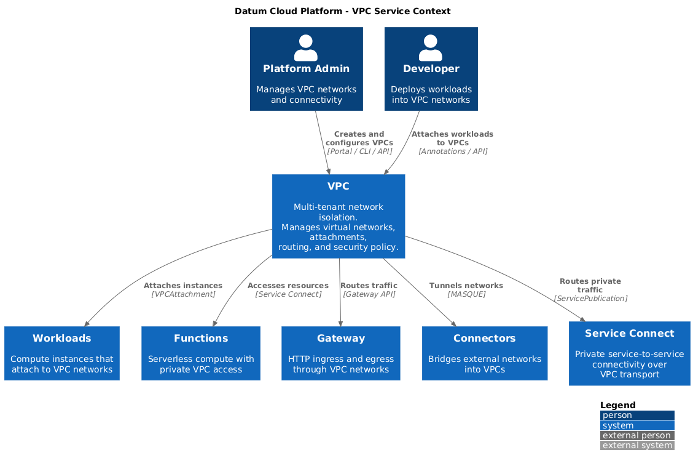

# Virtual Private Cloud (VPC)

**status:** provisional
**stage:** alpha
**latest-milestone:** v0.1

## Summary

VPC delivers multi-tenant network isolation for the Datum Cloud platform, enabling
customers to create private, isolated network environments that span across
clusters, regions, and cloud providers. Using SRv6 (Segment Routing over IPv6),
VPC embeds tenant identity directly into packet headers, providing network
isolation without external lookups, supporting 281 trillion unique VPCs with
sub-millisecond forwarding decisions in the Linux kernel.

## Motivation

Datum Cloud runs workloads for many customers on shared infrastructure. Without
network isolation, traffic from one customer could be visible to or interfere
with another. Platform services such as Functions, Workloads, Connectors, and
Gateways all require a networking foundation that provides:

1. **Tenant isolation** - Customer A's traffic must never mix with Customer B's
2. **Cross-cluster connectivity** - Applications in one cluster must reach
   applications in another within the same VPC
3. **Scalability** - The platform must support a massive number of tenants
   without exhausting network address space
4. **Simplicity** - Developers should attach workloads to a VPC with a single
   annotation, without understanding the underlying network topology

Existing approaches (VXLAN, GRE, IPsec) each impose tradeoffs in overhead,
tenant capacity, or operational complexity that limit the platform's ability to
scale multi-tenant networking globally.

### Goals

- Provide isolated, multi-tenant virtual networks as a platform primitive
- Enable VPCs to span multiple Kubernetes clusters across regions and clouds
- Integrate with Gateway API for ingress and egress traffic management
- Support platform services (Functions, Workloads, Connectors) as VPC consumers
- Deliver IPAM-driven address allocation for VPC CIDRs and subnets
- Enforce network security policies at the VPC level

### Non-Goals

- Replacing the primary CNI for intra-cluster pod-to-pod networking
- Physical network hardware management (switches, routers, NICs)
- Application-layer service mesh capabilities (retries, circuit breaking)
- DNS resolution (delegated to Authoritative DNS service)
- Region selection for VPC placement in MVP

## Proposal

VPC introduces two Kubernetes custom resources, `VPC` and `VPCAttachment`, that
together define isolated network environments and connect workloads to them. A
data plane built on SRv6 encapsulates tenant traffic at the kernel level, while
a control plane distributes routing information across clusters.

### C4 Context Diagram

The following diagram illustrates VPC's position within the Datum Cloud platform
and its relationships with integrating services, users, and external systems.



<details>
<summary>View PlantUML Source</summary>

See [context.puml](./context.puml)

</details>

**Key relationships:**

| System | Integration |
|---|---|
| **Workloads** | Compute instances attach to VPC networks via VPCAttachment |
| **Functions** | Accesses VPC resources through private Service Connect connectivity |
| **Gateway** | Routes external HTTP traffic into VPC backends via Gateway API |
| **Connectors** | Bridges external/on-premise networks into VPCs using MASQUE tunnels |
| **Service Connect** | Routes private service-to-service traffic over VPC network transport |

### Developer Experience

Developers interact with VPC through standard Kubernetes resources. Creating
a VPC and attaching a workload requires three resources:

```yaml
# 1. Define the VPC
apiVersion: galactic.datumapis.com/v1alpha
kind: VPC
metadata:
  name: my-vpc
spec:
  networks:
    - 10.0.0.0/16
    - fd00:acme::/64

# 2. Define the attachment
apiVersion: galactic.datumapis.com/v1alpha
kind: VPCAttachment
metadata:
  name: my-app-attachment
spec:
  vpc:
    name: my-vpc
  interface:
    addresses:
      - 10.0.1.10/24
  routes:
    - destination: 10.0.2.0/24
      via: 10.0.1.1

# 3. Annotate the pod
apiVersion: v1
kind: Pod
metadata:
  name: my-app
  annotations:
    k8s.v1alpha.galactic.datumapis.com/vpc-attachment: my-app-attachment
spec:
  containers:
    - name: app
      image: my-app:latest
```

The platform handles all networking details automatically: VPC identifier
assignment, CNI configuration, VRF isolation, SRv6 encapsulation, and
cross-cluster route distribution.

### User Stories

1. **VPC Creation:** A platform admin creates a VPC with specified CIDR ranges
   and the system assigns a unique identifier, making the VPC available for
   workload attachment.

2. **Workload Attachment:** A developer annotates a pod with a VPCAttachment
   reference and the pod automatically receives an isolated network interface
   connected to the VPC.

3. **Cross-Cluster Communication:** Two workloads in the same VPC but different
   clusters communicate transparently, with SRv6 handling encapsulation and
   routing across the underlay.

4. **External Ingress:** External HTTP traffic reaches a VPC workload through
   a Gateway that terminates TLS and routes requests via Gateway API into the
   VPC network.

5. **Hybrid Connectivity:** A Connector bridges an on-premise network into a VPC,
   allowing cloud workloads to reach enterprise resources over a MASQUE tunnel.

6. **Network Policy:** A platform admin applies security policies restricting
   traffic between VPC attachments, enforced at the kernel level by the
   galactic-agent.

### VPC Responsibilities

VPC is responsible for the following capabilities:

**Network Isolation**
- Tenant traffic isolation using SRv6 encapsulation with VPC identity encoded
  in packet headers (48-bit VPC ID + 16-bit attachment ID)
- Kernel-level VRF (Virtual Routing and Forwarding) domains per attachment
- No external database lookups required for forwarding decisions

**Lifecycle Management**
- VPC and VPCAttachment custom resource reconciliation
- Unique identifier assignment (48-bit for VPCs, 16-bit for attachments)
- NetworkAttachmentDefinition generation for Multus CNI integration

**Routing**
- Cross-cluster route distribution via BGP VPNv6 (replacing MQTT in v2)
- SRv6 segment list computation for traffic engineering
- Per-attachment route tables with custom route entries

**Pod Networking**
- CNI plugin for automatic pod network interface creation
- Virtual ethernet (veth) pair setup between pod namespace and host VRF
- Static IPAM configuration per attachment

**Security**
- Network policy enforcement at the VPC level
- Webhook validation ensuring VPCAttachment existence before pod admission
- RBAC roles for admin, editor, and viewer access patterns

### Security and Access

VPC networks are isolated by default. Workloads within a VPC can communicate
freely; workloads in different VPCs cannot. External access requires explicit
configuration:

- **Ingress:** Gateway resources must be configured with Gateway API routes
  to expose VPC services externally. Gateway supports TLS termination,
  authentication (OIDC, API keys), and rate limiting.
- **Egress:** NAT Gateway provides outbound internet access with IPAM-allocated
  public IPs. Egress policies control reachable destinations.
- **Hybrid:** Connectors bridge external networks into VPCs through authenticated
  MASQUE tunnels.

### Constraints

- VPC CIDRs must not overlap within the same tenant context
- Attachments are limited to ~65,000 per VPC (16-bit identifier space)
- SRv6 encapsulation requires IPv6 underlay connectivity between clusters
- MTU is reduced to 1300 bytes within VPC networks due to SRv6 header overhead
- Stateless operation only; VPC does not maintain connection state

## Design Details

### Architecture

VPC is composed of four runtime components:

| Component | Deployment | Responsibility |
|-----------|------------|----------------|
| **galactic-operator** | Deployment (1 per cluster) | Reconciles VPC/VPCAttachment CRDs, assigns identifiers, generates CNI configs, runs admission webhooks |
| **galactic-agent** | DaemonSet (1 per node) | Programs SRv6 routes and VRF in the kernel, exchanges routes via BGP, serves gRPC for CNI registration |
| **galactic-cni** | Binary (on each node) | Invoked by kubelet on pod creation; creates veth pairs, configures VRF, registers with agent |
| **galactic-router** | Deployment (1 per cluster, v1 only) | MQTT-based route distribution; replaced by BGP route reflectors in v2 |

### SRv6 Addressing

VPC encodes tenant identity in a 128-bit IPv6 address:

```
[SRv6 Prefix (64 bits)] [VPC ID (48 bits)] [Attachment ID (16 bits)]
```

This enables forwarding decisions based solely on the destination address,
with no external lookups. The kernel decapsulates using `End.DT46` to deliver
packets into the correct VRF.

### Platform Service Integration

**Workloads** deploy compute instances that reference VPCAttachments. The
galactic-operator's mutating webhook injects the Multus network annotation,
and the CNI plugin handles interface creation transparently.

**Functions** access VPC resources through Service Connect. The Functions
service plane creates ServicePublications that route through VPC transport,
providing private connectivity without internet traversal.

**Gateway** attaches Envoy Gateway pods directly to VPC networks. HTTPRoute
and TCPRoute resources map external endpoints to VPC backend services, with
the gateway handling TLS termination and authentication.

**Connectors** use MASQUE tunnels to bridge external networks into VPCs.
ConnectorAdvertisement resources register reachable networks, and
ConnectorAttachment associates connectors with specific VPCs.

**Service Connect** uses VPC as its underlying network transport. Service
publications and endpoints route through VPC networks, enabling private
control plane connectivity across the platform.

## Roadmap

| Phase | Scope |
|-------|-------|
| **MVP (current)** | VPC/VPCAttachment CRDs, SRv6 data plane, MQTT routing, pod attachment via annotation |
| **Phase 1** | BGP VPNv6 migration, Gateway integration, IPAM allocation, network policy enforcement, Connector attachment |
| **Phase 2** | NAT/egress gateway, security groups, VPC peering, traffic metering for billing, multi-region route optimization |
| **Phase 3** | Private DNS zones per VPC, advanced traffic engineering, Cloud Router abstraction |

## Platform Dependencies

VPC relies on:
- **Kubernetes** - Cluster orchestration, CRD framework, and workload scheduling
- **IPAM** - Address pool allocation for VPC CIDRs, subnets, and public IPs
- **IAM** - Access control for VPC operations via PolicyBindings
- **BGP Infrastructure** - Route reflector topology for scalable route distribution (Phase 1)
- **IPv6 Underlay** - Physical network connectivity between clusters

VPC enables:
- **Workloads** - Multi-network compute attachment
- **Functions** - Private VPC resource access via Service Connect
- **Gateway** - HTTP ingress/egress through VPC networks
- **Connectors** - Hybrid network bridging into VPCs
- **Service Connect** - Private service-to-service transport
- **Authoritative DNS** - Private DNS zones scoped to VPCs

## Design Decisions

### Alternative 1 - VXLAN Overlay

VXLAN provides mature multi-tenant overlay networking with broad ecosystem
support. However, it imposes 50 bytes of per-packet overhead, limits tenant
count to 16 million (24-bit VNI), and offers no native path control. SRv6
provides lower overhead, identity encoded in the address, and full traffic
engineering capability.

### Alternative 2 - eBPF-based Isolation (Cilium-style)

eBPF-based networking offers high-performance in-kernel packet processing
with policy enforcement. However, Cilium's multi-tenancy is policy-based
rather than architecturally isolated, and cross-cluster connectivity requires
a separate product (Cluster Mesh). SRv6 with VRF provides true kernel-level
routing domain isolation with native cross-cluster support.

### Alternative 3 - Hardware-based SRv6 (SONiC)

Hardware ASIC-based SRv6 offers line-rate performance for switch fabric
use cases. However, it requires specific hardware, cannot run in cloud
environments, and targets datacenter switching rather than multi-tenant
virtual networking. Galactic's kernel-based approach runs on any Linux
node without specialized hardware.

---

*This document represents a provisional design in alpha stage. Implementation
details and platform integrations may evolve based on feedback and development
progress.*
