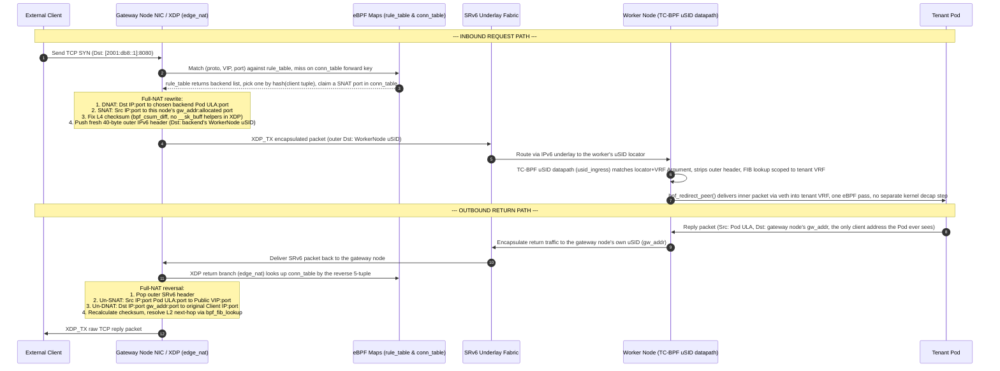
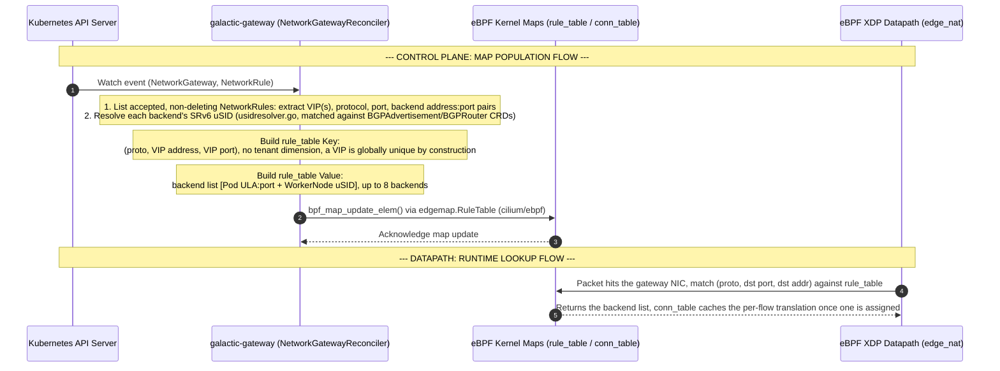

## Packet Trace

This sequence diagram walks one ingress TCP flow through
`galactic-gateway`'s edge XDP Full-NAT datapath end to end: an external
client hitting a VIP, through the gateway node's `edge_nat` XDP program
(`internal/plumbing/ebpf/edgeprog/edgenat.c`), across the SRv6 underlay to
the backend Pod's worker node, and back. `2001:db8::1:8080` is an
illustrative VIP:port, not a value from any config in this repo.

Two things about this datapath are easy to get wrong and matter for
reading the diagram correctly:

- **It is Full-NAT, not plain DNAT.** The gateway rewrites *both* the
  destination (VIP → backend Pod address) and the source (client address →
  the gateway node's own `gw_addr:port`) on the way in. Because of that,
  the backend Pod never learns the real client address — its reply is
  naturally addressed back to the gateway node, which is what lets the
  return path work with zero pod-side or worker-side awareness of NAT.
- **The worker-node decap is one eBPF pass, not a kernel SRv6 feature.**
  There is no kernel `seg6local` route involved (that path was removed in
  an earlier cutover — see
  [ARCHITECTURE-CNI.md](../agents/ARCHITECTURE-CNI.md)). A single TC-BPF
  program, `usid_ingress` (`internal/plumbing/ebpf/prog/usid.c`), matches
  the outer destination against its locator table, strips the outer IPv6
  header, resolves the tenant VRF via a scoped FIB lookup, and redirects
  straight into the Pod's veth (`bpf_redirect_peer()`) — all in the same
  packet pass. The function this program implements is End.DT46
  (dual-stack), not End.DT6 — this codebase's SRv6 type explicitly rejects
  `End.DT6` as unsupported.

## eBPF Map

This diagram covers the control-plane side: how a `NetworkRule` CRD
becomes `rule_table` rows the datapath above actually reads. The only CRDs
`galactic-gateway`'s reconcilers watch are `NetworkGateway` and
`NetworkRule` (`internal/controller/networkgateway_controller.go`,
`networkrule_controller.go` — `SetupWithManager`); `BGPAdvertisement`/
`BGPRouter` are read, not watched, purely to resolve backend uSIDs
(`internal/controller/usidresolver.go`).

The `rule_table` key deliberately carries **no tenant dimension** —
`(proto, VIP address, VIP port)` alone disambiguates every rule on a node,
because a VIP is globally unique by construction. A `NetworkRule`'s
`vpcRef`/`vpcAttachmentRef` are threaded through for telemetry/audit
labeling only; the datapath itself never consults them.

