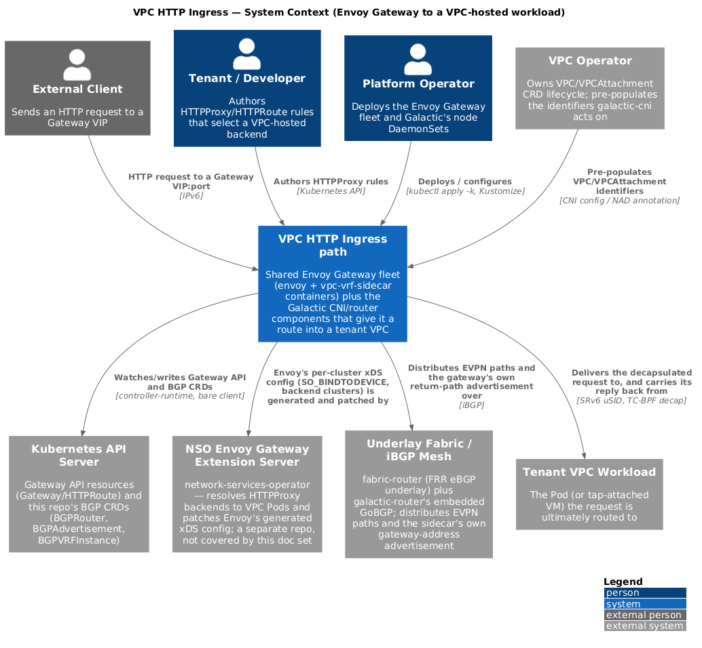
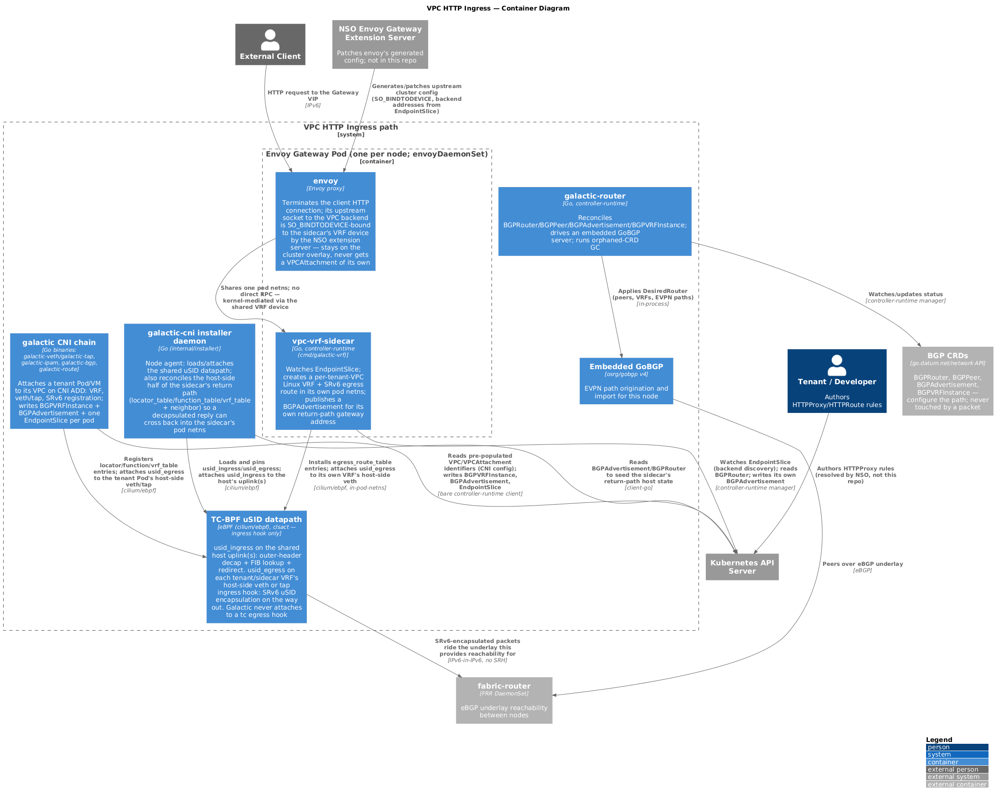

# VPC HTTP Ingress

How an HTTP request that lands on the shared Envoy Gateway fleet reaches a
Pod (or tap-attached VM) inside a tenant VPC, and how the reply gets back.
This is the index for a four-document set; read this one first.

> Last verified: 2026-09-06 against galactic @9f44c13. This path itself has
> incomplete pieces — see [Known gaps](#known-gaps) before you trust
> anything below against a real cluster.

This document set is scoped to one path only. For Galactic's product-wide
architecture (all three binaries, every CRD, the edge XDP NAT+LB gateway),
start at [docs/architecture/README.md](../architecture/README.md) instead —
this doc does not repeat it.

## The path in one page

A shared Envoy Gateway fleet (one pod per node, `envoyDaemonSet`) terminates
every tenant's HTTP traffic. Each Gateway pod has two containers: `envoy`
itself, and `vpc-vrf-sidecar` (binary `cmd/galactic-vrf`, package
`internal/ingresssidecar`). Neither container has a `VPCAttachment` — the
Gateway pod stays on the cluster overlay network for its own identity.
Tenant disambiguation happens one layer down, inside the pod: a Linux VRF
device per tenant VPC, created by the sidecar in its own network namespace,
plus SRv6 encapsulation on the way out.

Forward path, in order:

1. **Backend discovery.** `galactic-cni`'s `galactic-bgp` chain plugin
   publishes one `discoveryv1.EndpointSlice` per tenant Pod on CNI ADD,
   labeled `galactic.datum.net/tenant-id` and carrying that Pod's computed
   SRv6 uSID as an annotation
   (`internal/cnibgp/endpointslice.go:88`, `docs/cni/configuration.md:341-372`). The
   NSO Envoy Gateway extension server (a separate repo) reads these to
   build Envoy's backend clusters — not covered further here.
2. **Backend route.** `vpc-vrf-sidecar` watches those same `EndpointSlice`
   objects. For each one, it ensures a per-VPC Linux VRF exists in its own
   pod netns (`internal/plumbing/vrf`) and installs an SRv6-encapsulating
   egress route for that Pod's address, toward that Pod's own SID
   (`internal/ingresssidecar/backend.go:108`).
3. **Socket binding.** The NSO extension server binds Envoy's upstream
   socket to that VRF device with `SO_BINDTODEVICE` — the kernel's own
   mechanism for a VRF-unaware process to participate in one
   (`network-services-operator/internal/extensionserver/mutate/vpcpod.go:26`,
   a separate repo).
4. **Encapsulation.** A packet Envoy sends toward the backend enters the
   VRF's routing table and is SRv6-encapsulated by `usid_egress`, a TC-BPF
   program the sidecar attaches to its own VRF's host-side veth, on that
   veth's **ingress** hook
   (`internal/ingresssidecar/ebpfdatapath.go:274-320`). It rides the
   underlay `fabric-router`/`galactic-router` provide reachability for.
5. **Decapsulation and delivery.** On the backend Pod's own node,
   `usid_ingress` — the same TC-BPF program family, attached to that node's
   shared uplink(s) by `galactic-cni`'s installer daemon — matches the
   outer header, strips it, resolves the tenant VRF, and delivers the inner
   packet straight into the Pod's veth
   (`internal/plumbing/ebpf/attach/attach.go`, `docs/gateway/gateway-ingress-packet-trace.md` describes the same decap mechanism for a different ingress product — see [Terminology](#terminology-two-things-both-called-gateway)).

The reply direction needs its own advertisement (the sidecar's VRF has no
`VPCAttachment` a normal CNI ADD would have created one for) and its own
decap registration on the gateway node (a gateway-only node has no CNI
attachment to trigger the usual TC-BPF map writes). Both exist in code
today — `internal/ingresssidecar/gateway.go` (`PublishGateway`) and
`internal/installer/sidecarreturn.go` (`ensureSidecarReturnPath`) — but see
[Known gaps](#known-gaps): the end-to-end path has not been proven working
in ContainerLab, and two independent gaps upstream of this mechanism
currently block it on at least one real cluster. Full detail belongs to the
sibling docs, not here.

## Two planes: control plane and dataplane

Every component above falls into exactly one of two categories, and mixing
them up is the single most common way to get lost in this codebase.

**Control plane** — Kubernetes objects and the reconcilers that watch
them. `BGPRouter`, `BGPAdvertisement`, `BGPVRFInstance`, and
`EndpointSlice` are all control plane: they describe *desired* state.
`galactic-router`, the CNI chain plugins, and the sidecar's
controller-runtime manager are also control plane: they *compute* that
desired state and write it down, either as more Kubernetes objects or as
eBPF map entries. **None of this moves a single packet.** A `kubectl get
bgpadvertisement` that looks correct tells you the control plane did its
job; it tells you nothing about whether a packet can actually get through.

**Dataplane** — kernel and eBPF state that a packet actually traverses:
Linux VRF devices and their routing tables, `usid_ingress`/`usid_egress`
(the TC-BPF programs), and their backing maps (`locator_table`,
`function_table`, `vrf_table`, `egress_route_table`). This is what the
control plane's reconcilers write *into*, but from a packet's point of
view the CRDs and reconcilers do not exist — only the map contents and the
attached programs do.

The recurring failure mode this path has already hit twice (see
[Known gaps](#known-gaps)) is control-plane state that looks entirely
correct — a `BGPAdvertisement` created, a route imported — with no
matching dataplane state to act on it, because the component responsible
for writing that dataplane entry never ran on that node. Every sibling
document below tells you, for its slice of the path, which side of this
split each piece of state lives on.

## Diagrams

Both diagrams are scoped to this one path — the Envoy Gateway fleet plus
the Galactic components that give it a route into a tenant VPC. They are
not Galactic's product-wide diagrams; see
[docs/architecture/](../architecture/) for those.

### Level 1 — System Context



Source: [`context.puml`](./context.puml).

### Level 2 — Container

The Envoy Gateway pod's two containers, the CNI chain and installer
daemon, the shared TC-BPF datapath, and `galactic-router`/GoBGP — with the
external systems (Kubernetes API, the NSO extension server, the underlay
fabric) this path depends on but does not own.



Source: [`containers.puml`](./containers.puml).

**Regenerating:** edit the `.puml` source, then re-render with Podman or
Docker:

```bash
podman run --rm -v "$(pwd)/docs/vpc-ingress:/data:Z" docker.io/plantuml/plantuml -tpng "/data/*.puml"
```

Commit both the `.puml` source and the regenerated `.png` — GitHub does
not render PlantUML inline. (Both PNGs in this directory were rendered
this way as part of writing this doc set; if your environment has no
container runtime, the `.puml` sources alone are still enough to read the
diagrams' structure or render them elsewhere.)

## Terminology: two things both called "gateway"

This repo uses "gateway" for two unrelated components, and the word
"edge" the same way. Keep them apart:

| | This doc's path | The other one |
|---|---|---|
| What it is | The shared Envoy Gateway fleet (Kubernetes Gateway API `envoy-datum-downstream-gateway`), fronted by NSO | `galactic-gateway`, this repo's own XDP Full-NAT load balancer |
| CRDs it reconciles | None in this repo — Gateway API objects, owned by NSO | `NetworkGateway`/`NetworkRule` |
| Node label | Runs on ordinary `galactic.datumapis.com/node=compute` nodes (the Envoy DaemonSet's affinity admits them) | `galactic.datumapis.com/node=edge` |
| Where it's documented | This doc set | [docs/agents/ARCHITECTURE-GATEWAY.md](../agents/ARCHITECTURE-GATEWAY.md), [docs/gateway/gateway-ingress-packet-trace.md](../gateway/gateway-ingress-packet-trace.md) |

`node=edge` is `galactic-gateway`'s own boundary, not a synonym for "where
Envoy runs." Both mechanisms decapsulate SRv6-uSID traffic with the same
`Function = End.DT46`, which is why it is easy to conflate them — but they
are two different ingress products with two different NAT strategies (this
path never does stateful NAT; `galactic-gateway` does Full-NAT).

## Known gaps

Established by live testing against a real cluster this week. Read these
before assuming any part of the path above works end to end.

- **Gateway `Programmed=False`.** The Kubernetes Gateway API resource for
  the downstream gateway class currently reports
  `Programmed=False`/`AddressNotAssigned`. Nothing external reaches Envoy
  as a result — this is upstream of everything else in this document.
- **Cross-site SID routes fail to install.** Node-locator `/64`s do not
  propagate between sites, so an EVPN route naming a remote site's SID has
  no route to that SID and fails to install — literally: resolving a
  SID's link/L2 next-hop via `netlink.RouteGet` returns exactly that error,
  `fmt.Errorf("no route to %s: %w"/"no route to %s", sid, ...)`
  (`internal/plumbing/ebpf/egressroutemap/egressroute.go:155,158`).
- **No ContainerLab end-to-end validation yet.** Both the forward-path
  EndpointSlice/route mechanism and the return-path advertisement/decap
  mechanism described above exist in code, but neither has an automated
  `tests/e2e` case, and the return path's own implementation plan lists
  live-kernel verification as a required, not-yet-complete pre-merge step
  (`docs/plans/855-ingress-sidecar-vpc-backend-connectivity.md`, "Status").
- **A `tcx`-attaching CNI preempts Galactic silently.** Every Galactic
  eBPF program attaches via a classic TC-BPF `clsact` qdisc, on the
  **ingress** hook only — never egress (verify: `Attach`/`AttachEgress`
  both pass `netlink.HANDLE_MIN_INGRESS`,
  `internal/plumbing/ebpf/attach/attach.go:260,288`). The kernel runs every
  `tcx` program on an interface before any `clsact` filter on it. If
  another CNI attaches via `tcx` to an interface Galactic owns, it
  consumes the packet first — Galactic's own counters read a clean zero,
  because nothing arrived, and a container restart cannot fix it (see
  `internal/plumbing/ebpf/attach/health.go:311-332`, `reportPreemption`'s
  doc comment on why this is deliberately excluded from the liveness
  probe).

## Read next

- [`request-path.md`](./request-path.md) — Request path: Envoy to VPC
  workload
- [`response-path.md`](./response-path.md) — Response path: VPC workload
  back to Envoy
- [`control-plane.md`](./control-plane.md) — Control plane: how the path
  gets configured
- [`ebpf-datapath.md`](./ebpf-datapath.md) — eBPF datapath reference

## Related documentation

- [docs/architecture/](../architecture/) — Galactic's product-wide C4
  diagrams (not specific to this path).
- [docs/agents/ARCHITECTURE-CNI.md](../agents/ARCHITECTURE-CNI.md) — the
  CNI attach chain in full: `galactic-cni`, `galactic-veth`/`galactic-tap`,
  `galactic-ipam`, `galactic-bgp`, `galactic-route`.
- [docs/agents/ARCHITECTURE-ROUTER.md](../agents/ARCHITECTURE-ROUTER.md) —
  `galactic-router`, BGP CRD reconciliation, GC.
- [docs/cni/configuration.md](../cni/configuration.md) — the
  `galactic-bgp` config stanza and its `EndpointSlice` side effect.
- [docs/plans/854-vpc-http-ingress-endpointslice.md](../plans/854-vpc-http-ingress-endpointslice.md),
  [docs/plans/855-ingress-sidecar-vpc-backend-connectivity.md](../plans/855-ingress-sidecar-vpc-backend-connectivity.md),
  [docs/plans/855-return-path-gateway-advertisement.md](../plans/855-return-path-gateway-advertisement.md),
  [docs/plans/855-return-path-ingress-decap.md](../plans/855-return-path-ingress-decap.md)
  — the implementation plans this whole path was built from. These are
  design documents, not reference docs: some sections describe work
  already superseded by later code (for example, the egress route
  mechanism they describe as a kernel `seg6` route has since been replaced
  by the TC-BPF `usid_egress`/`egress_route_table` mechanism described
  above — see `internal/plumbing/srv6/egress.go:27-40`). Read the sibling
  docs in this directory for the current, code-verified state; read these
  plans for the history and the open engineering decisions behind it.
