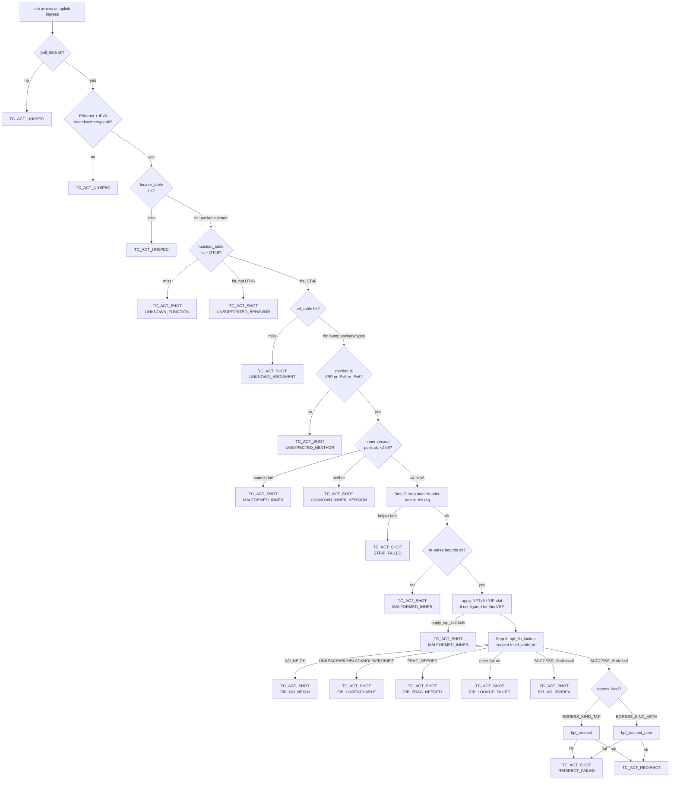
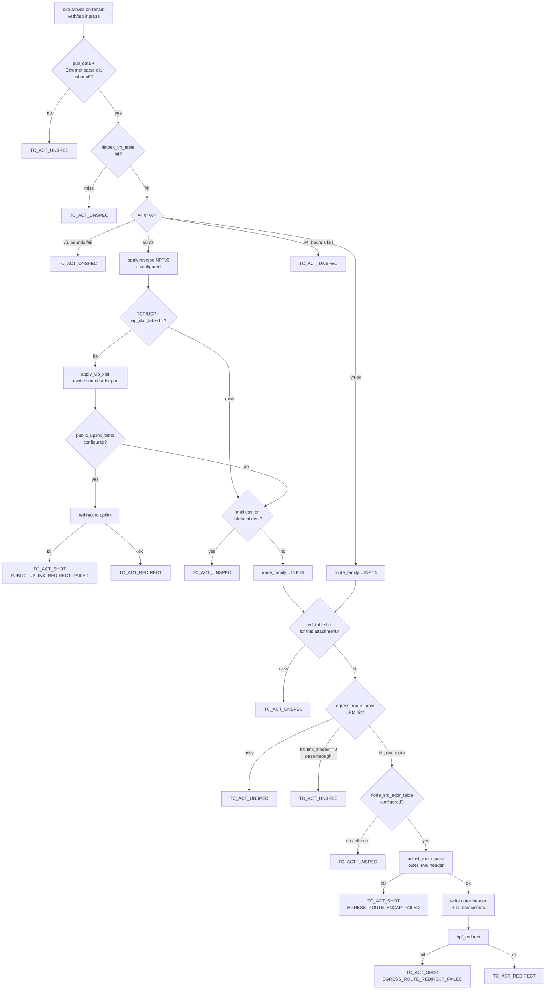

# eBPF uSID Datapath Reference

This is a field-level reference for the two TC-BPF programs that carry VPC
ingress traffic: `usid_ingress` and `usid_egress`, both defined in
[`internal/plumbing/ebpf/prog/usid.c`](../../internal/plumbing/ebpf/prog/usid.c).
It documents every map, every step, and every drop reason against the code as
written — it does not narrate a request or a reply through the system. For
that narrative, see the sibling documents `request-path.md` and
`response-path.md` in this directory.

> Last verified: 2026-09-06 against `internal/plumbing/ebpf/prog/usid.c`
> (1957 lines), `internal/plumbing/ebpf/attach/attach.go`,
> `internal/plumbing/ebpf/attach/health.go`, `internal/plumbing/ebpf/uformat/uformat.go`,
> `internal/plumbing/ebpf/prog/dropreason.go`, and the map packages
> (`usidmap`, `ifindexvrfmap`, `egressroutemap`, `nptv6map`, `vipxlatmap`).
> Every claim below cites a file and line. Generated files
> (`usid_bpfel.go`, `usid_bpfeb.go`, `*.o`) are build artifacts, not source,
> and are not described here as behavior.

## Read this alongside the source

Every section below cites `usid.c:LINE`. Line numbers shift when the file
changes; if a citation looks wrong, search the file for the quoted
identifier rather than trusting the number.

## 1. The two programs

Both `usid_ingress` (`usid.c:1114`) and `usid_egress` (`usid.c:1637`) are
`SEC("tc")` classic TC-BPF programs (`usid.c:1113`, `usid.c:1636`), and both
attach to a **clsact ingress hook** — not egress. Galactic does not attach a
program to any tc egress hook anywhere in this codebase; confirm this in
`internal/plumbing/ebpf/attach/attach.go`, where every attach call site
(`Attach`, line 260; `AttachEgress`, line 288) passes
`netlink.HANDLE_MIN_INGRESS` as `attachOne`'s `parent` argument (line 298).

This is counterintuitive because `usid_egress` is named for the direction of
the *tenant's* traffic, not for the tc hook it occupies:

| Program | Attaches to | Hook | Sees |
|---|---|---|---|
| `usid_ingress` | The node's shared physical/fabric-facing uplink (`ResolveInterfaces`, auto-detected or `GALACTIC_CNI_EBPF_INTERFACES`-overridden) | clsact **ingress** | SRv6/uSID-encapsulated packets arriving from the underlay — decap direction |
| `usid_egress` | Each tenant attachment's own host-side veth or tap interface | clsact **ingress** | Plain, not-yet-encapsulated packets the tenant just sent out of its own interface — the "from-container" interception point |

`usid_egress`'s own header comment (`usid.c:1616`-`1623`) states the reasoning
directly: the correct attach point is "TC *ingress* of the tenant's own
host-side veth (or tap, for a VM), the exact interface `usid_ingress`'s own
step 9 already redirects packets *to*" — the standard "from-container"
interception point, the same hook Cilium uses for its own per-endpoint egress
policy. A packet leaving a container arrives at its host-side veth peer on
that peer's own **ingress**, so intercepting the tenant's outbound traffic
means attaching to that interface's ingress hook, not to any egress hook.

`usid_ingress` attaches once per node, at process startup
(`attach.Start`, `attach.go:82`). `usid_egress` attaches once per
attachment, at CNI ADD time, from a short-lived process
(`internal/cnibgp`'s `attachUsidEgress`, called from `bgp.go:677`) that loads
the program from its own bpffs pin (`attach.go:194`-`202`,
`UsidEgressPinName`) rather than sharing a live process handle with
`usid_ingress`'s long-running loader.

Both attach as **classic TC-BPF** (a clsact qdisc plus a direct-action
`netlink.BpfFilter`, `attach.go:312`-`323`), not the newer kernel-6.6+ TCX
link mechanism — see [`attach/doc.go:36`-`39`](../../internal/plumbing/ebpf/attach/doc.go)
for why: TC-BPF works across a wider kernel range than the preflight check
already targets. This choice is exactly why [preemption by another CNI's TCX
program](#preemption-tcx-runs-before-clsact) is invisible to every counter in
this file — see the Debugging section.

## 2. The uSID format

The wire format is `uFMT 48+16`
([`uformat.go:5`-`39`](../../internal/plumbing/ebpf/uformat/uformat.go)):
a 128-bit IPv6 address with four fixed-offset fields and a zero-padded tail.
Every field is read at its fixed bit offset directly from the unmutated
packet — nothing is ever shifted to relocate one field into another field's
frame (`uformat.go:30`-`39`; `usid.c:24`, `usid.c:37`).

```
bit  1                  48 49              64 65   68 69          80 81                  128
     |------ uSID Block (48) ------|-- Node-ID (16) --|-Fn(4)-|-- Argument (12) --|------ Padding (48, zero) ------|
```

| Field | Bits | Bytes | Read by |
|---|---|---|---|
| Block | 1-48 | 0-5 | `usid.c:1183` (`locator_key`), `uformat.go:175` |
| Node-ID | 49-64 | 6-7 | `usid.c:1183` (part of `locator_key`), `uformat.go:184` |
| Function | 65-68 | 8 (high nibble) | `usid.c:1197`-`1198`, `uformat.go:197` |
| Argument | 69-80 | 8 (low nibble) + 9 | `usid.c:1227`, `uformat.go:211` |
| Padding | 81-128 | 10-15 | never read by the datapath; `uformat.Decode` (`uformat.go:229`-`233`) rejects non-zero padding, but this is a control-plane check, not a packet-path one |

`Function = 0xE` is `FunctionEndDT46`
(`uformat.go:82`) — the only behavior `usid_ingress` implements
(`usid.c:1219`-`1222`; `function_table`'s matching value is
`BEHAVIOR_END_DT46 = 1`, `usid.c:331`). `Function = 0xF`
(`FunctionEndDT2`, `uformat.go:83`) is a distinct, reserved value for a
future L2 uEnd.DT2 path; the datapath rejects it explicitly rather than
falling through to DT46 decap (`usid.c:29`-`35`, `usid.c:1213`-`1222`).

### Worked decode

Using the exact fixture `usid_test.go` builds test packets from
(`usid_test.go:298`, `baseUSID`):

```
Block    = 0x0102030405AA
Node-ID  = 0x0010
Function = 0xE   (FunctionEndDT46)
Argument = 0x123
```

`uformat.Encode` (`uformat.go:250`-`267`) places these at their fixed
offsets:

```
byte:   0  1  2  3  4  5  6  7  8  9  10 11 12 13 14 15
value:  01 02 03 04 05 AA 00 10 E1 23 00 00 00 00 00 00
```

Byte 8 is `E1`: high nibble `E` is Function, low nibble `1` is the top 4 bits
of the 12-bit Argument. Byte 9 (`23`) is the low 8 bits of Argument, so
`Argument = 0x1<<8 | 0x23 = 0x123` — matches. As an IPv6 address, this is
`102:304:5aa:10:e123::`.

The three map keys this address produces (`usid.c:766`-`778`):

| Key | Formula | Value for this example |
|---|---|---|
| `locator_key` | top 8 bytes as-is (`Block<<16 \| Node-ID`) | `0x0102030405AA0010` |
| `function_key` | `Block<<4 \| Function` | `0x0102030405AA` `<<4` `\|` `0xE` |
| `vrf_key` | `Block<<12 \| Argument` | `0x0102030405AA` `<<12` `\|` `0x123` |

Block and Function are never adjacent in the wire address (Node-ID sits
between them at bits 49-64), and Block and Argument are never adjacent
either (Node-ID and Function sit between them) — every key above is composed
from two independently-read values, never read as one contiguous span
(`usid.c:773`-`778`; `uformat.go:297`-`305`).

## 3. Every map

All ten maps below are declared `SEC(".maps")` in `usid.c:780`-`936` and
pinned under `/sys/fs/bpf/galactic` by default (`PinDir`, `attach.go:30`).
"Writer" and "reader" name the actual Go call sites that populate or query
each map from outside the datapath; the datapath program itself is always a
reader (and, for `drop_reasons`, the only writer).

| Map | Type | Key | Value | Written by | Read by | Empty means |
|---|---|---|---|---|---|---|
| `locator_table` | `HASH`, max 64 | `u64` locator_key | `{generation}` | `usidmap.LocatorTable.Register`, from `internal/cnibgp`'s `registerEBPFDatapath` (`bgp.go:651`) | `usid_ingress` step 2 (`usid.c:1185`) | Every uSID-addressed packet arriving on the uplink falls through with `TC_ACT_UNSPEC` (`usid.c:1187`-`1190`) — nothing this node owns is decoded at all |
| `function_table` | `HASH`, max 128 | `u64` function_key | `{behavior}` | `usidmap.FunctionTable.Register` (`bgp.go:654`) | `usid_ingress` step 4 (`usid.c:1206`) | Every packet that passed the locator match is dropped (`DROP_REASON_UNKNOWN_FUNCTION`, `usid.c:1209`) — never silently passed through, since step 2 already claimed it |
| `vrf_table` | `HASH`, max 8192 | `u64` vrf_key | `{vrf_table_id, egress_kind, packets, bytes, last_seen_ns, generation, dropped_packets}` | `usidmap.VRFTable.Register`/`Unregister`/`Reconcile` — CNI ADD (`bgp.go:658`), rollback (`internal/cni/resource.go`), and GC sweep | `usid_ingress` step 6 (`usid.c:1234`), `usid_egress`'s route-table-id resolution (`usid.c:1821`) | `usid_ingress`: dropped (`DROP_REASON_UNKNOWN_ARGUMENT`, `usid.c:1237`). `usid_egress`: falls through with `TC_ACT_UNSPEC` (`usid.c:1823`-`1826`) — "attachment registered but its vrf_table entry isn't, shouldn't happen; fail open" |
| `ifindex_vrf_table` | `HASH`, max 16384 | `u32` ifindex | `{block, argument}` | `ifindexvrfmap`, same CNI ADD call site as `vrf_table` (`bgp.go:662`-`667`); unregistered at CNI DEL, not GC | `usid_egress` entry (`usid.c:1672`) | No attachment is registered on this ifindex at all; `usid_egress` falls through unmodified (`TC_ACT_UNSPEC`, `usid.c:1676`) |
| `egress_route_table` | `LPM_TRIE`, max 32768, `BPF_F_NO_PREALLOC` | `{prefixlen, table_id, family, addr[16]}` | `{sid[16], link_ifindex, dmac[6], smac[6]}` | `egressroutemap.EgressRouteTable.Register`/`RegisterPassThrough` — `internal/runtime/gobgp/monitor.go` (EVPN path add/withdraw) and CNI ADD's `registerLocalEgressRoutes` (`bgp.go:632`) | `usid_egress` (`usid.c:1837`) | No configured route for this destination; falls through (`TC_ACT_UNSPEC`, `usid.c:1841`) — deferred to the kernel (a still-installed netlink route during migration, or genuinely none) |
| `node_src_addr_table` | `ARRAY`, 1 entry | `u32` (always 0) | `u8[16]` address | `egressroutemap.NodeSourceAddress.Set`, `internal/cnibgp`'s `registerNodeSourceAddress` (`bgp.go:700`, called on every CNI ADD) | `usid_egress`, after an `egress_route_table` hit (`usid.c:1864`) | All-zero read as "not yet configured"; falls through (`TC_ACT_UNSPEC`, `usid.c:1876`) rather than encapsulating with an unusable source |
| `nptv6_table` | `HASH`, max 8192 | `u64` vrf_key | `{ula_prefix[16], public_prefix[16], prefix_len, adjustment}` | `nptv6map.NPTv6Table.Register`, from `gc.SweepEBPFNPTv6Table`'s periodic re-registration (only writer; see `nptv6map/doc.go`) | `usid_ingress` (`usid.c:1422`), `usid_egress` (`usid.c:1693`) | A miss is not an error — most VRFs configure no NPTv6 mapping; the packet proceeds unrewritten |
| `vip_xlat_table` | `HASH`, max 8192 | `{block, argument, proto, direction, port, pad2}` | `{addr[16], port}` | `vipxlatmap.RegisterIngress`/`RegisterEgress`, from `ServiceVIPBindingReconciler` (`internal/controller/servicevipbinding_controller.go`) | `usid_ingress` (`usid.c:1449`), `usid_egress` (`usid.c:1707`) | A miss is not an error — most attachments have no active `ServiceVIPBinding`; the packet proceeds unrewritten |
| `public_uplink_table` | `ARRAY`, 1 entry | `u32` (always 0) | `{link_ifindex, dmac[6], smac[6]}` | `egressroutemap.PublicUplink.Set`, `internal/cnibgp`'s `registerPublicUplink` (`bgp.go:715`, called on every CNI ADD) | `usid_egress`, only after a VIP-sourced reply's `apply_vip_xlat` succeeds (`usid.c:1756`) | `link_ifindex == 0` (not configured yet): falls through to the pre-existing `egress_route_table` path rather than dropping (`usid.c:1770`-`1775`) |
| `drop_reasons` | `PERCPU_ARRAY`, max `__DROP_REASON_MAX` (39) | `u32` reason index | `u64` counter (or a raw value for the `TRACE_*_LAST_IFINDEX` slot) | The datapath itself, via `count_drop`/`count_claimed_drop`/`record_value` (`usid.c:942`-`972`) | `internal/plumbing/ebpf/metrics`'s Prometheus collector (`collector.go:163`-`183`), `bpftool map dump`, health checks | Every counter reads zero — see [Debugging](#debugging), this can mean "healthy" or "another program consumed the traffic first" |

Notes worth calling out beyond the table:

- **`vrf_table` is the only map with a `generation` field used for crash
  safety.** A `Register` call landing between the GC sweep's list-CRDs step
  and its delete-stale-entries step must never be reaped as stale
  (`usidmap/doc.go`'s "plugin-binary-vs-run-container race" section).
  `nptv6_table` and `vip_xlat_table` also expose a `Generation`/`Reconcile`
  API for interface parity, but track generation only in process memory —
  neither's kernel value struct has a spare field for it
  (`nptv6map/doc.go`, `vipxlatmap/vipxlat.go`'s package doc comment). A
  process restart resets those in-memory generations to zero.
- **`node_src_addr_table` and `public_uplink_table`'s actual write cadence
  contradicts their own doc comments.** `usid.c:877` and `usid.c:889` both
  describe these as "populated once, at CNI datapath registration time...
  not per CNI ADD/DEL", but the Go call site comments at `bgp.go:681`-`703`
  and `bgp.go:705`-`714` explicitly call this "redo-on-every-ADD" — cheap
  and idempotent, but genuinely re-run on every attachment's CNI ADD, not
  once per node. This is flagged, not resolved, below.
- **`egress_route_table`'s pass-through entries** (`link_ifindex == 0`,
  `usid.c:594`-`609`) exist purely to out-match a shorter default route via
  LPM — e.g. a tenant VRF's own `::/0` NAT66 default would otherwise hijack
  ordinary intra-VRF unicast between two attachments on the same node. A
  pass-through hit is treated identically to a genuine miss
  (`usid.c:1849`-`1852`).
- **`ifindex_vrf_table` has no GC sweep.** Its key is private to one
  attachment's own interface, so CNI DEL unregisters it directly
  (`ifindexvrfmap/doc.go`'s "Lifecycle: CNI DEL, not a periodic GC sweep").

## 4. `usid_ingress` step by step

Function: `usid.c:1114`-`1595`. Steps below match the numbered comments in
the source (`usid.c:12`-`65` for the overview; each step also has its own
inline comment at the point it executes).

| Step | What happens | Line | Failure → verdict |
|---|---|---|---|
| 0 | `bpf_skb_pull_data(skb, 0)` linearizes the packet so every later read is a direct, bounds-checked pointer dereference | `usid.c:1131` | Fail: `TC_ACT_UNSPEC` (temporary trace-only, not a counted drop reason) |
| 1 | Parse the outer Ethernet + IPv6 header; must be `ETH_P_IPV6` | `usid.c:1142`-`1159` | Bounds fail or wrong ethertype: `TC_ACT_UNSPEC` |
| 2 | Exact-match `daddr`'s top 64 bits (`locator_key`) against `locator_table` — no shift | `usid.c:1183`-`1190` | Miss: `TC_ACT_UNSPEC` (`DROP_REASON_TRACE_ING_LOCATOR_MISS`, temporary) |
| 3 | Read Function directly from `daddr[8]`'s high nibble | `usid.c:1197`-`1198` | n/a (read, not a match) |
| 4 | Exact-match `(block, function)` against `function_table`; reject anything that isn't `BEHAVIOR_END_DT46` | `usid.c:1200`-`1222` | Miss: `TC_ACT_SHOT` (`DROP_REASON_UNKNOWN_FUNCTION`). Wrong behavior: `TC_ACT_SHOT` (`DROP_REASON_UNSUPPORTED_BEHAVIOR`) |
| 5 | Read Argument directly from `daddr[8]`'s low nibble + `daddr[9]` | `usid.c:1227` | n/a |
| 6 | Exact-match `(block, argument)` against `vrf_table`; bump `packets`/`bytes`/`last_seen_ns` | `usid.c:1229`-`1243` | Miss: `TC_ACT_SHOT` (`DROP_REASON_UNKNOWN_ARGUMENT`) |
| 6.5 | Validate outer `nexthdr` names an inner packet directly (IPIP=4 or IPv6-in-IPv6=41); peek the inner version nibble | `usid.c:1251`-`1284` | Extension header present: `TC_ACT_SHOT` (`DROP_REASON_UNEXPECTED_NEXTHDR`). Bounds fail: `TC_ACT_SHOT` (`DROP_REASON_MALFORMED_INNER`). Neither v4 nor v6: `TC_ACT_SHOT` (`DROP_REASON_UNKNOWN_INNER_VERSION`) |
| 7 | Strip the outer IPv6 header (`bpf_skb_change_proto` for a v4 inner, then `bpf_skb_adjust_room`); pop any outer transit VLAN tag | `usid.c:1338`-`1386` | Any helper failure: `TC_ACT_SHOT` (`DROP_REASON_STRIP_FAILED`) |
| 7.5 | Re-derive `data`/`data_end` (every step-7 helper invalidates prior packet pointers); apply reverse NPTv6 and/or VIP-xlat if configured; build `bpf_fib_lookup` params | `usid.c:1391`-`1516` | Bounds fail: `TC_ACT_SHOT` (`DROP_REASON_MALFORMED_INNER`). `apply_vip_xlat` failure: `TC_ACT_SHOT` (`DROP_REASON_MALFORMED_INNER`) |
| 8 | `bpf_fib_lookup()` scoped to `vrf_table_id` via `BPF_FIB_LOOKUP_DIRECT \| BPF_FIB_LOOKUP_TBID` | `usid.c:1518`-`1553` | `NO_NEIGH`: `DROP_REASON_FIB_NO_NEIGH`. `UNREACHABLE`/`BLACKHOLE`/`PROHIBIT`: `DROP_REASON_FIB_UNREACHABLE`. `FRAG_NEEDED`: `DROP_REASON_FIB_FRAG_NEEDED` (no ICMPv6 Packet Too Big generated — accepted PMTUD gap). Anything else: `DROP_REASON_FIB_LOOKUP_FAILED`. `ifindex <= 0` after a `SUCCESS` return: `DROP_REASON_FIB_NO_IFINDEX`. All `TC_ACT_SHOT` |
| 9 | Redirect: `bpf_redirect(fib_params.ifindex, 0)` for `EGRESS_KIND_TAP`, `bpf_redirect_peer(fib_params.ifindex, 0)` otherwise | `usid.c:1555`-`1594` | Redirect call fails: `TC_ACT_SHOT` (`DROP_REASON_REDIRECT_FAILED`). Success: `TC_ACT_REDIRECT` |

Once step 2's `locator_table` lookup hits, the packet is claimed: every
failure from step 4 onward is `TC_ACT_SHOT`, never a silent pass-through —
`usid.c:1176`-`1182` explains why `TC_ACT_UNSPEC` (not `TC_ACT_OK`) is used
on the fail-open paths *before* that point: this filter runs
direct-action at a fixed tc priority alongside Cilium's own tc/bpf
programs on the same hook, and `TC_ACT_OK` would end the filter chain
outright, starving Cilium's later-priority filter of a packet it should
still see.



## 5. `usid_egress` step by step

Function: `usid.c:1637`-`1956`. `usid_egress` never "claims" a packet the
way `usid_ingress` does for its NPTv6/VIP-xlat responsibilities — a miss on
either lookup is expected, not an error. Once `egress_route_table` has a
matching entry, though, this program is that packet's only path off the
node, so a failure past that point is a drop, not a pass-through
(`usid.c:1625`-`1635`).

| Step | What happens | Line | Failure → verdict |
|---|---|---|---|
| 0 | `bpf_skb_pull_data`; parse Ethernet header; must be `ETH_P_IPV6` or `ETH_P_IP` | `usid.c:1641`-`1669` | Fail: `TC_ACT_UNSPEC` |
| 1 | Resolve `(block, argument)` via `ifindex_vrf_table`, keyed on `skb->ifindex` | `usid.c:1671`-`1678` | Miss: `TC_ACT_UNSPEC` ("no attachment registered on this ifindex at all") |
| 2a (v6) | Bounds-check inner IPv6 header; apply reverse NPTv6 (`ula → public`) if `nptv6_table` has an entry | `usid.c:1687`-`1696` | Bounds fail: `TC_ACT_UNSPEC` |
| 2b (v6, TCP/UDP) | Look up `vip_xlat_table` on `(block, argument, proto, source port, DIR_EGRESS)`; if hit, rewrite source addr:port + L4 checksum | `usid.c:1698`-`1723` | `apply_vip_xlat` failure is not fatal to the packet — only the rewrite is abandoned; the function continues (`usid.c:1717`-`1721`) |
| 2c (v6, VIP-sourced reply) | If the VIP rewrite above succeeded, redirect unconditionally to `public_uplink_table`'s resolved next hop, bypassing `egress_route_table` entirely | `usid.c:1739`-`1776` | Redirect fails: `TC_ACT_SHOT` (`DROP_REASON_PUBLIC_UPLINK_REDIRECT_FAILED`). Redirect succeeds: returns immediately with `TC_ACT_REDIRECT`. `public_uplink_table` not configured: falls through to the rest of the function |
| 2d (v6) | Reject multicast (`ff00::/8`) / link-local (`fe80::/10`) destinations before they ever reach `egress_route_table` | `usid.c:1780`-`1803` | Matched: `TC_ACT_UNSPEC` (`DROP_REASON_TRACE_MULTICAST_LL_BAIL`, temporary) |
| 2 (v4) | Bounds-check inner IPv4 header | `usid.c:1807`-`1815` | Bounds fail: `TC_ACT_UNSPEC` |
| 3 | Resolve this attachment's Linux VRF table id via `vrf_table` | `usid.c:1817`-`1826` | Miss: `TC_ACT_UNSPEC` ("attachment registered but its vrf_table entry isn't — shouldn't happen; fail open") |
| 4 | LPM lookup `egress_route_table` on `(table_id, family, addr)` | `usid.c:1828`-`1842` | Miss: `TC_ACT_UNSPEC` (defer to the kernel) |
| 4.5 | Reject a pass-through entry (`link_ifindex == 0`) before doing any encap work | `usid.c:1844`-`1852` | Matched: `TC_ACT_UNSPEC` |
| 5 | Read this node's own source address from `node_src_addr_table` | `usid.c:1854`-`1876` | Array lookup nil (unreachable in practice): `TC_ACT_UNSPEC`. All-zero (not configured yet): `TC_ACT_UNSPEC` |
| 6 | `bpf_skb_adjust_room` to push room for a new outer IPv6 header | `usid.c:1883`-`1886` | Fail: `TC_ACT_SHOT` (`DROP_REASON_EGRESS_ROUTE_ENCAP_FAILED`) |
| 6.5 | Re-derive packet pointers; bounds-check the new outer header space | `usid.c:1889`-`1904` | Fail: `TC_ACT_SHOT` (`DROP_REASON_EGRESS_ROUTE_ENCAP_FAILED`) |
| 7 | Write the outer IPv6 header (version, payload length, nexthdr, hop limit 64, saddr from `node_src_addr_table`, daddr from the route's resolved SID) and L2 dmac/smac from the route entry | `usid.c:1906`-`1939` | n/a (pure writes) |
| 8 | `bpf_redirect(rv->link_ifindex, 0)` — same-netns, since this attach point and the physical uplink both live in the root netns | `usid.c:1947`-`1955` | Fail: `TC_ACT_SHOT` (`DROP_REASON_EGRESS_ROUTE_REDIRECT_FAILED`). Success: `TC_ACT_REDIRECT` |

`egress_route_value`'s L2/link-ifindex fields are resolved once, Go-side, at
`Register` time (`egressroutemap.EgressRouteTable.Register`), not via a
per-packet `bpf_fib_lookup()` — `usid.c:576`-`592` and `usid.c:1921`-`1937`
both explain why: a live `bpf_fib_lookup()` called from this attach point
(the tenant's own VRF-enslaved veth) unconditionally returns
`BPF_FIB_LKUP_RET_BLACKHOLE` for a main-table destination, confirmed
empirically across four parameter combinations — a real kernel VRF/l3mdev
isolation boundary against the *attaching* skb's own device, not a
parameter bug. `usid_ingress` never hits this because its own attach point
(the physical uplink) was never VRF-enslaved to begin with.



## 6. Drop reasons

The full `enum drop_reason` (`usid.c:621`-`757`), and its Go mirror
(`internal/plumbing/ebpf/prog/dropreason.go`):

| # | C identifier | Go constant | Permanent? | Notes |
|---|---|---|---|---|
| 0 | `DROP_REASON_UNKNOWN_FUNCTION` | `DropReasonUnknownFunction` | yes | `usid.c:622` |
| 1 | `DROP_REASON_UNKNOWN_ARGUMENT` | `DropReasonUnknownArgument` | yes | `usid.c:623` |
| 2 | `DROP_REASON_MALFORMED_INNER` | `DropReasonMalformedInner` | yes | `usid.c:624` |
| 3 | `DROP_REASON_UNKNOWN_INNER_VERSION` | `DropReasonUnknownInnerVer` | yes | `usid.c:625` |
| 4 | `DROP_REASON_STRIP_FAILED` | `DropReasonStripFailed` | yes | `usid.c:626` |
| 5 | `DROP_REASON_FIB_LOOKUP_FAILED` | `DropReasonFibLookupFailed` | yes | `usid.c:627` |
| 6 | `DROP_REASON_REDIRECT_FAILED` | `DropReasonRedirectFailed` | yes | `usid.c:628` |
| 7 | `DROP_REASON_FIB_NO_NEIGH` | `DropReasonFibNoNeigh` | yes | `usid.c:629` |
| 8 | `DROP_REASON_FIB_UNREACHABLE` | `DropReasonFibUnreachable` | yes | `usid.c:630` |
| 9 | `DROP_REASON_FIB_FRAG_NEEDED` | `DropReasonFibFragNeeded` | yes | `usid.c:631` |
| 10 | `DROP_REASON_UNEXPECTED_NEXTHDR` | `DropReasonUnexpectedNextHdr` | yes | `usid.c:638` |
| 11 | `DROP_REASON_UNSUPPORTED_BEHAVIOR` | `DropReasonUnsupportedBehavior` | yes | `usid.c:643` |
| 12 | `DROP_REASON_EGRESS_ROUTE_ENCAP_FAILED` | `DropReasonEgressRouteEncapFailed` | yes | `usid.c:652` |
| 13 | `DROP_REASON_EGRESS_ROUTE_FIB_LOOKUP_FAILED` | `DropReasonEgressRouteFibLookupFailed` | yes | `usid.c:663`; **unused** — the per-packet FIB lookup this counted was replaced by Go-side precomputation; kept undeleted to avoid renumbering |
| 14 | `DROP_REASON_EGRESS_ROUTE_REDIRECT_FAILED` | `DropReasonEgressRouteRedirectFailed` | yes | `usid.c:665` |
| 15 | `DROP_REASON_PUBLIC_UPLINK_REDIRECT_FAILED` | `DropReasonPublicUplinkRedirectFailed` | yes | `usid.c:671` |
| 16 | `DROP_REASON_TRACE_MULTICAST_LL_BAIL` | — | **no** | `usid.c:675` |
| 17 | `DROP_REASON_TRACE_MISS_VRF` | — | **no** | `usid.c:676` |
| 18 | `DROP_REASON_TRACE_MISS_ROUTE` | — | **no** | `usid.c:677` |
| 19 | `DROP_REASON_TRACE_PASSTHROUGH_ENTRY` | — | **no** | `usid.c:678` |
| 20 | `DROP_REASON_TRACE_ADJUST_ROOM_OK` | — | **no** | `usid.c:679` |
| 21 | `DROP_REASON_TRACE_REACHED_REDIRECT` | — | **no** | `usid.c:680` |
| 22 | `DROP_REASON_TRACE_REDIRECT_OK` | — | **no** | `usid.c:681` |
| 23 | `DROP_REASON_TRACE_IFINDEX_MISS` | — | **no** | `usid.c:690` |
| 24 | `DROP_REASON_TRACE_ENTRY` | — | **no** | `usid.c:696` |
| 25 | `DROP_REASON_TRACE_PULL_DATA_FAILED` | — | **no** | `usid.c:697` |
| 26 | `DROP_REASON_TRACE_ETH_BOUNDS_FAILED` | — | **no** | `usid.c:698` |
| 27 | `DROP_REASON_TRACE_ETHERTYPE_MISMATCH` | — | **no** | `usid.c:699` |
| 28 | `DROP_REASON_TRACE_IFINDEX_HIT` | — | **no** | `usid.c:700` |
| 29 | `DROP_REASON_TRACE_ING_REACHED_REDIRECT` | — | **no** | `usid.c:718` |
| 30 | `DROP_REASON_TRACE_ING_REDIRECT_OK` | — | **no** | `usid.c:719` |
| 31 | `DROP_REASON_TRACE_ING_LAST_IFINDEX` | — | **no** | `usid.c:723`; **not a counter** — `record_value` overwrites it with the raw resolved ifindex, read as a value, never summed |
| 32 | `DROP_REASON_FIB_NO_IFINDEX` | — | **no**, but a real drop | `usid.c:731`; a genuine drop (`bpf_fib_lookup` returned `SUCCESS` with an unusable ifindex), just placed in the temporary block to avoid renumbering slots 16-30. Should graduate into the permanent block once the temporary slots around it are removed |
| 33 | `DROP_REASON_TRACE_ING_ENTRY` | — | **no** | `usid.c:751` |
| 34 | `DROP_REASON_TRACE_ING_PULL_DATA_FAILED` | — | **no** | `usid.c:752` |
| 35 | `DROP_REASON_TRACE_ING_ETH_BOUNDS_FAILED` | — | **no** | `usid.c:753` |
| 36 | `DROP_REASON_TRACE_ING_ETHERTYPE_MISMATCH` | — | **no** | `usid.c:754` |
| 37 | `DROP_REASON_TRACE_ING_IP6_BOUNDS_FAILED` | — | **no** | `usid.c:755` |
| 38 | `DROP_REASON_TRACE_ING_LOCATOR_MISS` | — | **no** | `usid.c:756` |

`__DROP_REASON_MAX` (`usid.c:757`) is 39, sizing the `drop_reasons`
`PERCPU_ARRAY`. `dropreason.go`'s `DropReasonCount = 16`
(`dropreason.go:36`) bounds the Go mirror and the Prometheus collector's own
scan (`collector.go:167`, `for i := range prog.DropReasonCount`) — indices
16-38 are readable via `bpftool map dump` or a direct `Lookup` call, but
carry no Prometheus label and no Go constant. They are documented in
`usid.c` as "TEMPORARY diagnostic checkpoints... remove once resolved"
(`usid.c:672`-`674`, `usid.c:732`-`737`) for an open `bpf_redirect`
investigation into packets that are claimed by `vrf_table` (`packets`
increments) but never actually delivered, with no drop counter moving
either (`usid.c:707`-`717`).

## 7. Debugging

### Reading `drop_reasons`

`drop_reasons` is `BPF_MAP_TYPE_PERCPU_ARRAY` (`usid.c:810`-`815`): each
index holds one `u64` counter *per CPU*, not one counter total. A raw
`bpftool map dump pinned /sys/fs/bpf/galactic/drop_reasons` shows one array
of per-CPU values per key; to get the meaningful total for a reason, sum
across CPUs — exactly what `internal/plumbing/ebpf/metrics/collector.go`
does (`collectDrops`, `collector.go:163`-`183`): `Lookup` into a `[]uint64`
slice, one element per CPU, then sum. A single-CPU read (or eyeballing only
CPU 0 in a raw dump) undercounts on any multi-core node.

### `tc filter show` cannot see everything

`checkNotPreempted`'s own comment (`health.go:314`-`323`) states this
directly: this package attaches via clsact, and **the kernel runs every TCX
program on a hook before any clsact filter on it**. `tc filter show` only
enumerates classic tc filters (clsact included) — it has no visibility into
a TCX link. Use `bpftool net show <dev>` instead, which reports both classic
tc filters and TCX links attached to a device.

### Preemption: TCX runs before clsact {#preemption-tcx-runs-before-clsact}

If another CNI (or any other agent) attaches its own program to a TCX link
on an interface Galactic also attaches to, that program decides the
packet's fate **first**. If it consumes or drops the packet, `usid_egress`
is never invoked, and every counter in this file — `drop_reasons`, the
per-VRF `packets`/`bytes` counters, everything — reads a clean zero, because
from this program's own vantage point, nothing arrived
(`health.go:311`-`323`).

`Health.Handle.Healthy` (`health.go:201`) calls `reportPreemption`
(`health.go:208`, `health.go:300`-`309`), which runs `checkNotPreempted`
(`health.go:338`) and logs a warning if something precedes this datapath on
one of its own owned interfaces — scoped to the tenant veth/tap interfaces
carrying `usid_egress` (identified by `hasEgressFilter`, `health.go:358`),
deliberately not to the shared uplinks `usid_ingress` attaches to, where a
second CNI on the same uplink is the expected, unremarkable arrangement
(`health.go:325`-`332`).

**This check is deliberately never wired into health/liveness/readiness.**
`reportPreemption`'s own comment (`health.go:285`-`299`) is explicit: both
probes point at the same health service, and anything reported through it
restarts the container — but a restart cannot remove another program from
an interface it doesn't own. Wiring this in produced a measured six restarts
in six minutes on a node with a foreign program deliberately attached,
changing nothing each time. The finding goes to the log, next to what an
operator reads, not into the signal that decides whether the container
lives.

The check identifies the foreign program by kernel program ID, not name
(`ownProgramIDs`, `health.go:268`-`283`): reading a program's name by ID
needs `CAP_SYS_ADMIN` or `CAP_PERFMON`, which this container's capability
set (`ALL` dropped, `BPF`/`NET_ADMIN`/`NET_RAW` added) does not grant
(`health.go:258`-`262`). When the name can't be read, the log message names
the ID and tells the operator to run `bpftool prog show id <N>` themselves
(`health.go:415`-`418`).

### A practical checklist

1. `bpftool net show <dev>` on the uplink and on a specific tenant
   veth/tap — confirm both `usid_ingress` (uplink) and `usid_egress`
   (tenant interface) actually show up, and check for anything with a
   TCX attach type listed *before* them.
2. `bpftool map dump pinned /sys/fs/bpf/galactic/locator_table` and
   `.../function_table` — empty means this node has never run a real CNI
   ADD for the uSID Block in question (`bgp.go:651`-`654`).
3. `bpftool map dump pinned /sys/fs/bpf/galactic/vrf_table` — check
   `packets` vs. `dropped_packets` for the specific `(block, argument)` in
   question. `packets > 0, dropped_packets == 0`, but nothing arrives at
   the target interface, is exactly the unresolved gap the `TRACE_ING_*`
   slots (29-31, 33-38) exist to narrow down (`usid.c:701`-`723`).
4. Sum `drop_reasons` per reason across all CPUs (not a single-CPU read);
   compare against the table in [section 6](#6-drop-reasons) — note that
   indices 16-38 exist and are readable even though they carry no
   Prometheus label.
5. Check the process log for a `reportPreemption` warning
   ("another tc program runs ahead of this datapath") before assuming the
   datapath itself is misbehaving — a healthy-looking zero counter can mean
   either "nothing arrived" or "something else consumed it first".

## Related documents

- `request-path.md` (sibling, this directory) — the narrative decap path a
  request takes through `usid_ingress`.
- `response-path.md` (sibling, this directory) — the narrative encap path a
  reply takes through `usid_egress`.
- [`docs/agents/ARCHITECTURE-CNI.md`](../agents/ARCHITECTURE-CNI.md) — where
  this datapath fits in the CNI attach chain.
- `docs/plans/tc-bpf-egress-srv6-encap.md` — cited repeatedly by `usid.c`
  and the `egressroutemap` package doc comments as the design rationale for
  `usid_egress`'s egress-routing extension (`egress_route_table`,
  `node_src_addr_table`), but **not present in this checkout** as of the
  date above — could not verify its contents or confirm it was ever
  committed.
