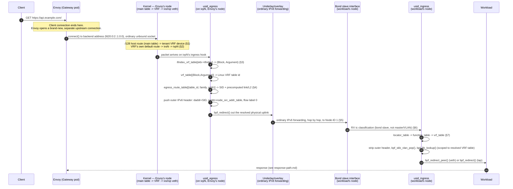

# Request path: Envoy Gateway to a tenant VPC workload

> Last verified: 2026-09-06 against commit `9f44c13`.

This document traces one HTTP request forward, from the moment Envoy
Gateway opens an upstream connection to a backend inside a tenant VPC, to
the moment that connection's packets land on the workload's own network
interface. It covers the **forward leg only**. The response leg — how the
workload's reply gets back through the same VRF/SID path to Envoy and out
to the client — is a separate document, `docs/vpc-ingress/response-path.md`
(not yet written at the time of this writing).

Every mechanism described below is cited to a specific file and line.
Where a design document describes something the code does not (yet, or
any longer) do, this document says so explicitly.

## Two nodes, two roles

The forward path crosses two nodes:

- **Envoy's own node** runs the shared, multi-tenant Envoy Gateway fleet.
  A second container in the same pod — the **ingress sidecar**,
  binary `galactic-vrf` (`cmd/galactic-vrf/root.go:31`) — maintains one
  Linux VRF device per tenant VPC that has a live backend on this node,
  and an SRv6 egress route inside it. See
  `internal/ingresssidecar/doc.go:6-9`: the sidecar exists "responsible
  only for VPC backend connectivity — Linux VRF device + SRv6 seg6 encap
  route lifecycle — never for xDS/EDS, health checking, or anything
  Envoy-facing."
- **The workload's own node** runs the ordinary Galactic CNI/router stack
  (`internal/cnibgp`, the TC-BPF uSID datapath) that every VPC-attached
  pod or VM already depends on, documented in
  [ARCHITECTURE-CNI.md](../agents/ARCHITECTURE-CNI.md).

The sidecar's own VRF/veth attachment on Envoy's node is a **synthetic**
uSID attachment: it reuses the same eBPF maps and the same `usid_egress`
program as a genuine tenant CNI attachment, but registers itself under a
reserved, never-collides-with-a-real-tenant Block value
(`uformat.BlockMax`, `internal/ingresssidecar/ebpfdatapath.go:71`), not
the fabric's real per-router locator Block. Keep the two identity spaces
distinct while reading: "Block" on Envoy's node is this sidecar's own
private bookkeeping value; "Block" on the workload's node (§7 below) is
the real, wire-significant SRv6 locator Block every other node in the
fabric agrees on.

## 1. Envoy's upstream connection and how the tenant VRF gets selected

**What this repository's code verifiably does.** The ingress sidecar
never touches Envoy's configuration, xDS, or sockets — confirmed by its
own package doc comment (`internal/ingresssidecar/doc.go:6-9`) and by the
fact that no code under `internal/ingresssidecar` imports or shells out to
anything Envoy-related. Its only job is to make sure that **by the time
Envoy's kernel-level `connect()` call happens**, the necessary VRF, veth,
and route state already exists in this pod's network namespace.

The mechanism that actually steers an ordinary, unbound outbound
connection into the right tenant VRF is a plain destination-address host
route, not a socket option:

- `internal/ingresssidecar/backend.go:107-119` (`EnsureRoute`) installs,
  for every backend pod's `/128` address, two things in the same call:
  1. an SRv6 encapsulation route via `srv6.RouteEgressAdd` (§4 below), and
  2. a redirect route via `ensureRedirectRoute` — see next.
- `internal/ingresssidecar/ebpfdatapath.go:473-491` (`ensureRedirectRoute`)
  installs a `/128` host route for that pod's address in this pod's
  **main** routing table (`unix.RT_TABLE_MAIN`), with no gateway, naming
  the tenant's VRF device as the sole nexthop (`LinkIndex`). Its own doc
  comment states the property directly: this route wins ordinary
  longest-prefix-match over the default route "without needing cilium to
  know anything about the VPC address space, or Envoy to bind its
  sockets to anything." A connection Envoy opens on an ordinary,
  unbound socket toward that address is, as a result, redirected into the
  tenant's VRF by the kernel's own route lookup, with no participation
  from Envoy at all.

This fixed a real outage: commit `eccd7a8` ("Ingress gateway pods can now
reach their VPC backends over SRv6") describes the prior state as "its
outbound connections to a VPC backend leave unencapsulated, so cilium
treats them as ordinary external traffic, drops them ... with no changes
needed to cilium or the proxy" once the fix landed.

**What a separate design document proposed instead, and why this
document cannot verify it.** The original enhancement design
(`enhancements` repo, branch `http-ingress-for-vpc-networks`, not on the
default branch of that repo and not merged into this repository) and this
repo's own `docs/plans/855-ingress-sidecar-vpc-backend-connectivity.md`
describe a different mechanism for the same problem: a separate **Envoy
Gateway extension server**, external to this repository, that patches
each backend's connection configuration in Envoy with a **socket-bind
option** naming the tenant's VRF device — so that Envoy's own `connect()`
call is pre-bound to the correct VRF before the kernel ever does a route
lookup. The plan is explicit that this half is not this repository's to
verify: "The socket-bind-option framing remains the extension server/#857
side's problem to verify, out of this plan's control"
(`docs/plans/855-ingress-sidecar-vpc-backend-connectivity.md`, §9 item 5).

There is no extension server code in this repository, so this document
cannot confirm whether that component exists, whether it sets any
socket-bind option, or how (if at all) it interacts with the
destination-route mechanism above. What this document *can* confirm,
from the code cited above, is that the destination-route mechanism alone
is sufficient to move an ordinary, un-bound connection into the right
tenant VRF — the sidecar's own code does not depend on Envoy binding
anything.

**An open question this document could not resolve from the code.** The
original design's socket-bind approach exists specifically to solve
address collision: two tenants can own the identical pod prefix, and
routing on destination address alone cannot tell them apart if both are
live on this node at once. `ensureRedirectRoute` installs its host route
into `unix.RT_TABLE_MAIN` — one shared table, keyed only by destination
address, using `netlink.RouteReplace` (`internal/ingresssidecar/ebpfdatapath.go:473-491`).
If two tenants' `EndpointSlice`s ever surface the identical `/128` address
on the same Envoy Gateway node at the same time, the second `EnsureRoute`
call's `RouteReplace` overwrites the first tenant's redirect route,
pointing both tenants' traffic at whichever VRF was registered most
recently. Nothing in `internal/ingresssidecar` disambiguates this case.
Whether this is prevented upstream (e.g. by how VPC address pools are
assigned in practice) is outside this repository and not verified here —
flagged as a real, code-traceable risk rather than asserted as broken.

## 2. The per-tenant VRF and its veth pair inside Envoy's pod netns

For each VPC with a live backend pod on this node,
`kernelBackend.EnsureVRF` (`internal/ingresssidecar/backend.go:70-88`)
creates the VRF device (`vrf.Add`, resolving its Linux routing table ID
via `vrf.TableID`) and then calls `ensureEgressDatapath` to wire the eBPF
side.

`ensureEgressDatapath` (`internal/ingresssidecar/ebpfdatapath.go:309-395`)
creates a veth pair local to this VPC's VRF, named from the VRF's own
kernel table ID (`egressVethNames`,
`internal/ingresssidecar/ebpfdatapath.go:118-120`):

- `ivsN` — the **inner** end, enslaved into the VRF (`N` is the VRF's
  Linux routing table ID).
- `ivpN` — the **peer**, deliberately left outside the VRF, in the pod's
  main network namespace.

`ensureEgressVeth` (`internal/ingresssidecar/ebpfdatapath.go:136-208`)
creates the pair if it doesn't exist, enslaves `ivsN` into the VRF, and
installs a default route (`::/0`) inside the VRF's own routing table,
via `ivsN`, gatewayed through `ivpN`'s link-local address — not an
on-link route. The comment at lines 178-208 explains why: an on-link
default forces the kernel to resolve a neighbor for the packet's *final*
destination before the packet ever reaches a TC hook, and nothing answers
that for an arbitrary tenant address. Routing via the peer's own,
always-answerable link-local address means the kernel only ever resolves
one real neighbor.

This veth pair is the reason `usid_egress` sees this pod's traffic at
all: a Linux VRF master device's own TC egress hook was tried first and
does not fire for routed traffic (`ensureEgressDatapath`'s doc comment,
`internal/ingresssidecar/ebpfdatapath.go:266-292`, and commit `258d457`).
The veth pair gives `usid_egress` the same kind of real interface a
genuine tenant CNI attachment already has.

## 3. `usid_egress`: how it identifies the tenant without trusting the packet

`usid_egress` is attached to `ivpN`'s own clsact **ingress** hook —
`attach.AttachEgress` (`internal/plumbing/ebpf/attach/attach.go:284-289`),
called from `internal/ingresssidecar/ebpfdatapath.go:392` — at
`netlink.HANDLE_MIN_INGRESS`.

The key lookup, `internal/plumbing/ebpf/prog/usid.c:1671-1677`:

```c
__u32 ifindex = skb->ifindex;
struct ifindex_vrf_value *iv = bpf_map_lookup_elem(&ifindex_vrf_table, &ifindex);

if (!iv) {
        count_drop(DROP_REASON_TRACE_IFINDEX_MISS);
        return TC_ACT_UNSPEC; // no attachment registered on this ifindex at all
}
```

`ifindex_vrf_table` is keyed on `skb->ifindex` — the interface the packet
*arrived on* — not on anything read from the packet's own bytes. That
registration was written once, at setup time, by
`ensureEgressDatapath`'s call to `ifindexTable.Register` keyed on
`ivpN`'s own ifindex (`internal/ingresssidecar/ebpfdatapath.go:382`).
The value it resolves to (a `(Block, Argument)` pair,
`internal/plumbing/ebpf/prog/usid.c:408-419`) never comes from the
packet either.

This is the property that makes colliding tenant address space safe on
the egress side: the interface a packet arrives on *is* the tenant's
identity for this program's purposes. Two tenants can own the identical
destination address; as long as each one's traffic reaches `usid_egress`
on its own dedicated `ivpN` interface (which §1 and §2 establish), the
program never has to compare addresses across tenants to tell them apart.

For this sidecar's own registrations, `Block` is always the reserved
`uformat.BlockMax` sentinel and `Argument` is the VRF's own Linux table
ID (`argumentForTableID`,
`internal/ingresssidecar/ebpfdatapath.go:73-89`) — see the "Two nodes,
two roles" note above for why that's safe.

## 4. Building the outer header: `egress_route_table` and `node_src_addr_table`

Once `usid_egress` has resolved `(Block, Argument)` from `ifindex_vrf_table`,
it needs the Linux VRF table ID those two values name.  It gets it with
one more lookup against `vrf_table`
(`internal/plumbing/ebpf/prog/usid.c:1680`, `1821-1826`) — the same map
`ensureEgressDatapath` populated via `registry.VRF.Register`
(`internal/ingresssidecar/ebpfdatapath.go:368`). `vrf->vrf_table_id`
is then used, not `(Block, Argument)`, to key the next lookup:

```c
// internal/plumbing/ebpf/prog/usid.c:1828-1841
struct egress_route_key rkey;

__builtin_memset(&rkey, 0, sizeof(rkey));
rkey.table_id = vrf->vrf_table_id;
rkey.family = route_family;
__builtin_memcpy(rkey.addr, dst_addr, sizeof(rkey.addr));
rkey.prefixlen = 8 * (sizeof(rkey.table_id) + sizeof(rkey.family)) +
                 (route_family == USID_EGRESS_ROUTE_FAMILY_INET6 ? 128 : 32);

struct egress_route_value *rv = bpf_map_lookup_elem(&egress_route_table, &rkey);
```

`egress_route_table` is an LPM trie keyed on `(Linux VRF table ID,
address family, destination address)`
(`internal/plumbing/ebpf/prog/usid.c:517-558`). Its entries are written
by `srv6.RouteEgressAdd`
(`internal/plumbing/srv6/egress.go:27-67`), which the ingress sidecar
calls directly from `EnsureRoute`
(`internal/ingresssidecar/backend.go:107-113`). **This is a change from
what two of this repo's own design documents describe.**
`docs/plans/855-ingress-sidecar-vpc-backend-connectivity.md` (§2, §7) and
the 854/855 EndpointSlice contract both describe the egress mechanism as
a kernel-native `seg6` `ENCAP_RED` route (`netlink.SEG6Encap`). That is
no longer what `RouteEgressAdd` does. Its own doc comment says so
directly: "the TC-BPF replacement for what used to be a kernel-native
SEG6 encap route ... confirmed broken by CVE-2026-31668 under this
codebase's own per-tenant-VRF architecture" (`internal/plumbing/srv6/egress.go:27-35`).
`RouteEgressAdd` today writes straight into the `egress_route_table` eBPF
map via `egressroutemap.EgressRouteTable.Register`
(`internal/plumbing/srv6/egress.go:61-67`) — there is no kernel routing
table entry involved in the encapsulation step at all. Treat the 854/855
plan documents' description of this specific mechanism as superseded;
this document's description above is what the code in `main` actually
does.

One more inconsistency worth flagging directly: `RouteEgressAdd`'s own
doc comment (`internal/plumbing/srv6/egress.go:45-49`) claims "usid_egress's
own `bpf_fib_lookup()` resolves that fresh, per packet" for the
route's link and L2 addressing. That is also not what the code does.
`egressroutemap.EgressRouteTable.Register` resolves the SID's link,
destination MAC, and source MAC **once, at registration time**, via
`resolveLinkAndL2` (`internal/plumbing/ebpf/egressroutemap/egressroute.go:152-172`,
called from `Register` at line 288), using `netlink.RouteGet(sid)`
against this node's own already-converged routing table (populated by
the underlay/EVPN control plane — see §5) and the kernel's IPv6 neighbor
cache, actively soliciting resolution if the cache has no entry yet
(`solicitNeighbor`, `internal/plumbing/ebpf/egressroutemap/egressroute.go:239-244`).
The resolved values are stored directly in the map's value
(`struct egress_route_value`, `internal/plumbing/ebpf/prog/usid.c:610-615`)
and `usid_egress` reads them back unchanged
(`internal/plumbing/ebpf/prog/usid.c:1938-1939`, `1947`) — it never calls
`bpf_fib_lookup()` at all on this path. `usid.c`'s own comment on
`struct egress_route_value` (`internal/plumbing/ebpf/prog/usid.c:574-593`)
explains why a per-packet `bpf_fib_lookup()` from this attach point does
not work: it unconditionally returns `BPF_FIB_LKUP_RET_BLACKHOLE` for a
main-table destination, "the kernel's own VRF/l3mdev isolation boundary
asserting itself against the *attaching* skb's real device." The comment
in `egress.go` predates that finding and was not updated; trust the C
code and the map-writer, not that specific sentence in `egress.go`.

**Failure mode.** If the underlay has no route to the destination SID at
all, `resolveLinkAndL2`'s `netlink.RouteGet(sid)` call fails with `no
route to <sid>` (`internal/plumbing/ebpf/egressroutemap/egressroute.go:155,158`),
and `Register` — and so `RouteEgressAdd`, and so the sidecar's
`EnsureRoute` — returns an error without ever writing the
`egress_route_table` entry. A request to that backend will reach
`usid_egress`, miss `egress_route_table`
(`DROP_REASON_TRACE_MISS_ROUTE`), and defer to the kernel
(`TC_ACT_UNSPEC`, `internal/plumbing/ebpf/prog/usid.c:1839-1841`) — which,
since no kernel-native fallback route exists on this path anymore, has
nothing further to do with it.

**The outer header itself**, once `egress_route_table` and
`node_src_addr_table` both hit
(`internal/plumbing/ebpf/prog/usid.c:1854-1876`, `1883-1919`):

```c
// internal/plumbing/ebpf/prog/usid.c:1906-1918
__builtin_memset(outer->vtc_flow, 0, sizeof(outer->vtc_flow));
outer->vtc_flow[0] = 0x60; // version 6, traffic class/flow label left zero
...
outer->payload_len = __builtin_bswap16(inner_len);
outer->nexthdr = (route_family == USID_EGRESS_ROUTE_FAMILY_INET6) ? USID_IPPROTO_IPV6 : USID_IPPROTO_IPIP;
outer->hop_limit = USID_EGRESS_HOP_LIMIT;
__builtin_memcpy(outer->saddr, src, 16);
__builtin_memcpy(outer->daddr, rv->sid, 16);
```

- **`outer->daddr`** is `rv->sid` — the SID `egress_route_table`'s value
  carries, resolved once as described above.
- **`outer->saddr`** is `src` — read from `node_src_addr_table`, a
  single-slot `BPF_MAP_TYPE_ARRAY`
  (`internal/plumbing/ebpf/prog/usid.c:870-884`) holding this node's own
  SRv6/underlay-facing address, written by
  `ensureNodeSourceAddress` (`internal/ingresssidecar/ebpfdatapath.go:245-265`)
  via `egressroutemap.OpenPinnedNodeSourceAddress`. An all-zero value
  means "not registered yet," in which case `usid_egress` fails open
  rather than encapsulate with a useless source
  (`internal/plumbing/ebpf/prog/usid.c:1869-1876`).
- **The flow label is set to zero.** `vtc_flow` is memset to zero and
  then only byte 0 is written (`0x60`, IPv6 version 6 in the high
  nibble); traffic class and flow label are left at zero
  (`internal/plumbing/ebpf/prog/usid.c:1906-1907`).
- **Hop limit** is a fixed constant, `USID_EGRESS_HOP_LIMIT = 64`
  (`internal/plumbing/ebpf/prog/usid.c:242`) — not copied from the inner
  packet's own hop limit; the comment there explains the outer header
  only needs to survive the underlay's own hop count.

## 5. Transit: resolving the outer SID to a link and next-hop

The link, destination MAC, and source MAC baked into `egress_route_table`
(§4) come from a **one-time** resolution, not a per-packet lookup:
`resolveLinkAndL2` (`internal/plumbing/ebpf/egressroutemap/egressroute.go:152-172`)
calls `netlink.RouteGet(sid)` against this node's own kernel routing
table. That table is populated by the underlay/overlay BGP control plane
this repository implements elsewhere — `fabric-router` (FRR) for the
physical eBGP underlay and `galactic-router` (embedded GoBGP) for the
EVPN/iBGP overlay that distributes each node's locator aggregate; see
[ARCHITECTURE-ROUTER.md](../agents/ARCHITECTURE-ROUTER.md). This document
does not re-derive that mechanism; it only establishes that by the time
`resolveLinkAndL2` runs, the node already has a converged route toward
the SID's containing locator prefix, from which it reads the physical
egress link and resolves the next-hop's MAC via the kernel's IPv6
neighbor cache (soliciting it if necessary,
`internal/plumbing/ebpf/egressroutemap/egressroute.go:239-244`).

Once `usid_egress` redirects the encapsulated frame out that resolved
link (`bpf_redirect(rv->link_ifindex, 0)`,
`internal/plumbing/ebpf/prog/usid.c:1947`), every hop between Envoy's
node and the workload's node forwards it as an **ordinary IPv6 packet**
addressed to the SID. This is the point of the uSID "reduced
encapsulation" format this fabric uses: there is no per-hop Segment
Routing Header to process, so any plain IPv6 router along the path
forwards on destination address alone. This document does not verify
the behavior of any specific transit node; that is standard IPv6
forwarding, outside this repository's own code.

## 6. Arrival on the destination node: classification happens on the bond slaves

The workload's node runs `usid_ingress` on whichever interfaces
`ResolveInterfaces` resolves
(`internal/plumbing/ebpf/attach/interfaces.go:76-93`). When the
underlay/overlay-facing interface is a Linux bonding master (or a VLAN
sitting on top of one), the ingress hook is **not** attached to the bond
master or the VLAN device — it is expanded to the bond's real slave
interfaces, by `expandBondSlaves`
(`internal/plumbing/ebpf/attach/interfaces.go:316-354`) and
`vlanBondMaster` (`internal/plumbing/ebpf/attach/interfaces.go:385-406`).

The reason, from `expandBondSlaves`'s own doc comment
(`internal/plumbing/ebpf/attach/interfaces.go:290-303`): "On a Linux
bonding master, RX ingress tc/eBPF classification happens on the slave
devices, not the bond master itself — a well-known kernel behavior
(confirmed live: `tc filter show dev bond0 ingress` showed this
package's own filter correctly attached, `tc filter show dev <slave>
ingress` showed nothing on either slave, and every uSID datapath map
counter ... stayed at zero despite tcpdump confirming packets arriving
on the wire)." A filter attached only to the bond master, or to a VLAN
interface layered on top of the bond, never sees the traffic at all —
the packets are real, they arrive, and `usid_ingress` simply never runs
for them. `vlanBondMaster`'s own doc comment
(`internal/plumbing/ebpf/attach/interfaces.go:360-383`) documents the
identical failure one level up: a VLAN device sitting on a bond inherits
the same problem, because RX classification still happens on the
physical slaves underneath.

`ResolveInterfaces` runs every resolved interface name — whether from
auto-detection or the `GALACTIC_CNI_EBPF_INTERFACES` override — through
this expansion (`internal/plumbing/ebpf/attach/interfaces.go:82-93`), so
an operator naming only the bond master still gets both master and
slaves attached.

## 7. `usid_ingress`: decapsulation on the destination node

`usid_ingress` (`internal/plumbing/ebpf/prog/usid.c:1113-1592`) runs a
fixed lookup chain, each an exact-match hash lookup (never LPM) against
the unmutated outer header:

1. **`locator_table`** (`internal/plumbing/ebpf/prog/usid.c:1183-1190`) —
   exact-matches the destination address's top 64 bits (Block(48) +
   Node-ID(16)) with no shift. A miss means this packet isn't addressed
   to one of this node's own uSID Blocks: `TC_ACT_UNSPEC`, hand off
   unmodified to any other filter on the same hook (e.g. Cilium's own).
2. **`function_table`** (`internal/plumbing/ebpf/prog/usid.c:1197-1222`) —
   keyed on `(Block, Function)`, where Function is read directly from
   bits 65-68 of the destination address (no shift, no mutation). A miss
   here is a drop (`TC_ACT_SHOT`), not a pass-through: the packet was
   already claimed by the locator match. Only `BEHAVIOR_END_DT46` is
   implemented; `BEHAVIOR_END_DT2` is rejected.
3. **`vrf_table`** (`internal/plumbing/ebpf/prog/usid.c:1227-1245`) —
   keyed on `(Block, Argument)`, where Argument is read from bits 69-80.
   A hit resolves `vrf->vrf_table_id`, the Linux routing table this
   packet's inner address will be looked up in.

After the chain resolves the Linux VRF table:

- **`bpf_skb_adjust_room(skb, -strip_len, BPF_ADJ_ROOM_MAC, 0)`**
  (`internal/plumbing/ebpf/prog/usid.c:1346-1349`) strips the outer IPv6
  header, exposing the inner IPv4 or IPv6 packet.
- **`bpf_skb_vlan_pop(skb)`**
  (`internal/plumbing/ebpf/prog/usid.c:1383-1386`) unconditionally drops
  any VLAN tag the packet is still carrying. The reason, from the
  comment immediately above it
  (`internal/plumbing/ebpf/prog/usid.c:1351-1382`): when the outer
  packet arrives on a VLAN whose tag the NIC strips via hardware
  offload, the tag lives in `skb->vlan_tci`, not in packet bytes — so
  stripping the outer *header* never touches it. That tag describes the
  transit segment the *outer* packet crossed; the *inner* packet belongs
  to a tenant VRF and never belonged to that segment. Left in place, a
  tap device would reinsert it into a frame the guest has no VLAN
  interface to accept, and any other VLAN-filtering program on the
  resolved egress interface is entitled to silently drop the frame after
  this program has already returned `TC_ACT_REDIRECT`.
- **`bpf_fib_lookup()`**
  (`internal/plumbing/ebpf/prog/usid.c:1521-1526`), scoped to the
  resolved VRF table via `BPF_FIB_LOOKUP_TBID`, resolves the real
  next-hop link and L2 addressing for the *inner* address — unlike
  `usid_egress` (§4-5), this **is** a genuine per-packet lookup, because
  this attach point (the shared physical uplink) was never VRF-enslaved,
  so the blackhole behavior documented in §4 does not apply here.
- **Redirect, chosen by `egress_kind`**
  (`internal/plumbing/ebpf/prog/usid.c:1582-1585`):

  ```c
  if (vrf->egress_kind == EGRESS_KIND_TAP)
          redirect_rc = bpf_redirect(fib_params.ifindex, 0);
  else
          redirect_rc = bpf_redirect_peer(fib_params.ifindex, 0);
  ```

  `bpf_redirect_peer` is used for a veth attachment, since the
  container-side peer lives in a different network namespace and only
  `bpf_redirect_peer` can cross into it. `bpf_redirect` (same-namespace)
  is used for a tap attachment (VM workloads), since `internal/cni/tap`
  creates the tap device in this same namespace and never moves it.

## 8. Delivery to the workload

The redirect in step 7 hands the now-decapsulated inner packet directly
to the resolved interface — the pod's own container-side veth peer (via
`bpf_redirect_peer`, crossing into the pod's network namespace) or the
VM's tap device (via `bpf_redirect`, already in the same namespace).
From that point on, delivery is ordinary kernel networking with no
further Galactic-specific mechanism involved: the pod or VM's own IP
stack receives the frame on its interface and delivers it to whatever
socket is bound to the destination address and port — the workload's own
listening application. See
[ARCHITECTURE-CNI.md](../agents/ARCHITECTURE-CNI.md) for how that veth
pair or tap device was created in the first place, at CNI ADD time.

## Sequence diagram



## Packet anatomy

### On the wire, Envoy's node → underlay (after `usid_egress`)

| Layer | Field | Value |
|---|---|---|
| Outer Ethernet | `h_proto` | `0x86DD` (IPv6) |
| Outer IPv6 | `saddr` | this node's registered underlay address (`node_src_addr_table`) |
| Outer IPv6 | `daddr` | the destination SID, e.g. `2607:ed40:8002:1:e001::` |
| Outer IPv6 | `nexthdr` | `41` (IPv6-in-IPv6) for an IPv6 inner packet, `4` (IPIP) for IPv4 |
| Outer IPv6 | traffic class / flow label | `0` (unconditionally) |
| Outer IPv6 | hop limit | `64` (fixed constant, not copied from the inner packet) |
| Inner IPv6 | `saddr` | Envoy's own sidecar-assigned address in this VRF |
| Inner IPv6 | `daddr` | the tenant workload's real address, e.g. `fd20:0:2::1:0:0` |
| Inner L4 | — | unchanged — Envoy's original TCP SYN/segment |

### On arrival, workload's node (before `usid_ingress`)

Identical to the "on the wire" row above — this repository's own egress
path never mutates the packet again once redirected (§5); ordinary IPv6
forwarding at each transit hop does not touch payload bytes.

### After `usid_ingress` decapsulation (delivered to the workload)

| Layer | Field | Value |
|---|---|---|
| Ethernet | rewritten by `bpf_fib_lookup()`'s resolved `dmac`/`smac` | — |
| IPv6 | `saddr` | Envoy's own sidecar address (unchanged from the inner packet) |
| IPv6 | `daddr` | the tenant workload's real address, e.g. `fd20:0:2::1:0:0` |
| L4 | — | unchanged — the same TCP segment Envoy originally sent |

Any VLAN tag the outer packet carried in `skb->vlan_tci` is dropped by
`bpf_skb_vlan_pop()` before delivery (§7) — it never reaches the
workload.

### Worked SID decode

SID `2607:ed40:8002:1:e001::` — full form
`2607:ed40:8002:0001:e001:0000:0000:0000`:

| Field | Bits | Source hextets/bytes | Value |
|---|---|---|---|
| Block | 48 | `2607:ed40:8002` | `2607:ed40:8002` |
| Node-ID | 16 | `0001` (4th hextet) | `1` |
| Function | 4 | high nibble of byte 8 (`e` of `e001`) | `0xE` |
| Argument | 12 | low nibble of byte 8 + all of byte 9 (`0` + `01`) | `1` |

This matches `usid_ingress`'s own extraction exactly
(`internal/plumbing/ebpf/prog/usid.c:1183, 1192, 1197-1198, 1227`):
`locator_key` is the first 64 bits read big-endian (Block+Node-ID
together, no shift); `block = locator_key >> 16` recovers Block alone;
`function` is the high nibble of byte 8; `argument` is the low nibble of
byte 8 shifted left 8, OR'd with byte 9.

In this worked example, Node-ID `1` names the destination (workload's)
node. A source node in the same fabric might carry Node-ID `6` — that
identity matters for the response leg, covered in
`docs/vpc-ingress/response-path.md`, not here.

## What this document could not verify from this repository

- **The Envoy Gateway extension server's socket-bind option** (§1). Its
  code is not in this repository. This document confirms the sidecar's
  own destination-route mechanism works without it, but cannot confirm
  whether the extension server exists, runs, or interacts with that
  mechanism in any way.
- **Whether colliding tenant addresses on the same Envoy Gateway node are
  actually prevented from occurring** (§1). The code-level hazard
  (`ensureRedirectRoute`'s shared main-table route, keyed only on
  destination address) is real and traceable; whether it is reachable in
  practice depends on VPC address allocation policy outside this
  repository.
- **Behavior of intermediate transit routers** (§5). This document
  confirms the packet leaves Envoy's node as an ordinary IPv6 packet
  addressed to the SID, and is picked up as one on the workload's node,
  but does not trace any specific transit hop's forwarding behavior —
  that is standard IPv6 routing outside this repository's code.
- **The exact production topology this document's bond/VLAN discussion
  (§6) was diagnosed against.** The code and its comments describe the
  general mechanism and are cited exactly as written; this document does
  not restate which specific deployment first exhibited the bug.
