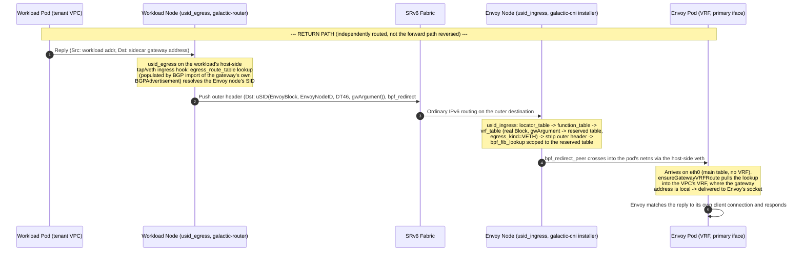

# The VPC ingress response path

This document traces how a reply from a workload inside a tenant VPC gets
back to the Envoy Gateway pod that proxied the original request, and out to
the client. It covers the return leg only. For how the request reaches the
workload in the first place, see [request-path.md](./request-path.md).

The audience is developers working on Galactic's datapath or the ingress
sidecar. Every mechanism claim below cites the file and line it comes from.
Where a claim comes from a design plan rather than shipped code, that is
stated explicitly, along with whether the code matches the plan.

> Last verified: 2026-09-06 against the `main` branch (commit range through
> `internal/installer/sidecarreturn.go`'s `fix(installer): publish the
> sidecar's entry point instead of going to look`).

## The central point: the reply is not the request in reverse

It is tempting to assume SRv6 traffic is symmetric: the workload's node
encapsulates a reply toward whatever node sent the request, using the
request's own outer header run backwards. That assumption is wrong here,
and it matters because it is the first thing an engineer debugging a broken
reply will reach for.

The workload's node has no memory of which node sent the request. It never
inspects the forward packet's outer source address at all — SRv6 uSID
decapsulation strips the outer header and hands the inner packet to a FIB
lookup scoped to the tenant's VRF (`internal/plumbing/ebpf/prog/usid.c:1518-1526`).
Nothing about that lookup, or anything downstream of it, records where the
packet arrived from.

Instead, the reply is routed independently, in the forward direction, based
on its own destination address. The workload's kernel addresses its reply
to Envoy's own per-VPC gateway address (an ordinary IPv6 destination, not a
tunnel endpoint) — see [step 1](#1-the-workloads-reply-and-its-destination).
That address is separately advertised into EVPN with its own SRv6 SID,
learned by the workload's node like any other route
(see [step 4](#4-transit-back-the-egress-route-table-lookup)). The workload's
node encapsulates the reply toward *that* SID — the Envoy node's sidecar
SID, resolved from BGP state — never toward the address the request's outer
header happened to carry. Forward and return are two independently
resolved, one-directional paths that happen to end up adjacent to each
other, not a single encapsulated tunnel with two ends.

## 1. The workload's reply, and its destination

Envoy's outbound connection into the VPC is bound to a per-VPC Linux VRF
inside Envoy's own pod netns (see request-path.md for how that VRF and the
forward-direction egress route are set up). The kernel picks a source
address for that connection from an address configured inside the VRF: this
sidecar's own **gateway address** for that VPC. The workload's reply is
therefore naturally addressed back to it — no header rewriting, no proxy
state, just an ordinary TCP/UDP reply to the address the SYN came from.

That address is not allocated from any IPAM pool. It is derived
deterministically by `DeriveGatewayAddress`
(`internal/ingresssidecar/gatewayaddress.go:100-133`):

```go
func DeriveGatewayAddress(prefix *net.IPNet, vpc, nodeID string) (net.IP, error) {
    ...
    sum := sha256.Sum256([]byte(vpcHex + "|" + nodeID))
    addr := make(net.IP, net.IPv6len)
    copy(addr, base[:networkBytes])
    copy(addr[networkBytes:], sum[:hostBytes])
    return addr, nil
}
```

`prefix` is a reserved, byte-aligned IPv6 CIDR configured once per
deployment (`GALACTIC_VRF_GATEWAY_PREFIX`), disjoint by construction from
any tenant VPC's address space — never handed to any IPAM allocator as a
pool to draw from (`gatewayaddress.go:73-90`). The host bits are the
truncated SHA-256 of `vpcHex + "|" + nodeID`. Two properties fall out of
that construction, and both are why the address is stable rather than
assigned:

- **Deterministic.** The same `(vpc, nodeID)` pair always derives the same
  address. A sidecar restart, or a fresh reconcile, recomputes the identical
  value — there is no allocation record to lose or to reconcile against.
- **Collision-safe by hashing, not by bookkeeping.** Nothing else ever
  contends for a specific value the way a live IPAM allocation call does
  (`gatewayaddress.go:82-90`), so a birthday-bound hash collision is an
  acceptable, not merely convenient, safety margin.

`ensureGatewayAddress` (`gatewayaddress.go:146-171`) assigns the derived
address, as a `/128`, to the VRF-slave veth `ensureEgressDatapath` already
creates for the forward path (`internal/ingresssidecar/ebpfdatapath.go:274-320`).
Worked example: for VPC id `vpc` and node identity `nodeID`, this
deployment's `GALACTIC_VRF_GATEWAY_PREFIX = fd30:e2e::/32` derives
`fd30:e2e:3a5:6094:7c95:22a:4aec:a4a9/128` — illustrative, not a value from
any specific cluster's config.

## 2. Making the gateway address routable: `PublishGateway`

An address assigned to an interface inside a pod's netns is not reachable
from anywhere else until something advertises it into EVPN.
`PublishGateway` (`internal/ingresssidecar/gateway.go:271-345`) does that:
it creates a `BGPAdvertisement` for the gateway address's `/128`, sourced
from this node's own `BGPRouter`.

It deliberately reuses the same `BGPVRFInstance` a real CNI attachment for
this `(vpc, node)` would use, rather than creating a second one:

```go
// Same (vpc, node)-keyed BGPVRFInstance a real CNI attachment on this node
// would use ... CreateOrUpdate here reuses one that already exists (a
// tenant pod sharing this node and VPC) rather than creating a competing
// entry ...
vrfName := crdnames.BGPVRFInstanceName(vpc, p.nodeName)
```

(`gateway.go:279-287`.) `allocateGatewayArgument` (`gateway.go:202-224`)
returns that shared instance's own `VRFID` if one already exists for this
`(vpc, node)`, so the gateway address's advertisement and any co-located
tenant pod's advertisement carry the same Route Target and the same uSID
Argument. See [Known constraints](#known-constraints) for why that sharing
is not free.

Two annotations get written onto the advertisement alongside the usual
spec fields (`gateway.go:332-333`):

```go
adv.Annotations[crdnames.AnnotationIngressHostIfindex] = strconv.Itoa(hostIfindex)
adv.Annotations[crdnames.AnnotationIngressHostMAC] = mac.String()
```

`crdnames.AnnotationIngressHostIfindex`/`AnnotationIngressHostMAC`
(`internal/crdnames/crdnames.go:63-64`) carry the ifindex, in the *host's*
namespace, of the peer of Envoy's own primary pod interface (`eth0`), plus
that interface's pod-side MAC — read by `podEntryPoint`
(`internal/ingresssidecar/gateway.go:254-269`).

The reason these are annotations rather than something the host reads for
itself is a privilege boundary, and it is worth stating precisely: the node
agent needs the pod's host-side veth ifindex and MAC to build the return
route (step 6, below), but it cannot read them by entering the pod's
network namespace — `setns` requires `CAP_SYS_ADMIN`, and the node agent's
container drops every capability except `BPF`, `NET_ADMIN`, and `NET_RAW`
(`internal/crdnames/crdnames.go:47-61`, `internal/installer/sidecarreturn.go:31-38`).
The sidecar, running inside the pod, can read both values with a single
unprivileged netlink query (`gateway.go:254-269`), so it publishes them on
the object it already writes, and the host side reads them back from there
instead.

## 3. `usid_egress` on the workload's ingress hook

On the workload's own node, `usid_egress` is attached to the *ingress* hook
of the workload's host-side interface — the tap device for a VM/unikernel
workload, or the host-side veth end for a pod. This is the inversion that
confuses people: traffic *from* the guest, on its way out, arrives at this
program on that interface's **ingress**, because "ingress" is relative to
the interface, and a guest's egress packet is arriving *into* the host
across that interface.

For a tap attachment, the tap device itself is named by
`intf.GenerateInterfaceNameHost` (`internal/cni/tap/tap.go:66-92`) — there
is no separate guest-side peer to attach to, since the VM's virtio-net
backend writes directly into this one device. `attachUsidEgress`
(`internal/cnibgp/bgp.go:676-679, 799-807`) loads `usid_egress` from its pin
and attaches it to that same name:

```go
hostName := intf.GenerateInterfaceNameHost(vpc, vpcAttachment)
if err := attachUsidEgress(pinDir, hostName); err != nil { ... }
```

`AttachEgress` (`internal/plumbing/ebpf/attach/attach.go:284-289`) attaches
via a clsact qdisc, ingress parent (`attach.go:307`, `attachOne` at
`attach.go:298-322` with `netlink.HANDLE_MIN_INGRESS`,
`ensureClsact` at `attach.go:411-431`). The identical call attaches
`usid_egress` to a pod's host-side veth end for a veth-mode attachment —
same hook, same direction, different interface type. `vrf_table`'s
`egress_kind` field (set at registration time from the CNI's own interface
type) is what tells the *decapsulating* side which redirect helper to use
later — it has no bearing on this attachment.

## 4. Transit back: the `egress_route_table` lookup

`usid_egress` resolves the reply's destination against
`egress_route_table`, an LPM trie keyed on the workload's own Linux VRF
table id plus the destination address
(`internal/plumbing/ebpf/prog/usid.c:1817-1841`). That table is populated
not at CNI ADD time for this entry, but whenever `galactic-router`'s BGP RIB
monitor processes an EVPN path whose Route Target matches a VRF this node
imports:

```go
addErr = srv6.RouteEgressAdd(prefix, gw, tableID)
```

(`internal/runtime/gobgp/monitor.go:173`, dispatched from
`matchTableID`, `monitor.go:218-239`.) `RouteEgressAdd`
(`internal/plumbing/srv6/egress.go:51-67`) writes the resolved SID straight
into the pinned `egress_route_table` — this is a TC-BPF map write, not a
kernel SEG6 route; there is no `seg6local`/`seg6` route involved on this
path. `gw` is the destination SID, taken from the BGP Prefix-SID attribute
on the path (`internal/runtime/gobgp/monitor.go:152-166`), itself computed
by the advertising router as `uSID(SRv6Locator, NodeID, Function, VRFID)`
(`internal/reconcile/reconcile.go:368-378`).

So once `PublishGateway` (step 2) creates the gateway address's
`BGPAdvertisement`, `galactic-router` on the *workload's* node imports it —
by Route Target, exactly like any other route for that VPC — and installs
an `egress_route_table` entry whose SID is the Envoy node's own sidecar
SID. `usid_egress` finds that entry, pushes a new outer IPv6 header
addressed to it (`usid.c:1878-1919`), and redirects out the resolved
physical uplink (`usid.c:1941-1955`) — a same-netns `bpf_redirect`, since
both the workload's own attach point and the fabric uplink live in the
host's root netns (`usid.c:1941-1945`).

This TC-BPF push-and-redirect is not the original mechanism for this step.
`RouteEgressAdd`'s own doc comment records that it replaces an earlier
kernel-native `seg6 ENCAP_RED` lwtunnel route (`netlink.SEG6Encap`):

> the TC-BPF replacement for what used to be a kernel-native SEG6 encap
> route ... that kernel mechanism is confirmed broken by CVE-2026-31668
> under this codebase's own per-tenant-VRF architecture (seg6 lwtunnel's
> `dst_cache` reused blindly across the input/output resolution paths'
> differing routing contexts), not fixable by any change to how this
> package calls it.

(`internal/plumbing/srv6/egress.go:27-33`.) Some earlier design material,
including `docs/plans/855-ingress-sidecar-vpc-backend-connectivity.md`,
still describes a `seg6 ENCAP_RED` route for the encap side generally — for
this reply's own encapsulation on the workload's tap/veth, that description
is superseded: it is the TC-BPF `usid_egress`/`egress_route_table` path
described above, not a kernel route, in current code.

**Failure mode.** `RouteEgressAdd` populates `egress_route_table` with a
fully precomputed link index and L2 addressing for the resolved SID, not
just the SID itself, because a live `bpf_fib_lookup` from `usid_egress`'s
own attach point always blackholes (`usid.c:576-592`). Resolving that
link/L2 information happens once, at registration time, in
`resolveLinkAndL2`; if the kernel has no route to the SID at all, it
returns `no route to <sid>` (`internal/plumbing/ebpf/egressroutemap/egressroute.go:155,158`)
and the `egress_route_table` entry is never written — the reply keeps
missing this lookup (`DROP_REASON_TRACE_MISS_ROUTE` at `usid.c:1840`,
`TC_ACT_UNSPEC`, deferring to the kernel) until the underlay route to that
SID converges.

Worked example: for a workload at `fd20:0:2::1:0:0/96` on a node whose real
uSID Node-ID is `1`, and an Envoy node whose real Node-ID is `6` with a
gateway Argument of `1`, the outer header pushed here is addressed to
`2607:ed40:8002:6:e001::` — Block `2607:ed40:8002::/48`, Node-ID `6`,
Function `0xE` (`uEnd.DT46`), Argument `1`.

## 5. Decap on the Envoy node: `usid_ingress`

The encapsulated reply arrives on the Envoy node's fabric-facing interface
and is processed by `usid_ingress`
(`internal/plumbing/ebpf/prog/usid.c:1113-1595`), the same program that
decapsulates every other uSID packet on this node. Its steps, for this
packet:

1. Exact-match the outer destination's top 64 bits (Block + Node-ID)
   against `locator_table` (`usid.c:1161-1190`).
2. Exact-match (Block, Function nibble) against `function_table`, requiring
   `BEHAVIOR_END_DT46` (`usid.c:1200-1222`).
3. Exact-match (Block, Argument) against `vrf_table`, which returns the
   resolved Linux routing table id and the entry's `egress_kind`
   (`usid.c:1229-1245`).
4. Strip the outer header (`usid.c:1346`, `bpf_skb_adjust_room` with a
   negative length, `BPF_ADJ_ROOM_MAC`).
5. `bpf_fib_lookup`, scoped to the resolved table via
   `BPF_FIB_LOOKUP_TBID`/`fib_params.tbid` (`usid.c:1518-1526`).
6. Redirect to the resolved egress interface, chosen by `egress_kind`:

```c
if (vrf->egress_kind == EGRESS_KIND_TAP)
    redirect_rc = bpf_redirect(fib_params.ifindex, 0);
else
    redirect_rc = bpf_redirect_peer(fib_params.ifindex, 0);
```

(`usid.c:1582-1585`.) The `vrf_table` entry that step 3 matches here is
registered with `EgressKindVeth`
(`internal/installer/sidecarreturn.go:244-251`), so step 6 takes the
`bpf_redirect_peer` branch: the resolved interface is one end of a veth
whose peer lives in Envoy's pod netns, and only `bpf_redirect_peer` crosses
that netns boundary — plain `bpf_redirect` would hand the packet to that
interface's own egress in the *host's* netns and it would never reach
Envoy.

## 6. The host-side state that makes the FIB lookup resolve

None of step 5's lookups have anything to match against unless something
installs it first, and — unlike a tenant CNI attachment — nothing runs a
CNI ADD for the Envoy sidecar's return path on this node. That state is
installed by `internal/installer/sidecarreturn.go`, part of the
`galactic-cni` node agent, reading the gateway `BGPAdvertisement`s this node
originates (`sidecarreturn.go:151-233`, `reconcileSidecarReturnPath` at
`sidecarreturn.go:137-149`).

**A reserved routing-table range.** Rather than a Linux VRF device, this
file uses a bare routing table per advertised Argument, numbered
`0xF000 + vrfID` (`sidecarReturnTableBase = 0xF000`,
`sidecarreturn.go:97`, `sidecarReturnTableID`,
`sidecarreturn.go:107-115`). The range sits well above where
`internal/plumbing/vrf`'s own allocator counts up from
(`vrf.go`'s `minVRFID = 1`), so it can never collide with a real tenant VRF
table id, and it holds one table per Argument specifically so pruning one
withdrawn VPC's return route can never disturb another's
(`sidecarreturn.go:60-72`).

**A `/128` route into that table**, out the pod's host-side veth ifindex
that the advertisement's annotations named:

```go
func ensureSidecarReturnRoute(table uint32, addr netip.Addr, hostIfindex int) error {
    route := &netlink.Route{
        Dst:       &net.IPNet{IP: addr.AsSlice(), Mask: net.CIDRMask(addr.BitLen(), addr.BitLen())},
        LinkIndex: hostIfindex,
        Table:     int(table),
    }
    ...
}
```

(`sidecarreturn.go:259-268`.) This is exactly what step 5's
`bpf_fib_lookup` resolves against.

**A permanent neighbor entry**, primed rather than solicited
(`ensureSidecarReturnNeighbor`, `sidecarreturn.go:277-290`, `NUD_PERMANENT`
at `sidecarreturn.go:281`). This exists because `bpf_fib_lookup` does not
trigger NDP the way ordinary kernel forwarding does — an unresolved
neighbor is `BPF_FIB_LKUP_RET_NO_NEIGH`, a silent drop, not a triggered
resolution (`sidecarreturn.go:29-38` records the same rule
`internal/hostgw` already documents for the forward path's tenant
neighbors). Because the sidecar publishes the pod-side MAC authoritatively
on the advertisement, this entry is safe to make permanent rather than
periodically re-solicited: a pod replacement republishes a new MAC, and the
next reconcile's `RouteReplace`/`NeighSet` simply overwrites the old one
(`sidecarreturn.go:283-290`).

**`locator_table`/`function_table` entries** for this node's own Block and
Node-ID (`sidecarreturn.go:195-198`), and the `vrf_table` entry itself
(`sidecarreturn.go:249`, `EgressKindVeth`). A node that hosts only Envoy
sidecars, with no tenant CNI attachment of its own, never runs the one
other code path that writes these two maps
(`internal/cnibgp/bgp.go:651-654`), so without this file's own
registration, step 1 of `usid_ingress` would never match any of this
node's reply traffic at all.

## 7. The last hop inside the pod: `ensureGatewayVRFRoute`

`bpf_redirect_peer` delivers the packet onto Envoy's pod-side veth peer —
but that peer is enslaved into the VPC's VRF, and the packet arrives on the
pod's *primary* interface (`eth0`), which is in no VRF at all. Assigning
the gateway address to the VRF-enslaved veth (step 1) makes that address
local only inside the VRF's own routing table; it says nothing about the
main table the primary interface's input lookup actually runs in.

`ensureGatewayVRFRoute` (`internal/ingresssidecar/gatewayaddress.go:197-215`)
exists for exactly that gap:

```go
func ensureGatewayVRFRoute(vpc string, addr net.IP) error {
    vrfName := intf.GenerateInterfaceNameVRF(vpc)
    vrfLink, err := netlink.LinkByName(vrfName)
    ...
    route := &netlink.Route{
        Dst:       &net.IPNet{IP: addr, Mask: net.CIDRMask(net.IPv6len*8, net.IPv6len*8)},
        LinkIndex: vrfLink.Attrs().Index,
    }
    return netlink.RouteReplace(route)
}
```

Without it, the exact failure the doc comment records is precise and worth
repeating: the input lookup runs in the main table, finds nothing local for
the gateway address, and drops the packet uncounted —
`Ip6InReceives` advances, `Ip6InDelivers` does not, and neither
`Ip6InNoRoutes` nor `Ip6InAddrErrors` moves either. Nothing short of a
packet capture at this exact hop distinguishes that from any other silent
drop.

The fix is a route at the VRF *device*, in the pod's main table, naming the
VRF as a bare next-hop device. A Linux VRF master device redirects a
lookup that reaches it into its own table — the same mechanism the pod's
other, tenant-facing routes into the VRF already use — so the main-table
lookup that currently fails is pulled into the table where the gateway
address is genuinely local, and delivery proceeds.

## 8. Envoy's response to the client

Once delivered to Envoy's process, the reply is Envoy's ordinary upstream
response handling — matching the request on the connection it arrived on
and writing the response back to the original client connection. That
logic belongs to Envoy Gateway, not to this repository, and is out of scope
here.

## Sequence diagram



## Forward vs. return: what differs

| | Forward (request path, see [request-path.md](./request-path.md)) | Return (this document) |
| --- | --- | --- |
| Destination resolved by | Envoy's own egress route toward the backend pod's SID | The workload's `egress_route_table`, toward the gateway address's SID, learned separately via BGP |
| Where routing state comes from | The backend pod's own `BGPAdvertisement` (`galactic-cni`, CNI ADD) | The sidecar's own `BGPAdvertisement` (`PublishGateway`, no CNI ADD involved) |
| `egress_kind` on decap | Selects `bpf_redirect` when the *backend* is tap-attached (VM/unikernel) | Always `EgressKindVeth` here — the redirect target is always Envoy's pod-netns veth, so it always takes `bpf_redirect_peer` (`usid.c:1582-1585`) |
| Host-side state on the receiving node | Written by a real CNI ADD (`internal/cnibgp/bgp.go`) | Written by `internal/installer/sidecarreturn.go` reading annotations, because no CNI ADD ever runs for a sidecar |
| Symmetry with its counterpart | N/A | **None.** Independently resolved outer destination, independently learned SID — never the forward packet's header reversed |

`egress_kind` is the one field both directions read, and it means the same
thing in both: which `bpf_redirect*` helper step 9 (`usid_ingress`) or its
equivalent uses to actually deliver the packet. On the *return* path it is
always `EGRESS_KIND_VETH`, because the delivery target is always a pod
netns crossed via a veth peer; on the *forward* path (see request-path.md)
it depends on whether the specific backend pod being reached is veth- or
tap-attached.

## Known constraints

Two design plans in `docs/plans/` describe earlier proposals for parts of
this mechanism. Citing them here because they are easy to find while
reading this code, and their proposed shape does not match what shipped:

- **`docs/plans/855-return-path-gateway-advertisement.md`** describes
  `PublishGateway`/`DeriveGatewayAddress` accurately as implemented — its
  "Status" line is current as of this writing.
- **`docs/plans/855-return-path-ingress-decap.md`** is stale. Its own
  "Status" line reads "proposed, design review complete. No code written
  for Pieces 1–3 yet" — that is no longer true. [Step 6](#6-the-host-side-state-that-makes-the-fib-lookup-resolve)
  above documents the code that fills that gap today:
  `internal/installer/sidecarreturn.go`. Read that step, not this plan, for
  what the host-side return-path state actually is.

  The plan is superseded in a second way worth flagging, not just outdated:
  the component that ended up owning this differs from the one the plan
  proposed. The plan's Pieces 1–3 assign the work to `galactic-router`
  (reasoning: it already watches `BGPRouter`, already runs in root netns
  with a pinned-map handle) and design a dedicated per-`(VPC, gateway
  node)` veth plus a *separate* `BGPVRFInstance` for the return path,
  specifically to avoid a `vrf_table` key collision with a co-located
  tenant attachment for the same VPC (decision D-6). The shipped
  implementation instead lives in `internal/installer`, part of
  `galactic-cni`'s node agent, not `galactic-router`, and it reuses Envoy's
  existing primary interface rather than adding a dedicated veth.

  D-6's underlying concern is real, as a latent property of the shipped
  key scheme, though not as a live fault. A real tenant CNI attachment
  registers `vrf_table` keyed on `(real block, BGPVRFInstance.Spec.VRFID)`
  (`internal/cnibgp/bgp.go:658`), and the sidecar's own return-path
  registration keys on the identical composition,
  `(block, e.vrfID)` (`internal/installer/sidecarreturn.go:249`). Those
  are only the same key because `PublishGateway` deliberately reuses the
  tenant's own shared `(vpc, node)` `BGPVRFInstance`
  (`internal/ingresssidecar/gateway.go:279-287`) rather than allocating a
  separate one — so the two registrations agree on `vrfID` by construction,
  not by coincidence. The collision needs both halves present at once: a
  single node hosting an Envoy Gateway pod's return path *and* a tenant
  pod's own CNI attachment, for the *same* VPC. In the deployment this
  return path targets, those are disjoint node sets — Envoy runs on
  gateway-designated nodes, tenant workloads elsewhere — so the condition
  does not occur there today. That separation is enforced by deployment
  scheduling (node affinity/taints), not by anything in this code path:
  nothing here checks for or rejects a co-located tenant attachment before
  reusing the shared `BGPVRFInstance`. That is exactly the gap D-6's
  separate-Argument proposal was meant to close structurally, and it
  remains open in the shipped code — worth knowing if a future deployment
  ever relaxes that node separation.
- The same ingress-decap plan also documents a Phase 0 blocker: on nodes
  where the SRv6 fabric runs over a non-Ethernet-framed interface (its
  example is a WireGuard-based mesh), `usid_ingress` never matches any
  packet at all, because step 1 unconditionally parses an Ethernet header.
  This is orthogonal to everything above — it affects whether *any* uSID
  traffic, forward or return, is decapsulated on such a node — and this
  document found no evidence in the datapath source that it has since been
  addressed. Unverified whether it is a live constraint on any specific
  deployment; noted here because it would present as a return-path failure
  that looks identical to everything in this document being correctly
  wired.

## Unverified claims

- Whether every deployment of this return path actually keeps Envoy
  Gateway pods and tenant CNI attachments for the same VPC on disjoint
  node sets, and whether that separation is enforced anywhere durable
  (e.g. a taint that rejects a conflicting scheduling) versus being an
  operational convention. This document did not check a live deployment's
  node affinity/taint configuration — only that the code itself (see
  "Known constraints" above) has no independent check of its own.
- Whether the Ethernet-framing-only assumption in `usid_ingress` (see
  `docs/plans/855-return-path-ingress-decap.md` §2a) is still an open
  constraint on any currently running deployment. No fix for it was found
  in `usid.c` or `internal/plumbing/ebpf/attach/interfaces.go` as of this
  writing, but this document did not check every deployment's underlay
  configuration.
